# VXLAN : Control and Data Plane Analysis

## The Problem VXLAN Solves

Traditional Layer 2 networks using VLANs are fundamentally broken at scale. The VLAN ID field is 12 bits, giving you exactly 4,096 possible segments. This is a hard limit encoded in the Ethernet frame format itself. When cloud providers need to isolate tens of thousands of tenants, or when data centers need to segment hundreds of different applications and environments, 4,096 is laughably insufficient. You cannot expand this number—the VLAN tag format is standardized and changing it would break every switch and network card in existence.

Beyond the numerical limit, VLANs create operational nightmares. Spanning Tree Protocol forces you to disable redundant links to prevent loops, meaning you pay for hardware that sits idle. VLANs are location-dependent—they're configured on specific switches, making it painful to move workloads across the data center. The MAC address learning process floods unknown traffic throughout the network, wasting bandwidth and creating scalability problems as the number of endpoints grows.

VXLAN solves these problems through a simple but powerful idea: overlay the Layer 2 network you want on top of a Layer 3 routed network that actually works at scale. You build a robust, scalable IP routed fabric as your physical network. Then you create virtual Layer 2 networks that tunnel through this IP fabric. The physical network only needs to route IP packets between switches. The virtual networks can be as numerous and as flexible as needed, completely decoupled from the physical infrastructure.

## The VXLAN Packet Format

Understanding VXLAN requires understanding exactly what happens to packets. When a server sends a standard Ethernet frame, VXLAN wraps this entire frame in multiple additional headers. Let's examine this encapsulation precisely.

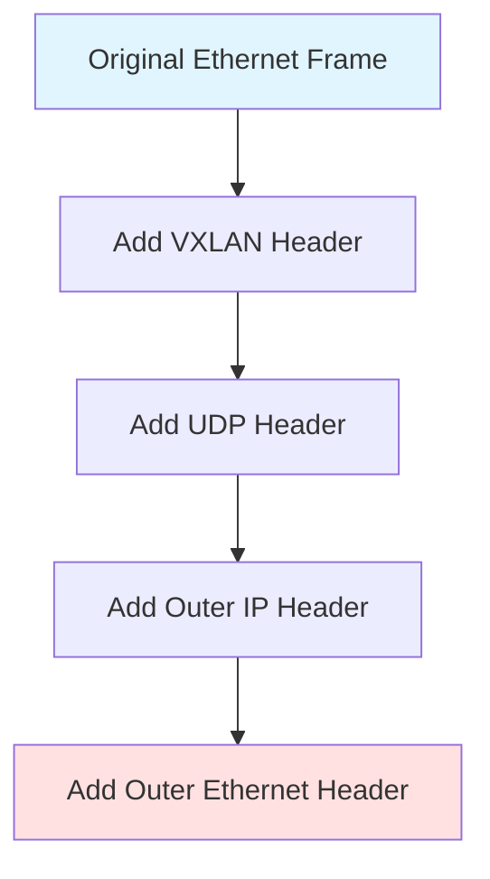

The innermost layer is the original Ethernet frame that the server created. This frame has the source MAC address of the sending server, the destination MAC address of the receiving server, and the payload data. This is exactly what would be sent in a traditional network. VXLAN doesn't modify this frame at all—it's preserved perfectly.

The VXLAN header is added around the original frame. This header is 8 bytes and contains several fields. The most important is the VNI—the VXLAN Network Identifier. This is a 24-bit field, providing 16,777,216 possible values. This is where VXLAN breaks through the 4,096 VLAN limit. Each VNI represents a separate virtual network segment. Two servers in VNI 10100 can communicate with each other but cannot see traffic in VNI 10200. The VNI provides the isolation that VLANs provided, but at vastly greater scale.

The UDP header comes next. VXLAN uses UDP port 4789 as the destination port. UDP is chosen because it's lightweight—there's no connection setup overhead, no acknowledgments, no flow control complexity. The VXLAN packet is simply wrapped in a UDP datagram. This makes VXLAN compatible with any IP network because every router and switch understands how to forward UDP packets.

The outer IP header contains the source IP address of the VTEP (VXLAN Tunnel Endpoint) on the sending switch and the destination IP address of the VTEP on the receiving switch. This is crucial: the physical network sees only this outer IP header. It routes the packet from source VTEP to destination VTEP like any other IP packet. The physical network has no knowledge of VXLANs, VNIs, or the inner frame—it just routes IP.

Finally, an outer Ethernet header is added with MAC addresses for the next-hop routing. As the packet traverses the network, this outer Ethernet header changes at each hop—switches rewrite it with the appropriate next-hop MAC address. The inner frame and all the encapsulation headers remain unchanged.

The total overhead is approximately 50 bytes. For a standard 1,500-byte Ethernet frame, you end up with a 1,550-byte packet after VXLAN encapsulation. This is why VXLAN networks typically use jumbo frames with MTUs of 9,000 bytes—to accommodate the encapsulation overhead without fragmenting packets.

## The VTEP: The Encapsulation Engine

The VXLAN Tunnel Endpoint is where all the magic happens. The VTEP is the component responsible for encapsulation and decapsulation. In practice, VTEPs are typically implemented in the hypervisor on compute servers or in top-of-rack switches. Understanding what the VTEP does is understanding how VXLAN actually operates.

When a virtual machine sends an Ethernet frame, that frame arrives at the VTEP. The VTEP must make a decision: where does this frame need to go? It looks at the destination MAC address in the inner frame. The VTEP maintains a forwarding table that maps MAC addresses to remote VTEPs. This table says "MAC address AA:BB:CC:DD:EE:FF is located behind VTEP with IP address 10.0.1.5".

If the VTEP finds the destination MAC in its table, it knows exactly what to do. It takes the original frame, adds the VXLAN header with the appropriate VNI, wraps it in a UDP packet, adds an IP header with the destination set to the remote VTEP's IP, and sends it into the network. The packet flows through the routed fabric to the destination VTEP.

When the packet arrives at the destination VTEP, the process reverses. The VTEP receives the packet addressed to its IP. It sees the UDP port 4789 and knows this is VXLAN traffic. It strips off the outer Ethernet, IP, and UDP headers. It examines the VXLAN header to determine the VNI. It then strips the VXLAN header, leaving the original Ethernet frame. This frame is delivered to the appropriate server or virtual machine in that VNI.

From the servers' perspective, this entire process is invisible. They send and receive standard Ethernet frames. The VXLAN encapsulation and decapsulation happen transparently. The servers believe they're on a simple Layer 2 network, even though the physical network is Layer 3 routed with multiple hops between endpoints.

## The Data Plane: How Traffic Actually Flows

The data plane is the actual forwarding of packets. Let's trace a packet's complete journey through a VXLAN network from Server A in Rack 1 to Server B in Rack 50. Both servers are in VNI 10100.

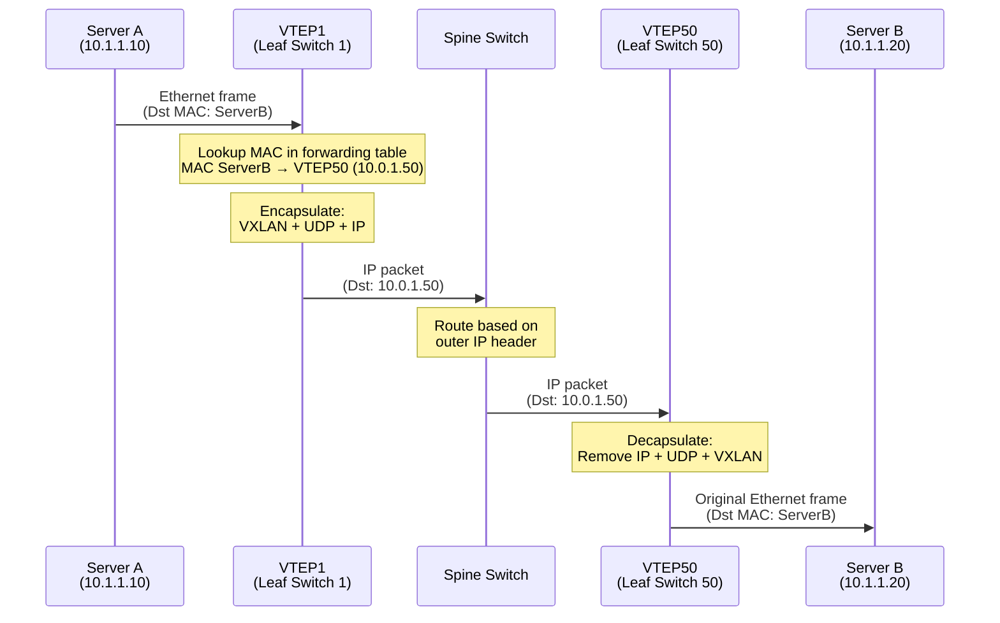

Server A wants to communicate with Server B. It creates a standard Ethernet frame with its own MAC as source and Server B's MAC as destination. This frame is handed to the VTEP on Leaf Switch 1.

VTEP1 looks up Server B's MAC address in its forwarding table. The table indicates that Server B's MAC is reachable through VTEP50, which has IP address 10.0.1.50. VTEP1 performs the encapsulation: it wraps the original frame in a VXLAN header with VNI 10100, adds a UDP header with destination port 4789, and adds an IP header with source 10.0.1.1 (VTEP1's address) and destination 10.0.1.50 (VTEP50's address).

This encapsulated packet enters the physical network. The packet reaches the Spine switch. The Spine doesn't understand or care about VXLAN. It sees only the outer IP header showing destination 10.0.1.50. It performs normal IP routing, looking up 10.0.1.50 in its routing table, and forwards the packet toward Leaf Switch 50.

The packet arrives at VTEP50. VTEP50 recognizes its own IP address in the destination field. It examines the UDP destination port 4789 and knows this is VXLAN traffic. It removes the outer IP and UDP headers, examines the VXLAN header to see VNI 10100, removes the VXLAN header, and is left with the original Ethernet frame. It looks at the destination MAC and forwards the frame out the port connected to Server B.

Server B receives the frame exactly as Server A sent it. The entire VXLAN encapsulation and routing through the data center fabric is completely transparent to both servers.

This data plane operation is stateless and simple. The VTEP looks up MAC addresses in a table, performs encapsulation or decapsulation, and forwards packets. There's no complex state machine, no connection tracking, no acknowledgments. This simplicity is crucial for performance—VTEPs can forward traffic at line rate without becoming bottlenecks.

## The Control Plane: Building the Forwarding Table

The data plane is simple, but it depends entirely on the VTEP's forwarding table being accurate. How does the VTEP know that MAC address AA:BB:CC:DD:EE:FF is behind VTEP at IP 10.0.1.50? This is the control plane's job. The control plane populates and maintains the forwarding tables that the data plane uses.

There are multiple approaches to the VXLAN control plane, and this is where VXLAN's design becomes interesting. The original VXLAN specification used flood-and-learn, similar to traditional Ethernet switches. When a VTEP receives a frame for an unknown destination MAC, it encapsulates the frame and sends it to all other VTEPs in that VNI. This is called flooding.

Flooding works but scales poorly. Imagine a VNI with 100 VTEPs. When any VTEP needs to flood, it must send copies of the packet to 99 other VTEPs. This is inefficient, consuming bandwidth and creating load on every VTEP even for traffic they don't care about. In a data center with thousands of VTEPs and millions of MAC addresses, flooding becomes unworkable.

The solution is to replace flood-and-learn with an explicit control plane that proactively distributes MAC address information. This is where EVPN enters the picture. EVPN provides a protocol for VTEPs to advertise which MAC addresses they host. Instead of learning through observation and flooding, VTEPs learn through explicit advertisements.

With an EVPN control plane, when Server A connects to VTEP1, VTEP1 learns Server A's MAC address through normal Ethernet learning—it sees frames from Server A and notes which port they came from. VTEP1 then creates an EVPN advertisement saying "I am VTEP1 at IP 10.0.1.1, and I have MAC address AA:BB:CC:DD:EE:FF in VNI 10100". This advertisement is distributed to all other VTEPs in the network.

VTEP50 receives this advertisement. It adds an entry to its forwarding table: "MAC AA:BB:CC:DD:EE:FF in VNI 10100 is reachable via VTEP at IP 10.0.1.1". Now when Server B sends traffic to Server A, VTEP50 already knows where to send it. There's no flooding, no learning delay, no wasted bandwidth on unnecessary traffic.

This proactive control plane is what makes VXLAN practical at scale. The control plane populates the forwarding tables that the data plane uses. The data plane simply follows the table entries, performing fast, simple lookups and encapsulation. This separation of control and data planes is a fundamental architectural pattern that enables scalable, high-performance networks.

## Broadcast, Unknown Unicast, and Multicast Traffic

Not all traffic is unicast between known endpoints. Networks must handle broadcast traffic (sent to all endpoints in a segment), unknown unicast traffic (destination MAC not yet learned), and multicast traffic (sent to a group of endpoints). VXLAN must handle these traffic types, and the approach differs between flood-and-learn and EVPN control planes.

In flood-and-learn VXLAN, broadcast and unknown unicast traffic is replicated to all VTEPs in the VNI. This can use IP multicast, where each VNI is mapped to a multicast group, and VTEPs join the appropriate multicast groups. When a VTEP needs to broadcast, it sends a single VXLAN packet to the multicast group address, and the network's multicast routing replicates it to all group members. This is more efficient than unicast replication but requires the network to support multicast routing.

Alternatively, ingress replication can be used where the source VTEP explicitly creates a copy of the packet for each remote VTEP and sends them as individual unicast packets. This is simpler to deploy because it requires no multicast support, but it's less bandwidth-efficient because the source VTEP and its uplinks must carry multiple copies of each packet.

With an EVPN control plane, broadcast and unknown unicast can be largely eliminated. EVPN distributes MAC address information proactively, so destination MACs are known before traffic is sent. For broadcast traffic, EVPN provides mechanisms to build optimized distribution trees. The specific implementation varies, but the key point is that EVPN's proactive control plane minimizes the need for flooding.

ARP traffic, which is broadcast-based in traditional networks, can be suppressed entirely with EVPN. When EVPN advertisements include both MAC and IP addresses, VTEPs can answer ARP requests locally without flooding them across the network. A server sends an ARP request asking "who has IP 10.1.1.20?", the local VTEP looks in its EVPN-learned table, finds the MAC address associated with that IP, and responds directly. The ARP request never leaves the local switch. This ARP suppression dramatically reduces broadcast traffic.

## VXLAN Without EVPN: The Limitations

To fully appreciate EVPN, you must understand VXLAN operating without it. In a pure flood-and-learn VXLAN deployment, every unknown destination triggers flooding. When a new VM boots up and hasn't communicated yet, the first packets sent to it are flooded to all VTEPs. When a VM moves from one host to another, there's a period where its new location hasn't been learned, triggering more flooding. In a dynamic environment with VMs constantly being created, moved, and destroyed, flooding can be constant.

The learning process is also reactive and slow. A VTEP only learns about remote MACs when it needs to send traffic to them or when it happens to receive traffic from them. This creates asymmetry—VTEP1 might know about MACs behind VTEP50, but VTEP50 might not know about MACs behind VTEP1 until traffic flows in both directions. This asymmetry complicates troubleshooting and can cause unexpected flooding patterns.

The forwarding table on each VTEP can grow very large. In a data center with 100,000 virtual machines, each VTEP potentially needs to learn 100,000 MAC addresses. These tables consume switch memory. Worse, MAC addresses age out if not used regularly. If a MAC ages out of the table and then receives traffic again, it triggers another flood-and-learn cycle.

Multicast configuration adds operational complexity. Each VNI needs a multicast group assigned. The network must support multicast routing, which many operators find complex to configure and troubleshoot. Multicast group addresses must be carefully managed to avoid conflicts. For large deployments with thousands of VNIs, multicast scaling can become a limitation.

VXLAN without EVPN works and is deployed, but it carries these operational burdens. It's a functional solution but not an elegant or scalable one. This is precisely why EVPN was developed—to provide the control plane sophistication that makes VXLAN practical for very large deployments.

## The Underlay: The Foundation Everything Runs On

VXLAN is an overlay network, but it requires an underlay network to function. The underlay is the physical IP network that carries VXLAN-encapsulated packets between VTEPs. Understanding the underlay requirements and characteristics is essential for successful VXLAN deployment.

The underlay must provide IP connectivity between all VTEPs. Each VTEP has an IP address, and the underlay must route packets between these addresses. This seems obvious, but the quality of this IP connectivity determines VXLAN performance. If the underlay has high latency, packet loss, or limited bandwidth, VXLAN overlay performance suffers.

Most VXLAN deployments use a Layer 3 leaf-spine fabric as the underlay. This provides multiple equal-cost paths between any pair of leaves, enabling ECMP load distribution. When VTEP1 sends encapsulated traffic to VTEP50, the underlay can distribute this traffic across multiple spine switches, utilizing all available bandwidth. This is far superior to traditional spanning tree networks where redundant links are blocked.

The underlay routing protocol is typically BGP or OSPF. These protocols distribute reachability information for VTEP IP addresses. When a new leaf switch with VTEPs is added, it announces its VTEP IP addresses via the routing protocol, and all other switches learn how to reach the new VTEPs. This dynamic routing enables plug-and-play infrastructure expansion.

MTU configuration on the underlay is critical. The underlay must support MTUs large enough to accommodate VXLAN encapsulation overhead. If the underlay MTU is 1,500 bytes and inner frames are also 1,500 bytes, the encapsulated packets will be 1,550 bytes and will require fragmentation. IP fragmentation significantly hurts performance and can cause problems with some network devices. The solution is configuring jumbo frames on the underlay—typically 9,000-byte MTUs—providing ample headroom.

The underlay should be highly available. While VXLAN itself doesn't require special availability mechanisms, the applications running on VXLAN networks certainly do. Standard underlay availability practices apply: redundant paths, fast convergence routing protocols, and proper link and node failure handling. If the underlay has frequent failures or slow convergence, VXLAN traffic experiences corresponding disruptions.

## Integration with the Physical World

Servers and virtual machines send and receive standard Ethernet frames. They have no awareness of VXLAN. The integration point between the physical and virtual networks—where VXLAN encapsulation happens—is crucial to understand.

In a virtualized environment, the hypervisor typically implements the VTEP function. When a virtual machine sends a frame, the hypervisor's virtual switch component receives it. This virtual switch includes VXLAN functionality. It maintains forwarding tables, performs lookups, and handles encapsulation and decapsulation. From the virtual machine's perspective, it's simply connected to a virtual network interface. The VXLAN complexity is hidden in the hypervisor.

For bare-metal servers without virtualization, top-of-rack switches typically serve as VTEPs. The server connects to the switch with a standard Ethernet connection. The switch port is configured as an access port in a particular VNI. When frames arrive from the server, the switch performs VXLAN encapsulation. When VXLAN traffic destined for the server arrives, the switch decapsulates and delivers standard Ethernet frames to the server.

Some modern network interface cards include VXLAN offload capabilities. These NICs can perform VXLAN encapsulation and decapsulation in hardware, freeing the CPU from this task. The operating system or hypervisor configures which VNI to use, and the NIC handles the encapsulation transparently. This offload is particularly valuable in high-performance environments where CPU cycles are precious.

## Troubleshooting VXLAN

When VXLAN isn't working, troubleshooting requires understanding both the overlay and underlay. Problems can exist at multiple layers, and symptoms can be misleading.

Start with the underlay. Can VTEPs reach each other at the IP level? Simple ping tests between VTEP IP addresses verify basic IP connectivity. If VTEPs cannot reach each other in the underlay, VXLAN cannot function. Check routing tables, interface states, and verify that routing protocols are operating correctly.

MTU problems are common. If underlay MTU is insufficient, VXLAN packets may be fragmented or dropped. Testing with different packet sizes helps identify MTU issues. Sending packets near maximum size and checking if they traverse successfully reveals MTU problems. Every device in the path must support adequate MTU, not just the endpoints.

Forwarding table state is crucial. Are the expected MAC addresses present in VTEP forwarding tables? If Server A cannot reach Server B, check whether Server B's MAC appears in VTEP1's table and with the correct remote VTEP IP. If the entry is missing or incorrect, the problem is in the control plane—either learning isn't working, or EVPN advertisements aren't being received.

Capture and analyze packets at multiple points. Capture at the sending server to see what it's transmitting. Capture at the sending VTEP to verify encapsulation is happening correctly. Capture at the receiving VTEP to confirm packets are arriving. Capture at the receiving server to verify decapsulation and delivery. This step-by-step analysis reveals exactly where packets are being dropped or corrupted.

VXLAN is not magic. It's a specific encapsulation format with well-defined behavior. When something goes wrong, systematic troubleshooting following the packet path will reveal the problem. Understanding both the data plane mechanics and the control plane state is essential for effective troubleshooting.

# EVPN : Control and Data Plane Analysis

## Why EVPN Exists

VXLAN provides the mechanism to create virtual Layer 2 networks over Layer 3 infrastructure, but it says almost nothing about how VTEPs discover where MAC addresses are located. The original VXLAN specification essentially said "figure it out yourself"—maybe use flooding and learning like traditional switches, maybe use multicast, maybe something else. This lack of a defined control plane left operators with scaling problems and operational complexity.

EVPN—Ethernet VPN—solves this by providing a sophisticated, scalable control plane specifically designed for overlay networks. EVPN is not a new protocol from scratch. It extends BGP, the same protocol that routes the Internet. BGP was chosen because it's proven at massive scale, handling hundreds of thousands of routes across the global Internet. If BGP can handle Internet-scale routing, it can certainly handle data center-scale MAC address distribution.

The fundamental shift EVPN brings is from reactive to proactive learning. Traditional networks learn MAC addresses by observing traffic and flooding unknowns. EVPN inverts this: VTEPs proactively advertise the MAC addresses they host, and all other VTEPs learn these advertisements before any traffic is sent. This eliminates flooding in the normal case and provides instantaneous knowledge of network topology changes.

## EVPN as a BGP Extension

BGP is fundamentally a protocol for distributing reachability information. Originally, this meant distributing IP prefixes—advertising which IP addresses are reachable through which autonomous systems. Multi-Protocol BGP (MP-BGP) extended this to carry different types of information beyond just IP routing. EVPN is one such extension, defining how to carry Ethernet information—MAC addresses, IP-to-MAC bindings, and more—through BGP.

The technical mechanism is address families. BGP can simultaneously carry routes for multiple address families. IPv4 unicast is one address family. IPv6 unicast is another. EVPN is the "L2VPN EVPN" address family. A single BGP session can carry routes for multiple address families, so the same BGP infrastructure that handles underlay routing can also handle EVPN overlay information.

This reuse of BGP brings substantial benefits. Operators already understand BGP. Tools for monitoring and troubleshooting BGP exist and are mature. BGP's scaling characteristics are well understood. Security mechanisms for BGP are established. Rather than inventing a new protocol with new tools, new knowledge requirements, and new operational practices, EVPN leverages existing infrastructure and expertise.

BGP sessions in an EVPN network typically use a route reflector architecture. Leaf switches acting as VTEPs don't peer with each other—that would require a full mesh of BGP sessions, which doesn't scale. Instead, leaves peer with route reflectors. The route reflectors receive EVPN routes from one leaf and redistribute them to all other leaves. This hub-and-spoke topology scales to thousands of leaves with minimal configuration complexity.

## EVPN Route Types: The Information Being Distributed

EVPN defines multiple route types, each carrying different information. Understanding these route types is understanding what EVPN actually does. The route types are identified by numbers, and several are essential for basic EVPN operation.

Type 2 routes are MAC/IP Advertisement routes. This is the core of EVPN functionality. When a VTEP learns about a MAC address—perhaps a VM booted up, or a server sent its first frame—the VTEP creates a Type 2 route. This route contains the MAC address, optionally an IP address if known, the VNI (VXLAN Network Identifier) that the MAC belongs to, and critically, the VTEP's own IP address. The route essentially says "I am VTEP at IP X, and I have MAC address Y in VNI Z, and it's associated with IP address W."

This Type 2 route is sent to the route reflector, which distributes it to all other VTEPs. Every VTEP in the network now knows that MAC Y in VNI Z is located behind VTEP X. They populate their forwarding tables accordingly. When any VTEP needs to send traffic to MAC Y, it knows exactly where to send it—encapsulate in VXLAN with VNI Z, add an outer IP header with destination X, and send it into the network.

Type 3 routes are Inclusive Multicast Ethernet Tag routes. These routes advertise VTEP membership in VNIs. When a VTEP wants to participate in VNI 10100, it sends a Type 3 route saying "I am VTEP at IP X and I'm part of VNI 10100". All other VTEPs receive this route and know that if they need to send broadcast or multicast traffic in VNI 10100, they should include VTEP X in the distribution.

Type 1 routes support fast failure detection and multihoming. Type 4 routes distribute Ethernet Segment information for multihoming scenarios. Type 5 routes handle IP prefix advertisements for routing between VNIs. While these are important for advanced deployments, the core functionality—making VXLAN work efficiently—depends primarily on Type 2 and Type 3 routes.

## The Control Plane: How Information Flows

Let's trace exactly how EVPN distributes information when a new endpoint appears. Server A boots up and connects to Leaf Switch 1. Server A has MAC address AA:BB:CC:DD:EE:FF and IP address 10.1.1.10. Server A is in VNI 10100.

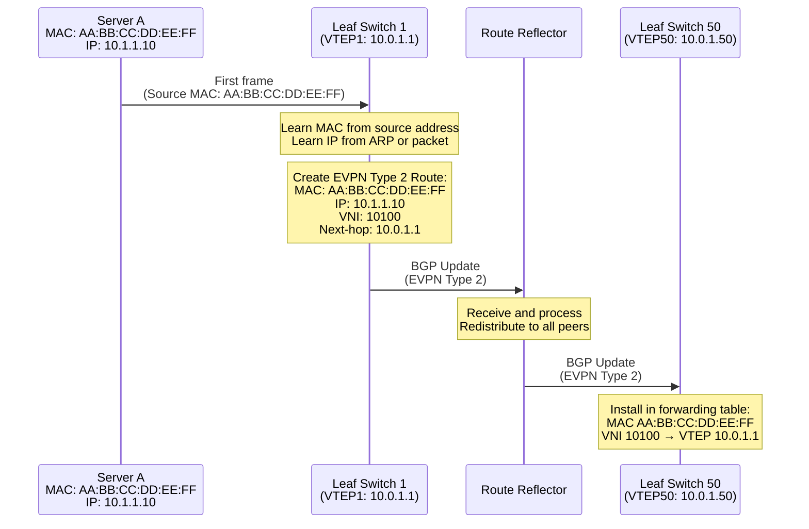

When Server A sends its first frame, Leaf1 learns the source MAC address through normal Ethernet learning. It also learns the IP address, either from ARP packets or by inspecting the IP header of packets. Leaf1 now has complete information: MAC address, IP address, and which VNI this endpoint belongs to.

Leaf1 constructs an EVPN Type 2 route. This route contains the MAC address (AA:BB:CC:DD:EE:FF), the IP address (10.1.1.10), the VNI (10100), and sets the BGP next-hop to its own VTEP IP address (10.0.1.1). This route is sent in a BGP Update message to Leaf1's BGP peers—in this case, the route reflectors.

The route reflector receives this BGP Update. It processes the route, adds it to its own BGP table, and because it's a route reflector, it redistributes this route to all its other clients. This means all other leaf switches receive this BGP Update.

Leaf Switch 50 receives the BGP Update containing the Type 2 route. It processes this route and installs it in its VXLAN forwarding table. The entry says "MAC address AA:BB:CC:DD:EE:FF in VNI 10100 is located behind VTEP at IP 10.0.1.1". Now, even though Leaf50 has never seen traffic from Server A, it knows where Server A is located. If Server B behind Leaf50 wants to send traffic to Server A, Leaf50 can immediately encapsulate and forward it to the correct VTEP.

This entire process happens in seconds. The BGP Update propagates through the network at the speed of routing protocol updates—typically completing within a second or two. From the moment Server A boots up, other VTEPs quickly learn its location. There's no waiting for traffic to flow and be learned. There's no flooding of unknown traffic. The network proactively knows the complete topology.

## ARP Suppression: Eliminating Broadcast Traffic

One of EVPN's most powerful features is ARP suppression. Traditional networks flood ARP requests as broadcasts. When Server B needs to send an IP packet to Server A, it first needs Server A's MAC address. It sends an ARP request as a broadcast: "Who has IP address 10.1.1.10? Please tell me your MAC address." Every device in the broadcast domain receives this, but only Server A responds.

In a VXLAN network without EVPN, this ARP request would be encapsulated and sent to all VTEPs in the VNI. Every VTEP receives it and delivers it to all local servers in that VNI. Thousands of VTEPs means thousands of copies of every ARP request. This wastes bandwidth and creates processing load on every VTEP and every server.

EVPN eliminates this. When the Type 2 route was advertised, it included both the MAC address and the IP address. Every VTEP has both pieces of information in its table. When Server B sends an ARP request asking for IP 10.1.1.10, the request arrives at Leaf50. Leaf50 checks its EVPN-learned table and finds that IP 10.1.1.10 maps to MAC address AA:BB:CC:DD:EE:FF.

Leaf50 immediately replies to the ARP request without forwarding it anywhere. It generates an ARP reply saying "IP 10.1.1.10 has MAC address AA:BB:CC:DD:EE:FF" and sends it to Server B. Server B receives the answer it needed. The ARP request never left Leaf50. It wasn't encapsulated, it wasn't sent to the route reflector, it wasn't distributed to other VTEPs, it wasn't delivered to Server A. The VTEP answered locally using information it already had.

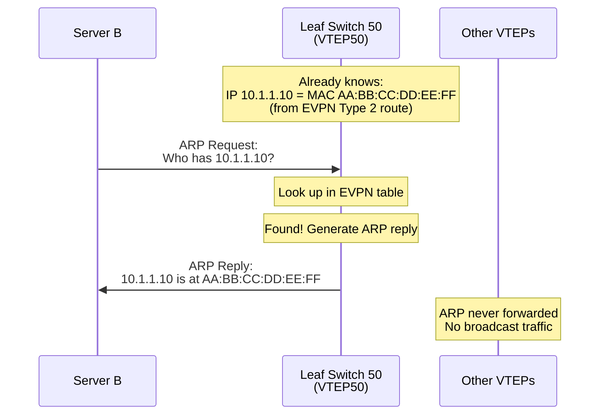

This ARP suppression dramatically reduces network traffic. In a network with thousands of servers, ARP traffic can be substantial. Eliminating this broadcast traffic frees bandwidth for actual data. More importantly, it reduces load on VTEPs and servers—they don't need to process and discard thousands of irrelevant ARP requests.

## The Data Plane: Fast Forwarding with EVPN

The data plane—actual packet forwarding—with EVPN is identical to VXLAN data plane forwarding. EVPN doesn't change how packets are encapsulated or forwarded. It changes how the forwarding tables are populated, but once those tables exist, forwarding works exactly as described in VXLAN documentation.

The key difference is that with EVPN, the forwarding tables are always complete and current. When VTEP50 needs to forward a frame to a destination MAC, it looks up the MAC in its table. With EVPN, this lookup almost always succeeds because EVPN has proactively populated the table. The VTEP immediately knows which remote VTEP to send to, performs encapsulation, and forwards the packet.

Contrast this with flood-and-learn VXLAN without EVPN. If the destination MAC isn't in the table, the VTEP must flood—send copies to all other VTEPs. This flooding wastes bandwidth and creates latency while the destination responds and learning occurs. With EVPN, flooding is rare—it only happens for the brief window before EVPN routes propagate, or for truly unknown destinations that don't exist.

The performance difference is significant. Every lookup succeeds immediately. No flooding delays. No wasted bandwidth on flooded traffic. No unnecessary load on VTEPs processing flooded packets. The data plane operates at maximum efficiency because the control plane has ensured complete topology knowledge.

## Route Targets and Import/Export: Controlling Information Distribution

EVPN deployments often have thousands of VNIs and potentially millions of endpoints. Distributing all this information to every VTEP would be wasteful—most VTEPs only participate in a subset of VNIs and only need information about relevant endpoints. BGP's route target mechanism solves this by filtering which routes are imported and exported.

Each EVPN route carries one or more route targets (RTs). These are special extended community attributes in BGP. When a VTEP advertises an EVPN route, it adds route targets indicating which VNI or service the route belongs to. Other VTEPs configure import route target filters specifying which route targets they're interested in.

For example, VNI 10100 might be associated with route target "RT:65000:10100". When Leaf1 advertises Server A's MAC in VNI 10100, it tags the Type 2 route with RT:65000:10100. Leaf50, which also participates in VNI 10100, configures an import filter saying "import routes with RT:65000:10100". When Leaf50 receives the route with this RT, it imports the route and installs it in the forwarding table.

Leaf Switch 75, which doesn't participate in VNI 10100, doesn't import routes with RT:65000:10100. When route reflectors send it the route, it ignores it. The route doesn't consume memory in Leaf75's forwarding table. This filtering scales well—each VTEP only maintains state for VNIs it actually participates in, not for the entire data center.

The export side works similarly. When a VTEP advertises routes, it attaches appropriate route targets based on which VNI the route belongs to. The configuration typically auto-derives route targets from VNI numbers, so operators don't manually configure thousands of route targets. The mapping might be as simple as "VNI X uses route target RT:ASN:X" where ASN is the BGP autonomous system number.

## Handling Failures and Changes

Networks are not static. Servers move, VMs migrate, equipment fails, and VTEPs go offline. EVPN handles these dynamic conditions through BGP's update mechanisms. When topology changes, EVPN distributes updated information, and VTEPs adjust their forwarding tables accordingly.

When Server A moves from behind Leaf1 to behind Leaf30, the change propagates through EVPN. When Leaf30 sees the first frame from Server A, it learns the MAC address locally. Leaf30 generates a Type 2 route advertising Server A's MAC with Leaf30's VTEP IP as the next-hop. This route is distributed to all VTEPs.

VTEPs receive this new route and compare it to their existing entry for Server A's MAC. They see that the same MAC address now has a different next-hop VTEP. BGP's route selection process determines that this new route should be preferred (typically because it's the most recent). VTEPs update their forwarding tables, replacing the old VTEP IP (Leaf1) with the new VTEP IP (Leaf30).

Leaf1, which no longer has Server A connected, withdraws its previous Type 2 route for Server A. It sends a BGP Withdraw message removing the route. This ensures that if VTEPs still had the old route, they definitively remove it. The combination of the new advertisement from Leaf30 and the withdrawal from Leaf1 ensures clean migration.

When a VTEP fails completely—perhaps Leaf1 loses power—its BGP session to the route reflector times out. BGP has keepalive mechanisms; if no keepalives are received for the hold time, the session is declared dead. The route reflector recognizes that Leaf1's session is down and withdraws all routes that Leaf1 had advertised.

These withdrawals propagate to all other VTEPs. They remove all forwarding table entries that had Leaf1 as the next-hop. Any MAC addresses that were behind Leaf1 become unknown. Traffic to those MAC addresses will fail until the endpoints reappear elsewhere or until operators resolve the Leaf1 failure. This automatic cleanup prevents black-holing traffic to failed VTEPs.

## EVPN for Multi-Tenancy

Data centers often host multiple tenants—different customers or different organizational units that require complete isolation from each other. EVPN supports this through VRF (Virtual Routing and Forwarding) instances and route target filtering.

Each tenant can have one or more VNIs assigned to them. These VNIs might use overlapping IP address spaces—Tenant A might use 10.0.0.0/8, and Tenant B might also use 10.0.0.0/8. This is acceptable because VNIs provide isolation. Traffic in VNI 10100 (Tenant A) never mixes with traffic in VNI 10200 (Tenant B) even if they use overlapping IPs.

The EVPN routes for different tenants carry different route targets. Tenant A's VNIs use route targets like RT:65000:10100, while Tenant B's VNIs use RT:65000:10200. VTEPs configure import filters based on which tenants they host. A VTEP hosting only Tenant A VMs imports only Tenant A route targets.

This ensures complete isolation. Even though all routes flow through the same BGP infrastructure, route target filtering ensures each VTEP only sees routes relevant to the tenants it hosts. A VTEP hosting Tenant A never sees Tenant B's MAC addresses and has no way to forward traffic to them. The control plane isolation is complete.

The data plane isolation comes from VNI separation. Even if somehow a VTEP had incorrect forwarding table entries, traffic in VNI 10100 contains the VNI in the VXLAN header. The receiving VTEP only delivers traffic to servers in matching VNIs. A packet with VNI 10100 can never be delivered to a server in VNI 10200. The combination of control plane filtering and data plane VNI checking provides defense in depth.

## Distributed Anycast Gateway: Routing at the Edge

Traditional networks that need to route between VLANs use centralized gateways. All traffic that needs routing flows to the gateway, gets routed, and flows back. This creates hairpin traffic patterns and makes the gateway a bottleneck. EVPN enables distributed anycast gateways where every VTEP can act as the gateway, eliminating these problems.

Multiple VTEPs advertise the same gateway MAC and IP address. This is configured consistently across all VTEPs—they all announce, for example, that the default gateway is at 10.1.1.1 with MAC address GW:GW:GW:GW:GW:GW. When a server needs to send traffic outside its subnet, it sends to this gateway address.

The local VTEP intercepts traffic to the gateway MAC. Instead of forwarding it somewhere else, the VTEP itself performs the routing. It looks up the destination IP in its routing table (populated through EVPN Type 5 routes or other routing mechanisms), determines the next hop, and forwards appropriately.

From the server's perspective, it simply sent traffic to its default gateway. It has no idea that the "gateway" is actually implemented distributed across many VTEPs. Each server's traffic gets routed locally at the VTEP closest to it, providing optimal traffic flow and eliminating bottlenecks.

This distributed routing integrates seamlessly with EVPN. Type 5 routes distribute IP prefix reachability information between VNIs, enabling routing between them. The same EVPN infrastructure that distributes MAC addresses also distributes routing information, providing a complete solution for both switching and routing in the overlay network.

## Troubleshooting EVPN

When EVPN isn't working correctly, troubleshooting requires examining both BGP control plane state and VXLAN data plane forwarding. The symptoms might appear in the data plane—traffic not flowing—but the root cause is almost always in the control plane.

First, verify BGP sessions are established. Check BGP neighbor status on VTEPs and route reflectors. If BGP sessions aren't up, EVPN cannot function. BGP session failures might be due to IP connectivity problems, authentication misconfiguration, or firewall rules blocking BGP. Standard BGP troubleshooting applies.

Once BGP sessions are established, verify routes are being sent and received. Check the BGP table on the advertising VTEP to ensure it's creating appropriate Type 2 routes for local MAC addresses. Check the BGP table on remote VTEPs to verify they're receiving these routes. If routes aren't being received, the problem might be route reflector configuration or route target filtering.

Examine route target configuration carefully. A common problem is mismatched route targets where the exporting VTEP tags routes with one RT but the importing VTEP filters for a different RT. Routes are advertised but not imported. Checking both export and import route target configuration often reveals these mismatches.

Verify that received routes are being installed in the forwarding table. A route might appear in the BGP table but not be used for forwarding if there's a problem converting the BGP route to a forwarding entry. Check the VXLAN forwarding table (sometimes called the MAC table or bridge table) to ensure entries exist with the correct remote VTEP IPs.

Use packet captures judiciously. Capture BGP Update messages to see exactly what routes are being advertised and what attributes they carry. Capture VXLAN data packets to verify encapsulation and forwarding. Systematic captures at different points in the path reveal exactly where the problem lies.

EVPN adds sophistication to VXLAN, but this sophistication comes with complexity. Understanding BGP fundamentals is prerequisite to understanding EVPN. Operators must be comfortable with BGP configuration, BGP route selection, and BGP troubleshooting. This is the investment required to gain EVPN's benefits—proactive learning, elimination of flooding, ARP suppression, and a scalable control plane for large overlay networks.

# BGP in Data Centers: Control and Data Plane Analysis

## Why BGP Replaced Interior Gateway Protocols

For decades, data centers used interior gateway protocols like OSPF or IS-IS for routing. These protocols were designed for enterprise networks with hierarchical topologies and relatively static configurations. They worked adequately for traditional three-tier data center architectures with access, aggregation, and core layers. But as data centers evolved toward leaf-spine architectures and massive scale, these protocols revealed fundamental limitations.

OSPF and IS-IS flood link-state information throughout the network. Every router must have complete topology knowledge. In small networks, this is fine. In networks with thousands of switches, this flooding becomes a scalability problem. Every topology change—every link flap, every router reboot—triggers a flood of updates to every device. The processing load and convergence time grow with network size.

BGP takes a different approach. It's a path-vector protocol where routers advertise reachability information without requiring complete topology knowledge. A BGP router needs to know only the routes it has received and which neighbors to send them to. This scales far better. BGP was designed to handle the Internet's scale—hundreds of thousands of routes distributed among tens of thousands of autonomous systems. Data center scale, while large, is modest compared to the Internet.

The shift to BGP in data centers was driven by practical necessity. Cloud providers building networks with thousands of switches found that OSPF simply didn't scale. BGP did. Operators who understood BGP from running Internet connectivity recognized they could apply that knowledge internally. Network automation benefited from BGP's well-defined configuration model. BGP became the answer not because it was designed for data centers but because it worked when other protocols didn't.

## BGP Fundamentals: Autonomous Systems and Neighbors

BGP operates between autonomous systems—networks under a single administrative control. Each autonomous system has a unique AS number, either 16-bit (1-65535) or 32-bit for newer deployments. In data center BGP, each switch typically has its own AS number. This differs from traditional BGP where an entire organization might use one AS number.

Using a unique AS number per switch enables several important behaviors. BGP includes the AS path—the sequence of ASs a route has traversed—in route advertisements. If a switch sees its own AS number in the AS path, it knows accepting that route would create a loop and rejects it. This provides automatic loop prevention without the complexity of protocols like Spanning Tree. In a leaf-spine fabric where multiple paths exist between leaves, this loop prevention is crucial.

BGP neighbors must be explicitly configured. Unlike OSPF which discovers neighbors automatically through multicast, BGP requires you to configure "neighbor X" commands specifying the IP address of each peer. This explicit configuration provides security—only configured neighbors can establish BGP sessions—but requires more initial setup. In modern deployments, automation generates these configurations, making the manual effort acceptable.

Two types of BGP sessions exist: eBGP (external BGP) between different autonomous systems, and iBGP (internal BGP) within the same autonomous system. Data center BGP almost exclusively uses eBGP. Each switch is its own AS, so sessions between switches are by definition external. The eBGP rules—where routes learned from eBGP peers are advertised to all other peers by default—simplify configuration compared to iBGP's more complex route distribution rules.

## The Control Plane: BGP Session Establishment

Before any routing information flows, BGP neighbors must establish a session. This session establishment process follows a specific state machine, and understanding these states helps troubleshoot BGP problems.

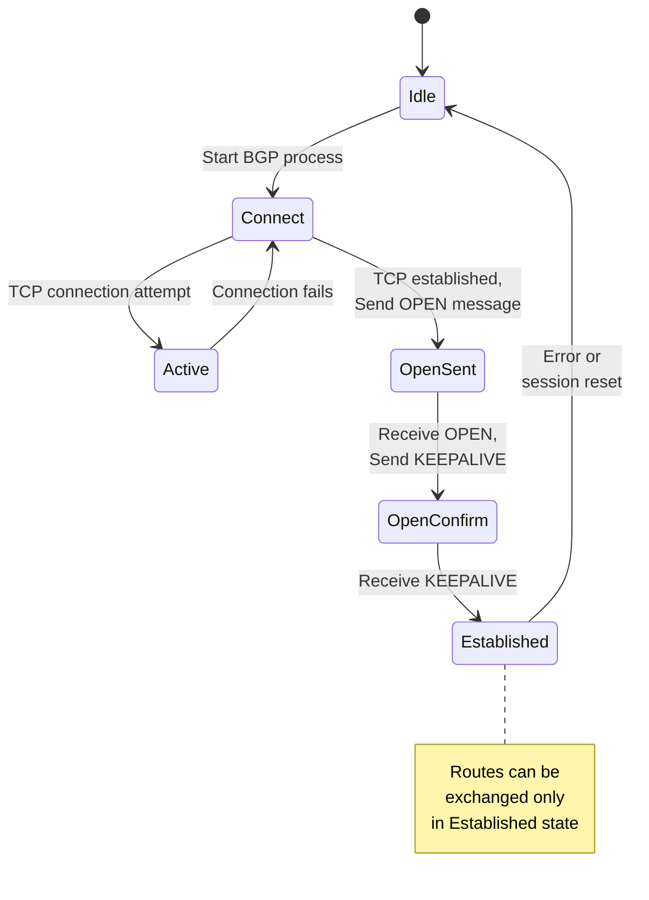

BGP starts in the Idle state. When BGP process begins, it moves to Connect and attempts to establish a TCP connection to the configured neighbor. BGP uses TCP port 179. One router connects to port 179 on the other. TCP handles reliability, ordering, and flow control, so BGP doesn't need to implement these functions.

If TCP connection succeeds, BGP moves to OpenSent and sends an OPEN message. This message contains the router's AS number, BGP identifier (typically the router's IP address), and capabilities—optional features the router supports like multi-protocol extensions. The neighbor receives this OPEN message and validates it. If acceptable, it replies with its own OPEN message and a KEEPALIVE acknowledgment, and BGP moves to OpenConfirm state.

Once both sides have sent and received OPEN messages and exchanged KEEPALIVE messages, BGP moves to Established state. Only in Established state can routes be exchanged. The routers now send UPDATE messages containing routing information and periodic KEEPALIVE messages to maintain the session. If keepalives aren't received for the configured hold time (typically 90-180 seconds), the session is declared dead and returns to Idle.

This session establishment seems slow for modern networks, but it provides important guarantees. The explicit handshake with capability negotiation ensures both routers agree on what features are supported. The TCP foundation provides reliable, ordered delivery without BGP needing to implement these mechanisms. The keepalive mechanism detects failures without relying on the underlying network layer.

## Route Advertisement and Propagation

Once BGP sessions are established, routers exchange routing information through UPDATE messages. Understanding exactly what information is sent and how it's processed is crucial for understanding BGP's control plane.

An UPDATE message contains one or more NLRI (Network Layer Reachability Information) entries. Each NLRI describes a destination network—in traditional BGP, this is an IP prefix like 10.1.1.0/24. For EVPN, the NLRI contains MAC addresses and VNI information. For IPv4 unicast routing, it's IP prefixes. The NLRI says "here's a destination you can reach."

Each UPDATE message also contains path attributes. These attributes describe characteristics of the path to reach the advertised destinations. The AS_PATH attribute lists the autonomous systems the route has traversed. The NEXT_HOP attribute specifies the next-hop IP address to reach the destination. Various other attributes provide additional information or influence route selection.

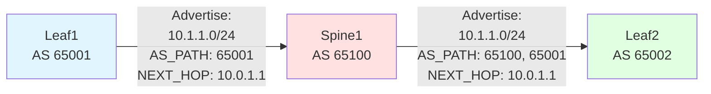

When Leaf1 advertises a route, it includes its own AS number in the AS_PATH. When Spine1 receives this route and forwards it to Leaf2, Spine1 prepends its own AS number to the AS_PATH. The AS_PATH grows as the route propagates. This serves two purposes: loop prevention (routers reject routes containing their own AS) and route selection (shorter AS paths are preferred).

The NEXT_HOP attribute requires careful attention. In eBGP, when a router advertises a route to an eBGP peer, it typically sets the next-hop to its own IP address on the link to that peer. This makes sense: "to reach this destination, send packets to me." However, in some configurations, the next-hop might be set to a different address—perhaps a loopback interface or an IP address on a different link.

For underlay routing in a leaf-spine fabric, leaves typically advertise their loopback addresses. These loopbacks are stable identifiers for the switches. When Leaf1 advertises its loopback 10.0.1.1 to Spine1, the next-hop is automatically set to Leaf1's interface IP on the leaf-spine link. When Spine1 forwards this to Leaf2, the next-hop is changed to Leaf1's loopback address. This ensures traffic destined for the loopback flows correctly.

## Route Selection: Choosing the Best Path

When a BGP router receives multiple routes to the same destination—perhaps from different neighbors or different paths—it must choose which route to use. BGP's route selection algorithm is deterministic and follows a specific order of comparison. This algorithm is crucial for understanding how traffic actually flows.

The comparison proceeds through multiple tie-breakers, checking each criterion in order until one route is preferred:

First, routes with higher LOCAL_PREF attribute are preferred. LOCAL_PREF is used within an AS to influence route selection. Higher values win. This is rarely used in data center eBGP deployments where each switch is its own AS.

Second, prefer routes with shorter AS_PATH. This favors routes that traverse fewer autonomous systems, presumably taking a shorter path. In a leaf-spine fabric, routes learned directly from neighboring switches have shorter AS paths than routes that traversed multiple hops. This naturally prefers direct connections.

Third, prefer routes with lower ORIGIN type. Routes can have origin IGP (most preferred), EGP, or INCOMPLETE. This criterion rarely matters in modern networks.

Fourth, prefer routes with lower MED (Multi-Exit Discriminator). MED is used between autonomous systems to influence incoming traffic. In data center eBGP, MED is rarely used.

Fifth, prefer eBGP routes over iBGP routes. Since data center BGP is typically all eBGP, this doesn't apply.

Sixth, prefer routes with the shortest IGP metric to the next-hop. This considers the cost within the local AS to reach the next-hop. In leaf-spine fabrics, this criterion is important.

Seventh, prefer the route received from the neighbor with the lowest router ID. This provides a deterministic tiebreaker when all else is equal.

This selection process ensures consistent, predictable routing behavior. In a leaf-spine fabric with multiple equal-cost paths, the selection algorithm combined with ECMP (Equal-Cost Multi-Path) enables efficient load distribution.

## Equal-Cost Multi-Path: Using Multiple Routes

Traditional BGP selects a single best path to each destination. However, in a leaf-spine fabric, multiple equally-good paths exist between any pair of leaves. BGP can be configured to install multiple equal-cost routes in the forwarding table, enabling load distribution across these paths.

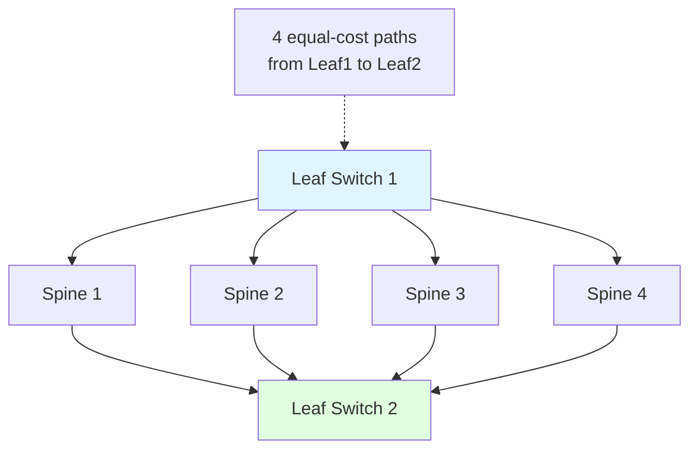

When Leaf1 learns about Leaf2's loopback from all four spines, it receives four routes with identical AS path length, identical MED, identical everything that BGP's selection algorithm considers. Without ECMP, Leaf1 would select one route based on some tiebreaker and ignore the others. With ECMP enabled, Leaf1 installs all four routes in its forwarding table.

When Leaf1 needs to forward a packet to Leaf2, it performs a hash on packet header fields—source IP, destination IP, protocol, and port numbers. This hash selects one of the four next-hops. All packets in the same flow use the same next-hop, maintaining packet ordering. Different flows hash to different next-hops, distributing load across all paths.

This ECMP behavior is critical for AI workloads. During collective operations like all-reduce, traffic patterns are many-to-many with each leaf sending to most or all other leaves simultaneously. ECMP ensures this massive parallel traffic spreads across all spine switches and all links. Without ECMP, selected paths would overload while others sit idle.

ECMP configuration varies by platform. Some switches automatically perform ECMP when multiple equal-cost BGP routes exist. Others require explicit configuration. The number of ECMP paths supported—the maximum number of equal-cost routes that can be installed—also varies. Modern switches typically support at least 64-way ECMP, adequate for even large spine tiers.

## The Data Plane: IP Forwarding with BGP Routes

BGP's control plane populates the routing table, but actual packet forwarding happens in the data plane. Understanding how BGP routes translate to forwarding behavior is essential for understanding network performance.

When BGP installs a route in the routing table, the route includes the destination prefix and the next-hop IP address. For example, "10.0.1.50/32 via 10.255.1.2" means packets destined for 10.0.1.50 should be forwarded toward next-hop 10.255.1.2. The router must then determine which interface connects to 10.255.1.2 and what Ethernet MAC address to use.

This resolution happens through the ARP table (Address Resolution Protocol table) or neighbor discovery. The router maintains a table mapping IP addresses to MAC addresses for directly connected devices. When the forwarding logic needs to send to next-hop 10.255.1.2, it looks up the MAC address for this IP, writes that MAC as the destination in the Ethernet frame, and sends out the appropriate interface.

Modern switches optimize this with hardware forwarding tables. The routing table entries are programmed into ASIC memory, allowing forwarding decisions at line rate. A packet arrives, the switch looks up the destination IP in hardware, determines the next-hop, looks up the next-hop's MAC, rewrites the Ethernet header, and forwards out the appropriate port—all in nanoseconds without CPU involvement.

With ECMP, the hardware forwarding table contains multiple next-hops for a single destination. The ASIC performs the hash on packet headers and selects which next-hop to use in hardware. This per-packet load distribution happens at full line rate. The CPU never sees data packets—it only handles control plane protocols like BGP. This separation enables high performance routing even at terabit scales.

## Route Reflectors: Scaling BGP in Large Networks

A full mesh of BGP sessions doesn't scale. If you have N routers and each must peer with every other router, you need N*(N-1)/2 sessions. With 100 routers, that's 4,950 sessions. With 1,000 routers, it's 499,500 sessions. The configuration complexity and session overhead become unmanageable.

Route reflectors solve this scaling problem. A route reflector is a BGP router with a special role: it receives routes from clients and redistributes them to other clients. Clients only peer with route reflectors, not with each other. This hub-and-spoke topology dramatically reduces the number of sessions.

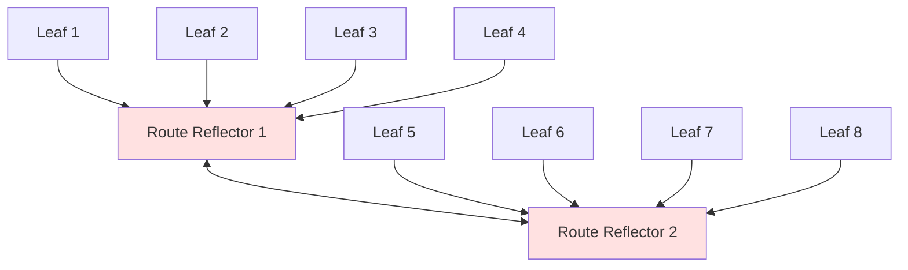

In this example, each leaf peers with one or two route reflectors. The route reflectors peer with each other. When Leaf1 advertises a route to RR1, RR1 reflects this route to all its other clients (Leafs 2-4) and to RR2. RR2 then reflects the route to its clients (Leafs 5-8). Every leaf learns about every other leaf's routes through the route reflectors, but no leaf directly peers with other leaves.

The number of sessions is now linear with the number of leaves rather than quadratic. With 1,000 leaves and four route reflectors, you have 1,000 leaf-to-RR sessions plus a handful of RR-to-RR sessions—approximately 1,000 sessions total instead of 499,500. This is manageable.

Route reflectors can be dedicated devices or spine switches with route reflector functionality enabled. Using spines as route reflectors is common in leaf-spine fabrics—the spines are already connected to all leaves for data forwarding, so using them for BGP sessions as well is natural.

Route reflectors must be carefully deployed. They become critical infrastructure—if all route reflectors fail, BGP routes stop propagating. Redundancy is essential. Typically, multiple route reflectors are deployed, and each leaf peers with at least two. If one route reflector fails, the others continue operation. Sessions to the failed RR are lost, but routes learned through other RRs remain valid.

## BGP Communities: Tagging Routes for Policy

BGP communities provide a mechanism to tag routes with metadata that can be used for policy decisions. A community is a 32-bit value (often written as two 16-bit numbers separated by a colon, like 65000:100) attached to routes. Communities don't affect routing directly but enable flexible policy implementation.

In data centers, communities might tag routes to indicate their source or purpose. Routes originated by leaf switches might be tagged with community 65000:LEAF. Routes learned from external networks might be tagged 65000:EXTERNAL. Spine switches can then implement policies based on these tags—perhaps preferring LEAF-tagged routes over EXTERNAL-tagged routes.

Communities enable automation of complex routing policies without manually configuring policies on every switch. A standardized community scheme can be implemented across the data center, and switches simply match community values to apply appropriate policies. Changes to policy can sometimes be implemented by changing community tags on route advertisements rather than reconfiguring every switch.

Extended communities provide even more flexibility with different types of extended communities for different purposes. Route targets in EVPN are one type of extended community. Other extended community types exist for various purposes. The extensibility of the community mechanism enables new applications without protocol changes.

## Graceful Restart and Non-Stop Routing

BGP routers occasionally need software upgrades or restarts. Without special mechanisms, a router restart means all BGP sessions to that router go down, all routes learned from it are withdrawn, and traffic is disrupted until the router comes back up and BGP sessions reestablish. For critical infrastructure, this disruption is unacceptable.

Graceful restart enables a router to restart while minimizing routing disruption. When a router signals it supports graceful restart, its neighbors know that if the session goes down, they should preserve the routes they learned from it for a grace period rather than immediately withdrawing them. This allows traffic to continue flowing during the restart.

When the restarting router comes back up, it reestablishes BGP sessions and receives all routes again. Its neighbors compare the new routes to the preserved old routes. If routes haven't changed, the transition is hitless. If routes changed, the neighbors update their forwarding tables accordingly. The grace period gives the restarting router time to recover without causing widespread routing changes.

Non-stop routing goes further, allowing a router to maintain forwarding while the control plane restarts. The data plane—the hardware ASICs doing actual packet forwarding—continues operating with its existing forwarding table. The control plane—the software running BGP—restarts. Once BGP reestablishes sessions and rebuilds the routing table, any necessary changes are programmed into the data plane.

These mechanisms are crucial for operating data centers where upgrades and maintenance are routine but downtime is unacceptable. A leaf switch can be upgraded during the day without disrupting training jobs running on servers behind it. Planned maintenance becomes less disruptive, improving overall availability.

## BFD: Faster Failure Detection

BGP keepalives provide failure detection but are slow. Keepalives are sent every 60 seconds by default with a hold time of 180 seconds. This means detecting a failure can take three minutes. For latency-sensitive applications like AI training, three-minute convergence is too slow.

Bidirectional Forwarding Detection (BFD) provides sub-second failure detection. BFD is a lightweight protocol that sends small hello packets very frequently—every 50-300 milliseconds. If BFD doesn't receive expected hellos, it declares the path failed immediately. BGP is configured to treat BFD failure as a reason to tear down the BGP session.

With BFD, failures can be detected in hundreds of milliseconds rather than minutes. When a link fails, BFD detects it, notifies BGP, BGP tears down the session and withdraws routes, and alternative paths are used—all within a second. For applications where every second of disruption matters, BFD is essential.

BFD operates at the network layer, independent of BGP. A single BFD session can monitor a network path for multiple protocols. This separation keeps BFD simple and fast while allowing BGP to focus on route distribution rather than liveness detection. The combination provides both rapid failure detection and sophisticated routing policy.

## Troubleshooting BGP in Data Centers

When BGP isn't working correctly, systematic troubleshooting follows a pattern. Start with the basics and work up to more complex issues.

First, verify BGP sessions are established. Check the output of "show bgp summary" or equivalent commands. If sessions are in any state other than Established, they cannot exchange routes. Common reasons for sessions not establishing include IP connectivity problems, authentication mismatches, AS number misconfigurations, or firewall rules blocking TCP port 179.

If sessions are established but routes aren't being exchanged, check address family configuration. A BGP session can be established for one address family but not negotiated for another. You might have IPv4 unicast working but EVPN not negotiated. Check capability negotiation during session establishment.

Verify routes are being advertised. Check the BGP table on the advertising router to ensure the routes exist locally. Check "show bgp neighbors X advertised-routes" to see what's being sent to a specific neighbor. If routes aren't being advertised, the problem might be route filtering, route-map configuration, or the routes not being present in the local BGP table.

On the receiving side, check if routes are being received but not installed. Routes might appear in the BGP table but not in the routing table if they're not the best path according to BGP's selection algorithm. Compare all received routes for a prefix to understand why one was chosen over others. Check AS path length, LOCAL_PREF, and other attributes.

Verify the forwarding table contains the expected routes. The routing table might have BGP routes installed, but they might not be programmed into hardware forwarding tables due to resource limitations or programming errors. Check platform-specific commands for hardware forwarding table state.

Use packet captures for deep problems. Capture BGP UPDATE messages to see exactly what routes and attributes are being advertised. This reveals subtle issues like incorrect next-hop addresses or missing communities that might not be obvious from show commands.

BGP provides powerful routing for data centers, but this power comes with complexity. Understanding BGP deeply—its control plane mechanisms, route selection process, and interaction with the data plane—is prerequisite for operating modern data center networks. The investment in BGP knowledge pays off in the ability to build, operate, and troubleshoot networks that scale to thousands of switches and millions of endpoints.

# The Complete System: VXLAN + EVPN + BGP Working Together

## Three Layers, One Solution

Modern data center networks are not built from a single technology but from three complementary technologies working in concert. BGP provides the underlay routing, distributing IP reachability information between switches. VXLAN provides the overlay encapsulation, creating virtual Layer 2 networks over the IP underlay. EVPN provides the control plane, distributing MAC address and host information to enable efficient VXLAN forwarding. Each technology has a specific role, and together they create a complete, scalable networking solution.

Understanding how these technologies integrate requires understanding what each layer contributes and how information flows between layers. The underlay and overlay are separate but interdependent. The control plane and data plane serve different functions but must stay synchronized. Misconfiguration at any layer breaks the entire system. Success requires comprehensive understanding of how all three technologies work together.

## The Underlay: BGP Routing Between Switches

The foundation is the physical network—the switches, links, and IP addressing that provides basic connectivity. This is called the underlay. The underlay must be working correctly before any overlay functionality can operate. Think of the underlay as the highway system. Before you can use trucks to deliver goods, the roads must exist and be passable.

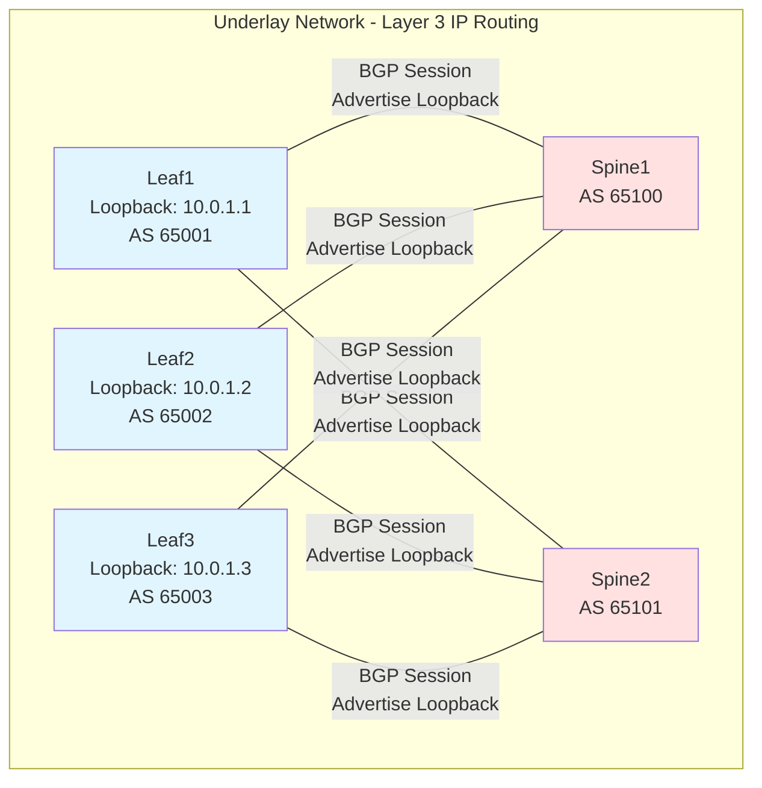

Each leaf switch has a loopback interface with an IP address. These loopbacks serve as stable identifiers—they remain reachable as long as the switch is operational, regardless of which physical links are up. Each leaf advertises its loopback address via BGP to the spine switches. The spines receive these advertisements and redistribute them to all other leaves.

After BGP converges, every leaf knows how to reach every other leaf's loopback address via IP routing. This IP connectivity is the underlay. When Leaf1 sends an IP packet destined for 10.0.1.3 (Leaf3's loopback), the underlay routes this packet: Leaf1 to a spine, spine to Leaf3. The path might go through Spine1 or Spine2 depending on ECMP hashing. Multiple paths exist, providing redundancy and load distribution.

Critically, the underlay knows nothing about VXLANs, VNIs, MAC addresses, or virtual networks. It simply routes IP packets between loopback addresses. This simplicity is deliberate. By keeping the underlay simple and focused on IP routing, we gain the scalability and reliability of proven Layer 3 networking. The complexity of virtual networks exists in the overlay, completely decoupled from the underlay.

## The Overlay: VXLAN Encapsulation

On top of this IP underlay, VXLAN creates virtual Layer 2 networks. Each leaf switch acts as a VTEP (VXLAN Tunnel Endpoint). When a server sends an Ethernet frame, the VTEP encapsulates this frame with VXLAN, UDP, and IP headers. The destination IP address in the outer header is the remote VTEP's loopback address. This encapsulated packet is then routed through the underlay.

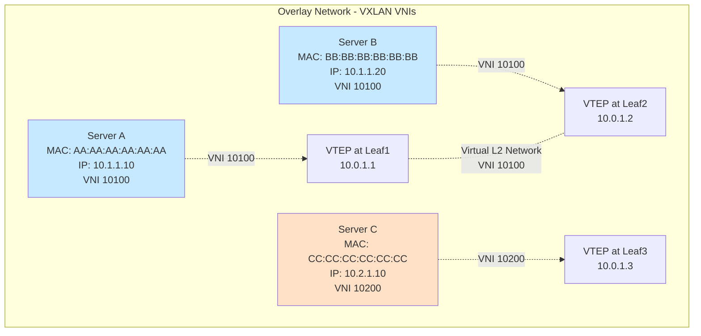

Servers A and B are in VNI 10100—they're in the same virtual network and can communicate at Layer 2. Server C is in VNI 10200—a completely separate virtual network. Even though all three servers might be in the same physical data center, on the same physical network infrastructure, the VNI provides isolation. Traffic in VNI 10100 never crosses into VNI 10200.

When Server A sends a frame to Server B, the frame arrives at VTEP1. VTEP1 looks at the destination MAC address (BB:BB:BB:BB:BB:BB) and determines this MAC is in VNI 10100 behind VTEP2. VTEP1 encapsulates: adds VXLAN header with VNI 10100, adds UDP header, adds IP header with source 10.0.1.1 and destination 10.0.1.2. This packet enters the underlay.

The underlay routes the packet from 10.0.1.1 to 10.0.1.2. It doesn't care what's inside the packet—it's just an IP packet. The packet might flow through Spine1 or Spine2, might take different paths if flows hash differently, but the underlay reliably delivers the packet from source VTEP to destination VTEP.

VTEP2 receives the packet. It recognizes its own loopback IP as the destination. It sees UDP port 4789 and knows this is VXLAN. It removes the outer IP and UDP headers, examines the VXLAN header to see VNI 10100, removes the VXLAN header, and delivers the original Ethernet frame to Server B. From the servers' perspective, they simply exchanged an Ethernet frame. The VXLAN encapsulation is invisible to them.

The separation is complete. The overlay depends on the underlay for IP connectivity but is otherwise independent. You can change underlay routing without affecting overlay VNIs. You can add, remove, or modify VNIs without touching underlay configuration. This separation simplifies operations and enables independent scaling of each layer.

## The Control Plane: EVPN Distributing MAC Information

VXLAN data plane forwarding depends entirely on VTEPs knowing which MACs are located behind which remote VTEPs. Without this knowledge, VTEPs must flood traffic to all possible destinations, which doesn't scale. EVPN provides the control plane that populates VTEP forwarding tables with accurate MAC location information.

EVPN runs over BGP. The same BGP infrastructure that distributes underlay routing information also distributes overlay MAC information. BGP is extended with a new address family—L2VPN EVPN—that carries Ethernet information instead of IP routing information. Leaf switches establish BGP sessions for both IPv4 unicast (for underlay routing) and L2VPN EVPN (for overlay MAC distribution) over the same connections.

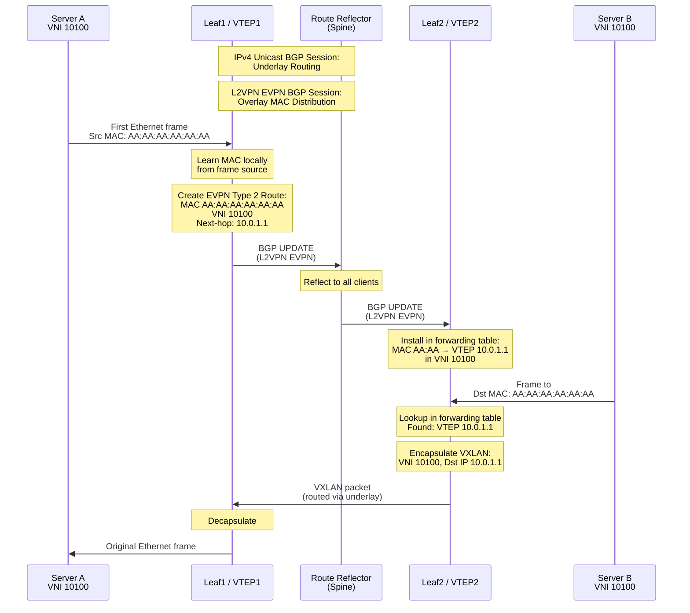

When Server A boots and sends its first frame, Leaf1 learns the source MAC address through standard Ethernet learning. Leaf1 then creates an EVPN Type 2 route advertising this MAC. The route contains the MAC address, the VNI, and sets the BGP next-hop to Leaf1's VTEP IP address. This route is sent via BGP to the route reflector.

The route reflector receives this EVPN route and redistributes it to all other leaves. Leaf2 receives it and installs an entry in its VXLAN forwarding table: MAC AA:AA:AA:AA:AA:AA in VNI 10100 is reachable via VTEP at IP 10.0.1.1. Now when Server B sends traffic to Server A, Leaf2 already knows where to send it. There's no flooding, no delay for learning, no wasted bandwidth.

This is the elegant integration of BGP and EVPN. The same routing protocol that distributes underlay IP reachability also distributes overlay MAC reachability. The same route reflector infrastructure serves both purposes. Operators use the same BGP knowledge and tools for both layers. The control plane is unified even though it serves two distinct functions.

## End-to-End Packet Flow: All Three Layers Together

Let's trace a complete packet flow showing how all three technologies work together. Server A at Leaf1 wants to send an IP packet to Server B at Leaf2. Both are in VNI 10100.

**Initial State:**
Before any traffic flows, EVPN has already distributed MAC information. Leaf1 has advertised Server A's MAC. Leaf2 has advertised Server B's MAC. Both leaves have complete forwarding tables for VNI 10100. The underlay BGP has converged, and all leaves can route to all other leaves' loopback addresses.

**Step 1: Server A Sends a Packet**
Server A wants to send to Server B at IP 10.1.1.20. Server A checks its ARP cache for Server B's MAC address. If not present, it sends an ARP request. With EVPN ARP suppression, Leaf1 intercepts this ARP and replies immediately with Server B's MAC (learned from EVPN Type 2 routes). Server A gets the MAC address without the ARP even leaving Leaf1.

Server A constructs an Ethernet frame: source MAC AA:AA:AA:AA:AA:AA, destination MAC BB:BB:BB:BB:BB:BB, containing an IP packet from 10.1.1.10 to 10.1.1.20. This frame is sent to Leaf1.

**Step 2: VXLAN Encapsulation**
Leaf1 receives the frame. It sees destination MAC BB:BB:BB:BB:BB:BB. It looks up this MAC in its VXLAN forwarding table for VNI 10100. The table entry (populated by EVPN) says this MAC is behind VTEP at IP 10.0.1.2.

Leaf1 performs VXLAN encapsulation. It wraps the original frame with:
- VXLAN header containing VNI 10100
- UDP header with destination port 4789
- IP header with source IP 10.0.1.1 (Leaf1's loopback) and destination IP 10.0.1.2 (Leaf2's loopback)
- Outer Ethernet header for the next hop

**Step 3: Underlay Routing**
The encapsulated packet enters the underlay network. The underlay sees only the outer IP header—source 10.0.1.1, destination 10.0.1.2. Leaf1 looks up 10.0.1.2 in its IP routing table (populated by underlay BGP). The routing table shows multiple equal-cost paths through Spine1 and Spine2.

Leaf1 performs ECMP hashing on the outer headers, selecting Spine1. The packet is forwarded to Spine1. Spine1 receives the packet, looks up destination 10.0.1.2, and forwards toward Leaf2. The packet arrives at Leaf2.

**Step 4: VXLAN Decapsulation**
Leaf2 receives a packet addressed to its loopback IP. It examines the UDP destination port 4789 and recognizes VXLAN traffic. It strips the outer Ethernet, IP, and UDP headers. It examines the VXLAN header, sees VNI 10100, and strips the VXLAN header.

Leaf2 is now left with the original Ethernet frame. It looks at the destination MAC BB:BB:BB:BB:BB:BB, checks which local port connects to this MAC, and forwards the frame out that port.

**Step 5: Delivery**
Server B receives the frame exactly as Server A created it. From Server B's perspective, it simply received an Ethernet frame from a peer on the same Layer 2 network. The VXLAN encapsulation, the underlay routing through spines, the EVPN control plane—all of this is invisible to the servers.

**Return Traffic:**
When Server B responds, the process reverses. Leaf2 encapsulates, the underlay routes from 10.0.1.2 to 10.0.1.1, Leaf1 decapsulates and delivers to Server A. Because EVPN has already distributed all necessary MAC information in both directions, return traffic flows immediately without any learning delays.

## Failure Scenarios: How the System Adapts

Understanding failure handling reveals how robust the three-layer design is. Let's examine different failure scenarios.

**Link Failure Between Leaf and Spine:**
If the link between Leaf1 and Spine1 fails, the underlay detects this immediately. BGP sessions between Leaf1 and Spine1 go down, either detected by keepalives or by BFD if deployed. Leaf1 withdraws routes learned via Spine1 and removes Spine1 from its ECMP next-hop set. All traffic from Leaf1 now uses only Spine2. Because multiple spines exist, this failure is transparent to the overlay. VXLAN traffic continues flowing through remaining paths.

**Spine Switch Failure:**
If Spine1 completely fails, all leaves lose their BGP sessions to Spine1. They remove routes learned from Spine1 and remove Spine1 from ECMP sets. All traffic redistributes across remaining spines. If Spine1 was also acting as a route reflector, EVPN routes from some leaves might temporarily be unavailable to others. However, leaves typically peer with multiple route reflectors precisely to handle this failure case. EVPN routes are redistributed through remaining route reflectors, and overlay operation continues.

**Leaf Switch Failure:**
If Leaf2 fails, its BGP sessions to spines go down. Spines withdraw all routes learned from Leaf2, including both underlay routes (Leaf2's loopback) and EVPN routes (MAC addresses behind Leaf2). These withdrawals propagate to all other leaves. Other leaves remove forwarding entries for MACs that were behind Leaf2. Traffic to Server B now fails because Server B is offline along with its leaf. When Leaf2 comes back online, it reestablishes BGP sessions, readvertises routes, and operation resumes.

**VM Migration:**
When a VM moves from Leaf1 to Leaf2, both leaves briefly see traffic from that VM. Leaf1 had advertised the VM's MAC via EVPN. When Leaf2 sees traffic from this MAC, it learns it locally and advertises its own EVPN route for this MAC. Because Leaf2's route is newer and has equal or better metrics, other VTEPs prefer Leaf2's advertisement. Leaf1, no longer seeing traffic from the VM, ages out its local MAC entry and withdraws its EVPN advertisement. The migration completes with traffic now flowing to the new location.

This failure handling happens automatically through the interaction of BGP control plane updates and VXLAN data plane forwarding. The system self-heals without operator intervention. The robustness comes from the careful integration of the three layers, each handling its responsibilities while adapting to changes reported by other layers.

## Configuration and Automation

Configuring VXLAN+EVPN+BGP requires coordination across all three layers, and manual configuration doesn't scale. Modern deployments use automation extensively. Understanding what needs to be configured helps understand how automation simplifies operations.

For the underlay, each leaf needs: interface IP addresses, loopback IP address, AS number, and BGP neighbor statements for each spine. Spines need similar configuration for neighbors to leaves and other spines. This is repetitive but predictable—configurations follow patterns based on position in the topology.

For VXLAN, each leaf needs: VTEP source interface (typically the loopback), VNI configurations with associated VLANs or bridge domains. This maps VNIs to local ports and determines which traffic belongs to which virtual network.

For EVPN, leaves need: BGP address family configuration enabling L2VPN EVPN, route distinguisher and route target configuration for each VNI. This determines how EVPN routes are tagged and filtered.

Automation tools generate these configurations from a high-level description of desired state. You might specify: "Create VNI 10100 for Tenant A, spanning Leaves 1, 2, and 5." The automation generates all necessary underlay BGP config, VXLAN VNI config, and EVPN route target config for these three leaves. Templates ensure consistency, validation catches errors, and version control tracks changes.

The abstraction level rises above individual switch commands to declarative intent: "These servers should be able to communicate in a virtual Layer 2 network, isolated from other tenants." The automation figures out the detailed configuration required to achieve this intent across the underlay, overlay, and control plane.

This abstraction is what makes large-scale VXLAN+EVPN+BGP deployments practical. The underlying technologies are complex, but automation hides this complexity behind higher-level interfaces. Operators interact with networks through intent rather than through thousands of configuration statements. The automation ensures the three layers are configured consistently and correctly.

## Why This Architecture Wins

The VXLAN+EVPN+BGP architecture dominates modern data center networking not because it's simple—it's not—but because it solves real problems at scale. The three-layer design provides:

**Scalability:** BGP handles hundreds of thousands of routes. VXLAN provides 16 million VNIs. EVPN proactively distributes MAC information without flooding. The architecture scales to the largest data centers.

**Flexibility:** Overlay networks are decoupled from physical infrastructure. Add VNIs without changing underlay. Move workloads without network reconfiguration. Multi-tenancy is native and extensive.

**Performance:** ECMP load distribution uses all links. Direct VXLAN encapsulation is fast. Hardware offload enables line-rate forwarding. The architecture doesn't compromise performance for flexibility.

**Operational Maturity:** BGP is proven at Internet scale. Tools, knowledge, and experience exist. VXLAN and EVPN extend familiar concepts rather than inventing new paradigms. Operations leverage existing expertise.

**Vendor Support:** All major vendors support this architecture. Standards exist. Multi-vendor interoperability is real. Organizations aren't locked to single vendors.

The complexity cost is real. Operating this architecture requires deep networking knowledge. But the alternatives—traditional VLANs, proprietary overlay solutions, or scaled-out Layer 2—all have worse problems. VXLAN+EVPN+BGP is the least-bad solution to very hard problems, and in practice, it works remarkably well.

Understanding these three technologies as an integrated system rather than isolated protocols is essential for successful deployment. The underlay provides the foundation. The overlay provides the flexibility. The control plane provides the intelligence. Together, they create modern data center networking.