# BGP Protocol Deep Dive
## Developer's Implementation Perspective

**Presented by: [Your Name]**  
**Duration: Full Day Session**

---

## Agenda Overview

### Module 1: BGP Fundamentals & Architecture
- BGP Protocol Basics
- BGP Message Types
- FSM (Finite State Machine)
- Session Establishment

### Module 2: Path Attributes & Route Selection
- Mandatory, Optional, Transitive Attributes
- BGP Decision Process
- Route Aggregation & Summarization

### Module 3: Scaling BGP
- iBGP vs eBGP
- Route Reflectors
- Confederations
- BGP Add-Path

### Module 4: Multi-Protocol BGP (MP-BGP)
- Address Family Architecture
- AFI/SAFI Framework
- IPv6 Unicast
- Multicast BGP

### Module 5: L3VPN & Advanced Services
- VPNv4/VPNv6 Architecture
- Route Distinguishers & Route Targets
- PE-CE Routing
- Inter-AS VPN Options

### Module 6: EVPN & Layer 2 Services
- EVPN Fundamentals
- EVPN Route Types
- VXLAN Integration
- Data Center Fabrics

### Module 7: Advanced Features
- BGP Security (TCP-AO, TTL Security)
- Graceful Restart & NSR
- BFD Integration
- BGP FlowSpec

### Module 8: Implementation & Operations
- Performance Optimization
- Troubleshooting
- Best Practices
- Testing Strategies

---

# Module 1: BGP Fundamentals & Architecture

---

## Slide 1: BGP Protocol Fundamentals

### What is BGP?

- **Border Gateway Protocol**: Path vector routing protocol
- **Interdomain Routing**: Routes between Autonomous Systems (AS)
- **Policy-Based**: Rich policy controls for route manipulation
- **Transport**: TCP port 179 (reliable transport)
- **Classless**: Supports CIDR and VLSM
- **Standards**: RFC 4271 (BGP-4), 100+ related RFCs

### Key Characteristics

| Characteristic | Description |
|----------------|-------------|
| Protocol Type | Path Vector (not Link State or Distance Vector) |
| Metric | Multiple attributes, complex decision process |
| Convergence | Slow but stable (path exploration) |
| Updates | Incremental, only changes sent |
| Scalability | Internet-scale (900K+ routes) |
| Sessions | Peer-to-peer TCP connections |

### BGP vs IGP Comparison

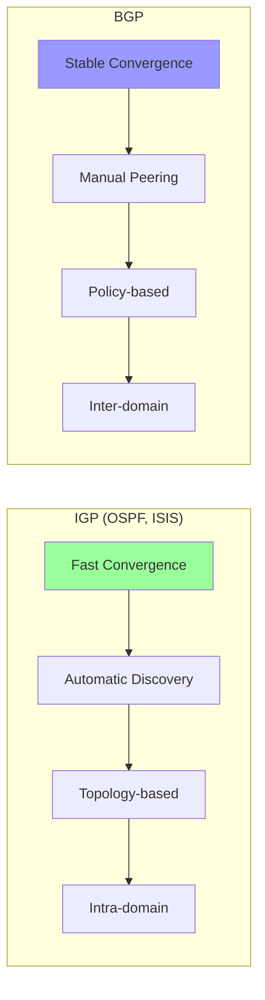

**Speaker Notes:**
BGP is fundamentally different from IGPs. It's a path vector protocol - maintains entire AS path to prevent loops. Unlike OSPF/ISIS which discover neighbors automatically, BGP requires explicit peering configuration. BGP runs over TCP (port 179), providing reliable transport - no need for BGP to handle retransmissions. Key concept: BGP is about reachability and policy, not optimal paths. An AS can manipulate routing based on business relationships (customer, peer, provider). BGP scales to Internet size: 900K+ IPv4 prefixes, 150K+ IPv6 prefixes. Updates are incremental - only send changes, not full table refreshes. Session-oriented: each peer maintains TCP connection. Implementation consideration: BGP is CPU-intensive during convergence, memory-intensive for storing large routing tables. Modern routers have dedicated Route Processor Units (RPU) for BGP.

---

## Slide 2: BGP Architecture - The Big Picture

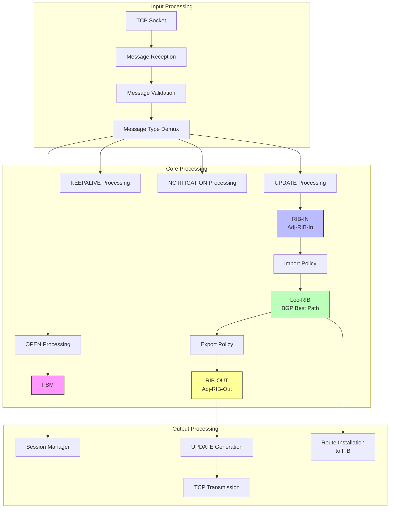

**Speaker Notes:**
BGP architecture centers around three Routing Information Bases (RIBs). Adj-RIB-In: stores routes received from each peer before policy. One per peer. Loc-RIB: local routing table after import policy and best path selection. Single instance. Adj-RIB-Out: stores routes to be sent to each peer after export policy. One per peer. Flow: receive UPDATE → store in Adj-RIB-In → apply import policy → run best path selection → store winner in Loc-RIB → apply export policy → store in Adj-RIB-Out → send UPDATE to peers. FSM manages session state. Implementation: Adj-RIB-In can be massive (full Internet table per peer), some implementations use single shared table with per-peer flags. Loc-RIB requires efficient data structure for best path calculation (typically radix tree or hash table). Modern optimization: route reflectors reduce memory by not storing Adj-RIB-Out for clients. Policy engine must be efficient - regular expressions, prefix lists, AS path filters. Threading: separate threads for input, best path calculation, output for performance.

---

## Slide 3: BGP Message Types

### Message Format - Common Header

```
 0                   1                   2                   3
 0 1 2 3 4 5 6 7 8 9 0 1 2 3 4 5 6 7 8 9 0 1 2 3 4 5 6 7 8 9 0 1
+-+-+-+-+-+-+-+-+-+-+-+-+-+-+-+-+-+-+-+-+-+-+-+-+-+-+-+-+-+-+-+-+
|                                                               |
+                                                               +
|                                                               |
+                                                               +
|                           Marker                              |
+                                                               +
|                                                               |
+-+-+-+-+-+-+-+-+-+-+-+-+-+-+-+-+-+-+-+-+-+-+-+-+-+-+-+-+-+-+-+-+
|          Length               |      Type     |
+-+-+-+-+-+-+-+-+-+-+-+-+-+-+-+-+-+-+-+-+-+-+-+-+
```

### Message Types

| Type | Name | Purpose | Size |
|------|------|---------|------|
| 1 | OPEN | Session establishment | Variable |
| 2 | UPDATE | Route advertisement/withdrawal | Variable |
| 3 | NOTIFICATION | Error reporting | Variable |
| 4 | KEEPALIVE | Session maintenance | 19 bytes |
| 5 | ROUTE-REFRESH | Request route resend | Variable |

### Message Structures

```c
#define BGP_MARKER_SIZE     16
#define BGP_HEADER_SIZE     19
#define BGP_MAX_MESSAGE     4096

// Common header
struct bgp_header {
    uint8_t marker[BGP_MARKER_SIZE];  // All 1's
    uint16_t length;                   // Total including header
    uint8_t type;                      // Message type
};

#define BGP_MSG_OPEN            1
#define BGP_MSG_UPDATE          2
#define BGP_MSG_NOTIFICATION    3
#define BGP_MSG_KEEPALIVE       4
#define BGP_MSG_ROUTE_REFRESH   5
```

**Speaker Notes:**
All BGP messages start with 19-byte header. Marker: 16 bytes of all ones - used for authentication in old BGP versions, now just sync pattern. Length: total message length including header, 19-4096 bytes. Type: message type (1-5). Validation critical: check marker is all ones, length is valid (19-4096), type is recognized. OPEN: negotiates session parameters - BGP version, AS number, hold time, capabilities. Sent after TCP connection established. UPDATE: carries routing information - prefixes to add, withdraw, and path attributes. Can be large (thousands of prefixes per message). NOTIFICATION: error condition, causes session termination. Includes error code and subcode for diagnosis. KEEPALIVE: 19 bytes (just header), sent periodically to maintain session. If no other messages sent, KEEPALIVE must be sent before hold timer expires. ROUTE-REFRESH: requests peer to resend all routes - useful after policy changes, avoids session reset. Implementation: use fixed-size header structure, variable payload. Parse incrementally for large UPDATEs. Network byte order critical - use htons/htonl. Validate all lengths before accessing data.

---

## Slide 4: BGP Finite State Machine (FSM)

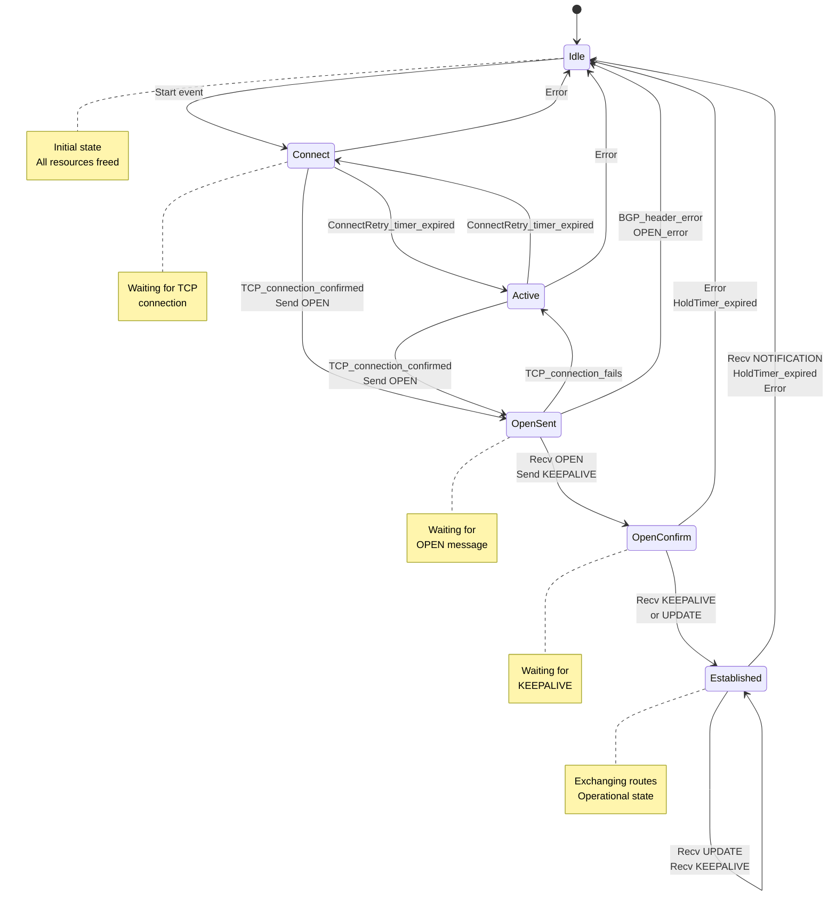

**Speaker Notes:**
BGP FSM has 6 states. Idle: initial state, no resources allocated. Manual admin or auto start moves to Connect. Connect: initiating TCP connection to peer. Success moves to OpenSent. ConnectRetryTimer (default 120s) retries on failure, moves to Active. Active: TCP connection failed, trying to re-establish. Similar to Connect but indicates previous failure. OpenSent: TCP established, OPEN message sent, waiting for peer's OPEN. Validate peer's OPEN parameters - BGP version must be 4, AS number must match expected (or ANY), hold time negotiation. Send KEEPALIVE if parameters acceptable. OpenConfirm: OPEN accepted, waiting for KEEPALIVE. Collision detection happens here - if both sides initiate, higher Router ID wins. Established: fully operational, exchanging UPDATEs. This is the goal state. Implementation: FSM implemented as event-driven state machine. Events: administrative (start, stop), timer (ConnectRetry, Hold, KeepAlive), TCP (connection confirmed, fails), BGP (OPEN received, KEEPALIVE received, UPDATE received, NOTIFICATION received). Each state has allowed events, transitions, and actions. Critical timers: ConnectRetryTimer (default 120s), HoldTimer (negotiated, typically 90s-180s), KeepaliveTimer (HoldTime/3, typically 30s-60s). Any error or NOTIFICATION causes transition back to Idle - BGP tears down completely on errors.

---

## Slide 5: OPEN Message Structure

```
 0                   1                   2                   3
 0 1 2 3 4 5 6 7 8 9 0 1 2 3 4 5 6 7 8 9 0 1 2 3 4 5 6 7 8 9 0 1
+-+-+-+-+-+-+-+-+-+-+-+-+-+-+-+-+-+-+-+-+-+-+-+-+-+-+-+-+-+-+-+-+
|    Version    |     My AS     |           Hold Time           |
+-+-+-+-+-+-+-+-+-+-+-+-+-+-+-+-+-+-+-+-+-+-+-+-+-+-+-+-+-+-+-+-+
|                         BGP Identifier                        |
+-+-+-+-+-+-+-+-+-+-+-+-+-+-+-+-+-+-+-+-+-+-+-+-+-+-+-+-+-+-+-+-+
| Opt Parm Len  |
+-+-+-+-+-+-+-+-+-+-+-+-+-+-+-+-+-+-+-+-+-+-+-+-+-+-+-+-+-+-+-+-+
|                                                               |
|             Optional Parameters (variable)                    |
|                                                               |
+-+-+-+-+-+-+-+-+-+-+-+-+-+-+-+-+-+-+-+-+-+-+-+-+-+-+-+-+-+-+-+-+
```

### OPEN Message Fields

```c
struct bgp_open {
    uint8_t version;          // Must be 4
    uint16_t my_as;           // AS number (or AS_TRANS for 4-byte AS)
    uint16_t hold_time;       // Proposed hold time in seconds
    uint32_t bgp_id;          // BGP Identifier (router ID)
    uint8_t opt_parm_len;     // Length of optional parameters
    uint8_t opt_params[];     // Optional parameters (capabilities)
};

// Capability structure
struct bgp_capability {
    uint8_t type;
    uint8_t length;
    uint8_t value[];
};

// Important capabilities
#define CAP_MP_BGP              1   // Multiprotocol Extensions
#define CAP_ROUTE_REFRESH       2   // Route Refresh
#define CAP_OUTBOUND_FILTER     3   // Outbound Route Filtering
#define CAP_MULTI_ROUTES        4   // Multiple Routes to Destination
#define CAP_EXT_NEXTHOP         5   // Extended Next Hop
#define CAP_GRACEFUL_RESTART    64  // Graceful Restart
#define CAP_4BYTE_AS            65  // 4-byte AS Number
#define CAP_ADD_PATH            69  // ADD-PATH
#define CAP_ENHANCED_RR         70  // Enhanced Route Refresh
```

**Speaker Notes:**
OPEN message negotiates session parameters. Version: must be 4 (BGP-4). Version mismatch causes NOTIFICATION. My AS: sender's AS number. For 4-byte AS, use AS_TRANS (23456) in this field, real AS in capability. Hold Time: proposed hold time, 0 or ≥3 seconds. 0 means no keepalives/hold timer. Actual hold time is minimum of both peers' proposals. Typical: 180s. BGP Identifier: 32-bit identifier, typically router's loopback IP. Must be unique and stable. Used for collision detection and loop prevention. Optional Parameters: encoded as TLV (Type-Length-Value). Most important is Capabilities parameter (type 2). Capabilities advertise support for extensions. MP-BGP (cap 1): support for address families beyond IPv4 unicast. Must advertise AFI/SAFI. Route Refresh (cap 2): support for ROUTE-REFRESH message. 4-byte AS (cap 65): support for AS numbers >65535. Add-Path (cap 69): send multiple paths for same prefix. Implementation: validate OPEN carefully - version must be 4, AS must match expected (or use AS override), hold time must be acceptable. Negotiate capabilities - find common subset. If peer sends unsupported capability, ignore gracefully (don't fail session). Store negotiated parameters per peer. Hold timer starts when OPEN received. Send KEEPALIVE to acknowledge acceptable OPEN.

---

## Slide 6: Session Establishment Sequence

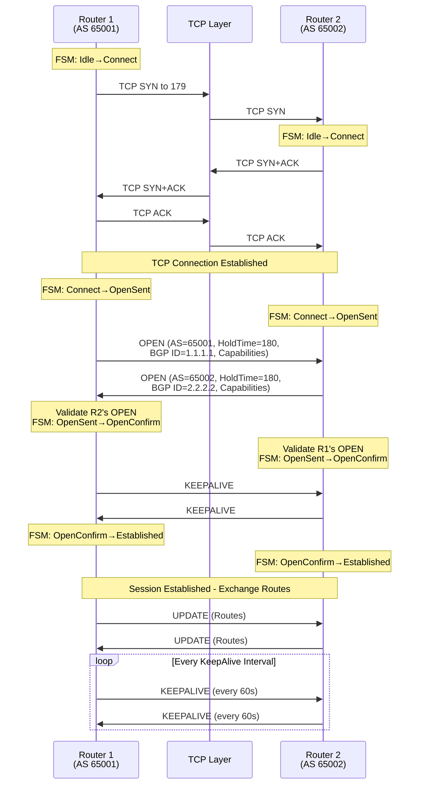

**Speaker Notes:**
BGP session establishment is TCP + BGP handshake. Step 1: TCP 3-way handshake. BGP listens on port 179. Active side connects to port 179. Both sides move FSM to Connect. Step 2: Both send OPEN immediately after TCP established, move to OpenSent. OPEN contains local parameters and capabilities. Step 3: Validate peer's OPEN. Check BGP version (must be 4), AS number (must match expected for eBGP), hold time (must be acceptable), BGP ID (must not be our own). Negotiate capabilities - intersection of supported features. Move to OpenConfirm. Step 4: Send KEEPALIVE to acknowledge acceptable OPEN. Wait for peer's KEEPALIVE. Step 5: Receive KEEPALIVE, move to Established. Start HoldTimer and KeepaliveTimer. Step 6: Exchange UPDATEs with routing information. Send KEEPALIVEs periodically (HoldTime/3). Implementation: handle collision detection - if both sides initiate, higher BGP ID wins, lower closes connection. TCP options: set TCP MD5/AO for security, enable TCP keepalives, adjust buffer sizes for large UPDATEs. Error handling: any validation failure sends NOTIFICATION with specific error code/subcode, tears down session to Idle. Hold timer critical: if no message (UPDATE or KEEPALIVE) received within HoldTime, declare peer dead, move to Idle. Keepalive interval: typically HoldTime/3 to ensure multiple chances before timeout.

---

## Slide 7: UPDATE Message Structure

```
 0                   1                   2                   3
 0 1 2 3 4 5 6 7 8 9 0 1 2 3 4 5 6 7 8 9 0 1 2 3 4 5 6 7 8 9 0 1
+-+-+-+-+-+-+-+-+-+-+-+-+-+-+-+-+-+-+-+-+-+-+-+-+-+-+-+-+-+-+-+-+
|   Withdrawn Routes Length (2 octets)          |
+-+-+-+-+-+-+-+-+-+-+-+-+-+-+-+-+-+-+-+-+-+-+-+-+-+-+-+-+-+-+-+-+
|   Withdrawn Routes (variable)                                 |
+-+-+-+-+-+-+-+-+-+-+-+-+-+-+-+-+-+-+-+-+-+-+-+-+-+-+-+-+-+-+-+-+
|   Total Path Attribute Length (2 octets)      |
+-+-+-+-+-+-+-+-+-+-+-+-+-+-+-+-+-+-+-+-+-+-+-+-+-+-+-+-+-+-+-+-+
|   Path Attributes (variable)                                  |
+-+-+-+-+-+-+-+-+-+-+-+-+-+-+-+-+-+-+-+-+-+-+-+-+-+-+-+-+-+-+-+-+
|   Network Layer Reachability Information (variable)           |
+-+-+-+-+-+-+-+-+-+-+-+-+-+-+-+-+-+-+-+-+-+-+-+-+-+-+-+-+-+-+-+-+
```

### UPDATE Components

```c
struct bgp_update {
    uint16_t withdrawn_len;        // Length of withdrawn routes
    uint8_t withdrawn_routes[];    // Prefixes being withdrawn
    uint16_t total_attr_len;       // Length of path attributes
    uint8_t path_attributes[];     // Path attributes
    uint8_t nlri[];                // Network Layer Reachability Info
};

// NLRI encoding (variable length)
struct nlri_prefix {
    uint8_t prefix_len;            // Prefix length in bits
    uint8_t prefix[];              // Prefix (variable length)
};

// Path attribute format
struct path_attribute {
    uint8_t flags;                 // Optional, Transitive, Partial, Extended
    uint8_t type_code;             // Attribute type
    uint8_t length[];              // 1 or 2 bytes (Extended flag)
    uint8_t value[];               // Attribute value
};

// Attribute flags
#define ATTR_FLAG_OPTIONAL      0x80
#define ATTR_FLAG_TRANSITIVE    0x40
#define ATTR_FLAG_PARTIAL       0x20
#define ATTR_FLAG_EXTENDED      0x10
```

**Speaker Notes:**
UPDATE message advertises or withdraws routes. Three main sections: Withdrawn Routes: prefixes being removed from routing table. Encoded as length-prefix pairs. Length is prefix length in bits, prefix is variable bytes (ceil(length/8)). Path Attributes: characteristics of routes being advertised. Each attribute has flags, type, length, value. Multiple attributes per UPDATE. NLRI: Network Layer Reachability Information - prefixes being advertised. Same encoding as withdrawn routes. All NLRI in UPDATE shares same path attributes. Attribute flags: Optional (0x80): can be unrecognized, Transitive (0x40): passed through even if unrecognized, Partial (0x20): not complete (for transitive), Extended (0x10): 2-byte length field. Implementation: validate lengths carefully - withdrawn_len + total_attr_len + NLRI must equal message length. Parse attributes first, validate all mandatory attributes present. Store in Adj-RIB-In with attributes. NLRI can contain many prefixes - one UPDATE can advertise thousands of routes. Withdrawn routes update must be processed before NLRI - order matters. Empty UPDATE (no withdrawn, no attributes, no NLRI) is invalid. UPDATE with only withdrawn routes is valid (withdrawals only). Path attributes apply to all NLRI in UPDATE - efficient encoding.

---

# Module 2: Path Attributes & Route Selection

---

## Slide 8: Path Attributes Overview

### Attribute Categories

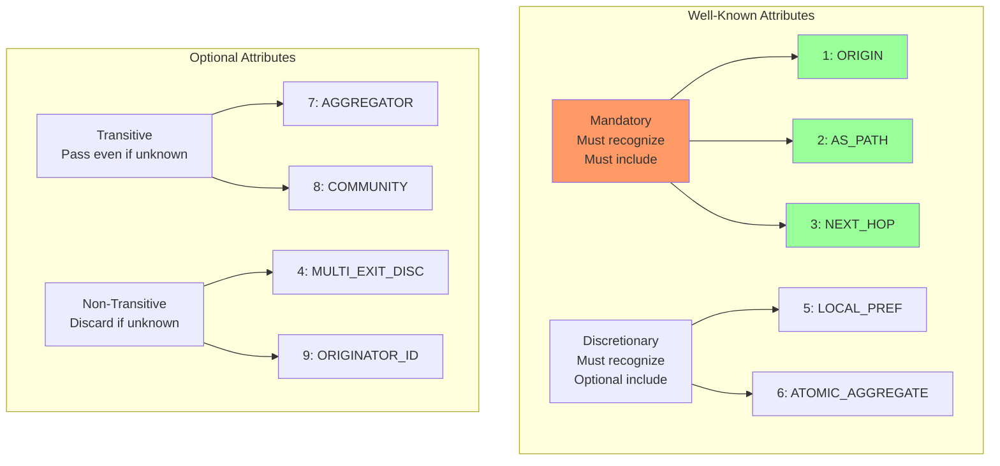

### Complete Attribute List

| Type | Name | Category | Transitive | Purpose |
|------|------|----------|------------|---------|
| 1 | ORIGIN | WK Mandatory | Yes | Route origin (IGP/EGP/Incomplete) |
| 2 | AS_PATH | WK Mandatory | Yes | AS path (loop prevention) |
| 3 | NEXT_HOP | WK Mandatory | Yes | Next hop IP address |
| 4 | MULTI_EXIT_DISC | Optional | No | MED (metric) |
| 5 | LOCAL_PREF | WK Discretionary | Yes | Local preference |
| 6 | ATOMIC_AGGREGATE | WK Discretionary | Yes | Aggregation indicator |
| 7 | AGGREGATOR | Optional | Yes | Aggregator AS and ID |
| 8 | COMMUNITY | Optional | Yes | Community values |
| 9 | ORIGINATOR_ID | Optional | No | Route reflector originator |
| 10 | CLUSTER_LIST | Optional | No | RR cluster path |
| 14 | MP_REACH_NLRI | Optional | No | MP-BGP reachable routes |
| 15 | MP_UNREACH_NLRI | Optional | No | MP-BGP unreachable routes |
| 16 | EXTENDED_COMMUNITY | Optional | Yes | Extended communities |
| 32 | LARGE_COMMUNITY | Optional | Yes | Large communities |

**Speaker Notes:**
Path attributes define route characteristics. Well-known mandatory: must be recognized by all implementations, must be present in every UPDATE. ORIGIN, AS_PATH, NEXT_HOP. Well-known discretionary: must be recognized, but optional to include. LOCAL_PREF (iBGP only), ATOMIC_AGGREGATE. Optional transitive: if unrecognized, accept and pass to others with Partial bit set. AGGREGATOR, COMMUNITY, EXTENDED_COMMUNITY. Optional non-transitive: if unrecognized, silently discard. MED, ORIGINATOR_ID, CLUSTER_LIST. Implementation: attribute parser must handle unknown optional attributes gracefully. Store all attributes per route in Adj-RIB-In. Index by type for fast lookup. Validation: check flags match expected for type. Well-known attributes must not have Optional flag. Extended length flag indicates 2-byte length field. Attribute ordering: some implementations expect specific order, but RFC doesn't mandate. Store in hash table or array indexed by type. Memory: attributes shared across multiple routes pointing to same path - use copy-on-write or reference counting. Critical for scale (millions of routes, thousands of unique paths).

---

## Slide 9: ORIGIN Attribute (Type 1)

### ORIGIN Values

```c
#define ORIGIN_IGP          0   // Learned from IGP (e.g., network statement)
#define ORIGIN_EGP          1   // Learned from EGP (historical)
#define ORIGIN_INCOMPLETE   2   // Unknown or redistributed

struct attr_origin {
    uint8_t flags;          // Well-known mandatory: 0x40
    uint8_t type;           // 1
    uint8_t length;         // 1
    uint8_t origin;         // IGP/EGP/Incomplete
};
```

### ORIGIN in Route Selection

- **Preference**: IGP > EGP > Incomplete
- **Use Case**: IGP (network statement, aggregate)
- **Use Case**: Incomplete (redistribution from IGP)

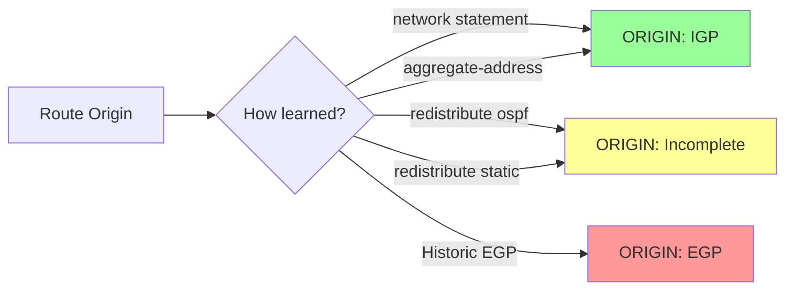

**Speaker Notes:**
ORIGIN attribute indicates how route entered BGP. Three values: IGP (0): route originated internally via network statement or aggregate-address. Most preferred. EGP (1): historical, from Exterior Gateway Protocol. Rarely used today. Incomplete (2): origin unknown, typically from redistribution. Least preferred. Well-known mandatory: must be present in every UPDATE, must be recognized. Single byte value. In BGP decision process, ORIGIN is step 7 - prefer IGP > EGP > Incomplete. Implementation: when originating routes locally (network statement), set ORIGIN to IGP. When redistributing from IGP (OSPF, ISIS), set to Incomplete. When receiving UPDATE, validate ORIGIN present and valid (0-2). Store with route in Adj-RIB-In. During best path calculation, compare ORIGIN only after earlier tie-breakers. Common mistake: treating ORIGIN as major decision factor - actually quite low priority. In practice, AS_PATH and LOCAL_PREF matter much more. ORIGIN primarily distinguishes directly originated routes (IGP) from redistributed routes (Incomplete).

---

## Slide 10: AS_PATH Attribute (Type 2)

### AS_PATH Structure

```c
struct attr_as_path {
    uint8_t flags;          // Well-known mandatory: 0x40
    uint8_t type;           // 2
    uint8_t length;         // Variable
    uint8_t segments[];     // AS_PATH segments
};

// AS_PATH segment
struct as_path_segment {
    uint8_t type;           // AS_SET or AS_SEQUENCE
    uint8_t length;         // Number of ASNs
    uint32_t asn[];         // AS numbers (2 or 4 bytes each)
};

#define AS_SET       1      // Unordered set {AS1, AS2, AS3}
#define AS_SEQUENCE  2      // Ordered sequence [AS1, AS2, AS3]
```

### AS_PATH Purposes

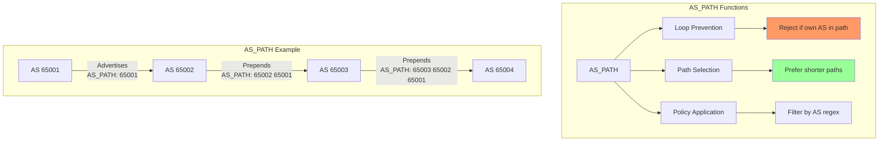

**Speaker Notes:**
AS_PATH is critical attribute serving multiple purposes. Loop prevention: primary purpose. When router receives route with own AS in AS_PATH, reject it (loop detected). No TTL field like IP - AS_PATH provides loop prevention. Path selection: shorter AS_PATH preferred (step 3 in decision process). Each AS added to path makes it one hop longer. Policy: match routes by AS_PATH using regular expressions. Filter or manipulate based on AS. Structure: sequence of segments. AS_SEQUENCE (type 2): ordered list of ASNs, most common. AS_SET (type 1): unordered set, used in aggregation when combining routes with different AS paths. Operations: Prepend: add own AS when advertising to eBGP peer. Placed at beginning. Multiple prepends possible for path manipulation (make path less attractive). iBGP: AS_PATH unchanged within AS - don't prepend. Aggregation: if combining routes with different AS_PATHs, create AS_SET. 4-byte AS support: AS numbers can be 2 bytes (0-65535) or 4 bytes (0-4294967295). Encode as 4-byte if negotiated in OPEN capability. Implementation: store as linked list or array. Validate length matches number of ASNs. Check for loops during UPDATE processing. Efficient comparison for best path - cache length. AS_PATH length is count of AS_SEQUENCE segments only, not AS_SET.

---

## Slide 11: NEXT_HOP Attribute (Type 3)

### NEXT_HOP Attribute

```c
struct attr_next_hop {
    uint8_t flags;          // Well-known mandatory: 0x40
    uint8_t type;           // 3
    uint8_t length;         // 4 (IPv4 address)
    uint32_t next_hop;      // Next hop IP address
};
```

### NEXT_HOP Behavior

```mermaid
graph LR
    subgraph "eBGP Scenario"
        R1[Router A<br/>192.168.1.1] -->|eBGP| R2[Router B<br/>192.168.1.2]
        R2 -->|eBGP<br/>NH=192.168.1.2| R3[Router C]
    end
    
    subgraph "iBGP Scenario"
        R4[Router D<br/>10.1.1.1] -->|eBGP<br/>NH=10.1.1.1| R5[Router E<br/>10.1.1.2]
        R5 -->|iBGP<br/>NH=10.1.1.1<br/>(unchanged)| R6[Router F]
    end
    
    subgraph "Next-hop-self"
        R7[Router G] -->|eBGP| R8[Router H<br/>10.2.2.1]
        R8 -->|iBGP<br/>NH=10.2.2.1<br/>next-hop-self| R9[Router I]
    end
    
    style R2 fill:#9f9
    style R5 fill:#ff9
    style R8 fill:#9f9
```

**Speaker Notes:**
NEXT_HOP specifies where to forward packets for this route. Critical: NEXT_HOP must be reachable via IGP, otherwise route is unusable. eBGP behavior: change NEXT_HOP to self when advertising to eBGP peer. Route learned with NH=X, advertised with NH=own IP. iBGP behavior: DO NOT change NEXT_HOP by default. Preserve original NEXT_HOP from eBGP peer. This allows optimal routing (no hairpinning through border routers). Problem: if iBGP peer can't reach NEXT_HOP via IGP, route is unusable. Solution: next-hop-self command forces NH change to self on iBGP. Multi-access networks: if eBGP peers on same LAN, keep original NH for efficiency (third-party next-hop). Implementation: validate NH is valid unicast IP. Store with route. Before installing in Loc-RIB, verify NH reachable via IGP recursive lookup. If IGP route to NH disappears, route becomes unusable (keep in Adj-RIB-In, remove from Loc-RIB). IGP tracking: maintain mapping of NHs to IGP next-hops. When IGP changes, re-evaluate all BGP routes using that NH. Performance: nexthop tracking table indexed by unique NHs. Many BGP routes share same NH - efficient group tracking. Common issue: iBGP peers can't reach each other's NHs - always use next-hop-self or ensure full IGP connectivity.

---

## Slide 12: LOCAL_PREF Attribute (Type 5)

### LOCAL_PREF Attribute

```c
struct attr_local_pref {
    uint8_t flags;          // Well-known discretionary: 0x40
    uint8_t type;           // 5
    uint8_t length;         // 4
    uint32_t local_pref;    // Preference value (default 100)
};
```

### LOCAL_PREF Usage

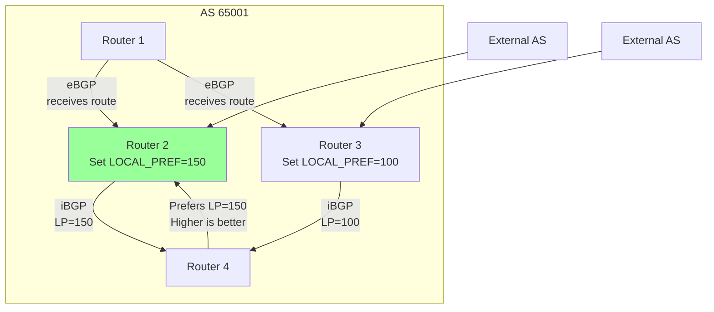

**Speaker Notes:**
LOCAL_PREF indicates route preference within an AS. Higher value = more preferred. Default: 100. Well-known discretionary: must be recognized, optional to include. Only used in iBGP: never sent to eBGP peers. Automatically stripped when advertising to eBGP. Scope: local to AS. Only affects outbound traffic (which exit point to use). Purpose: influence path selection within AS. Set based on business relationships - prefer customer routes over peer routes over provider routes. Typical values: Customer routes: LOCAL_PREF=200, Peer routes: LOCAL_PREF=150, Provider routes: LOCAL_PREF=100 (default). In BGP decision process: step 2, very high priority (only WEIGHT is higher, but WEIGHT is Cisco-specific non-standard). Implementation: when receiving from eBGP, attach LOCAL_PREF (default 100 or per-policy). Propagate unchanged in iBGP. Never send to eBGP. Store with route in Adj-RIB-In. During best path, compare early (step 2). Common use: set LOCAL_PREF on inbound from eBGP using route-maps. Match on prefix, AS_PATH, community, etc. Powerful policy tool. Best practice: use consistent LOCAL_PREF values across organization. Document policy: which ranges for which purposes. Higher LOCAL_PREF wins: 200 > 100.

---

## Slide 13: MED Attribute (Type 4)

### MULTI_EXIT_DISC (MED) Attribute

```c
struct attr_med {
    uint8_t flags;          // Optional non-transitive: 0x80
    uint8_t type;           // 4
    uint8_t length;         // 4
    uint32_t med;           // Metric value (lower is better)
};
```

### MED Behavior

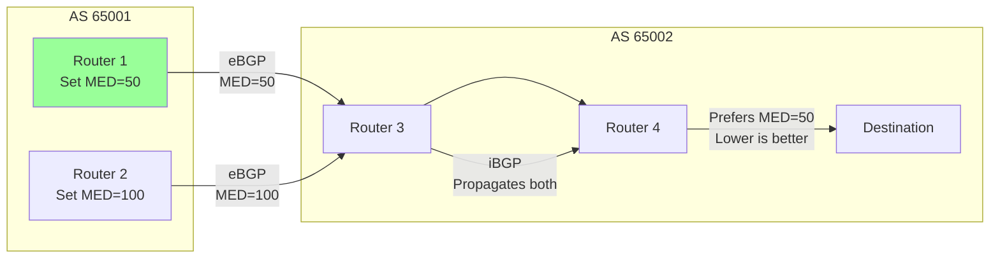

### MED Comparison Rules

- Only compared between routes from same AS
- Lower MED is better
- Absent MED treated as 0 (most preferred)
- Optional non-transitive: not propagated beyond neighboring AS

**Speaker Notes:**
MED (Multi-Exit Discriminator) suggests which entry point neighbor AS should use. Sent to adjacent AS to influence their inbound traffic. Lower MED = better. Optional non-transitive: receiving AS may ignore. Not propagated beyond immediate neighbor. Scope: one AS suggesting to neighbor. Affects inbound traffic to origin AS. Asymmetric with LOCAL_PREF: MED influences neighbors, LOCAL_PREF influences own AS. Comparison rule critical: only compare MEDs from same AS. Route from AS 65001 with MED=50 not compared to route from AS 65002 with MED=100 - different origin ASs. Decision process: step 6, relatively low priority. Implementation: when receiving from eBGP, store MED with route. If absent, treat as 0. When advertising to eBGP, attach MED if desired (typically IGP metric to route). Strip MED when advertising to third AS (optional non-transitive). During best path, only compare if routes from same AS (same leftmost AS in AS_PATH). Deterministic MED: configuration option to compare MEDs more consistently. Without it, comparison depends on arrival order. Best practice: use MED to influence inbound traffic. Set to IGP metric or fixed values. Document policy. Be aware neighbor might ignore. MED wars: avoid configurations where ASs mutually influence each other causing oscillation. Common values: set MED to IGP metric, or use fixed values (10, 20, 30) based on link preference.

---

## Slide 14: COMMUNITY Attribute (Type 8)

### COMMUNITY Attribute

```c
struct attr_community {
    uint8_t flags;          // Optional transitive: 0xC0
    uint8_t type;           // 8
    uint8_t length;         // Variable (multiple of 4)
    uint32_t communities[]; // Community values
};

// Community format: AS:Value (each 16 bits)
#define COMMUNITY_MAKE(as, val) (((as) << 16) | (val))

// Well-known communities
#define COMMUNITY_NO_EXPORT         0xFFFFFF01  // Do not advertise to eBGP
#define COMMUNITY_NO_ADVERTISE      0xFFFFFF02  // Do not advertise to any peer
#define COMMUNITY_NO_EXPORT_SUBCONFED 0xFFFFFF03 // Do not export outside confederation
#define COMMUNITY_LOCAL_AS          0xFFFFFF03  // Same as above
```

### Community Usage

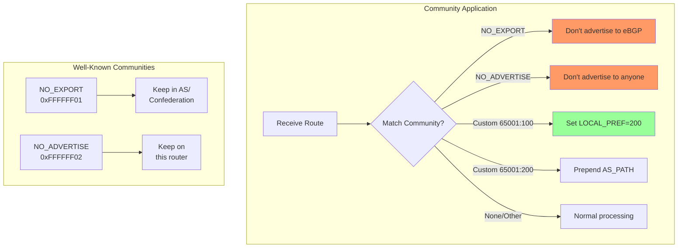

**Speaker Notes:**
COMMUNITY is powerful tagging mechanism for grouping routes and applying policies. Optional transitive: passed through multiple ASs. Format: 32-bit value, typically written AS:Value (each 16 bits). Example: 65001:100 means AS 65001, value 100. Can attach multiple communities to single route. Well-known communities: NO_EXPORT (0xFFFFFF01): do not advertise to eBGP peers. Used to keep routes within AS or confederation. NO_ADVERTISE (0xFFFFFF02): do not advertise to any peer (eBGP or iBGP). Route stays on receiving router. NO_EXPORT_SUBCONFED: do not export outside sub-confederation. Usage patterns: Color routes: tag routes at ingress based on source. Example: customer routes tagged 65001:100, peer routes 65001:200. Apply policy: match communities and perform actions. Example: if community 65001:100, set LOCAL_PREF=200. Signaling: downstream AS attaches community to request upstream action. Example: community 65001:prepend-twice means "prepend your AS twice". Implementation: store as ordered list or set per route. Support additive (add to existing), replace (replace all). During policy processing, match on community using exact match or regex. Propagate communities: must be explicitly configured, not automatic. Memory: store unique community lists, routes reference them (shared storage). Best practice: document community scheme. Use consistent AS:Value ranges. Publish externally if offering community-based controls to customers. Extended communities (type 16): 8-byte communities for more complex signaling (VPN, QoS).

---

## Slide 15: BGP Decision Process (Best Path Selection)

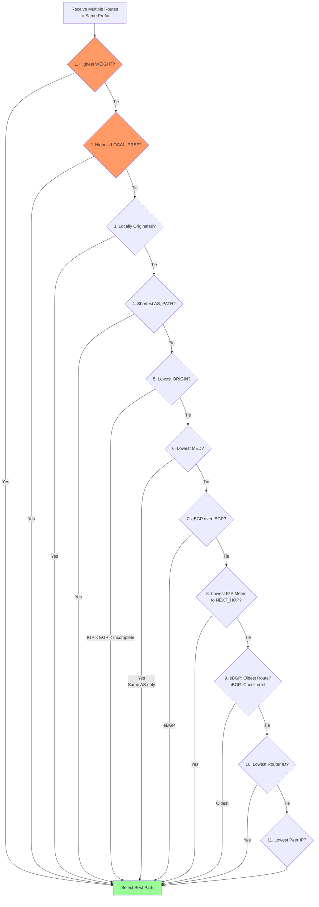

### Decision Process Steps

| Step | Criterion | Description | Scope |
|------|-----------|-------------|-------|
| 1 | WEIGHT | Cisco-specific, highest wins | Local only |
| 2 | LOCAL_PREF | Higher wins | AS-wide |
| 3 | Locally Originated | Prefer local (network/aggregate) | Local only |
| 4 | AS_PATH Length | Shorter wins | AS-wide |
| 5 | ORIGIN | IGP > EGP > Incomplete | AS-wide |
| 6 | MED | Lower wins (same AS only) | Between ASs |
| 7 | Path Type | eBGP > iBGP | Local only |
| 8 | IGP Metric | Lower metric to NH | AS-wide |
| 9 | Age | Oldest wins (stability) | Local only |
| 10 | Router ID | Lowest wins | Local only |
| 11 | Peer IP | Lowest wins (final tie-break) | Local only |

**Speaker Notes:**
BGP decision process selects single best path from multiple routes to same prefix. Deterministic: always produces same result for given inputs. Steps executed in order, first difference wins. Step 1 WEIGHT: Cisco proprietary, not in RFC. Higher better. Local to router. Step 2 LOCAL_PREF: AS-wide preference. Higher better. Most important standard attribute for policy. Step 3 Locally originated: prefer routes from local network statements or aggregates over learned routes. Step 4 AS_PATH length: shorter path preferred. Count AS_SEQUENCE segments only, not AS_SET. Step 5 ORIGIN: IGP (0) > EGP (1) > Incomplete (2). Step 6 MED: lower better, only between routes from same AS. Step 7 eBGP vs iBGP: prefer external over internal (shorter path to exit). Step 8 IGP metric: lowest cost to NEXT_HOP via IGP. Step 9 Route age: oldest route preferred (stability). Step 10 Router ID: lowest BGP router ID wins. Step 11 Peer address: final tie-breaker, lowest peer IP. Implementation: compare routes pairwise or sort list using comparison function. Early exit on first difference. Cache comparison results for unchanged attributes. Best path stored in Loc-RIB, marked for advertisement. When best path changes, trigger UPDATE generation. Critical: MED comparison only between same-AS routes - implementation must track origin AS. IGP metric requires IGP route lookup - maintain nexthop tracking. Common issue: MED non-determinism without "bgp deterministic-med" configuration - route arrival order affects selection.

---

## Slide 16: BGP Decision Process Implementation

```c
// Route structure with all attributes
struct bgp_route {
    struct prefix prefix;
    struct bgp_peer *peer;
    
    // Attributes
    uint32_t weight;                // Cisco-specific
    uint32_t local_pref;
    uint8_t origin;
    struct as_path *as_path;
    uint32_t next_hop;
    uint32_t med;
    bool locally_originated;
    bool ebgp;
    uint32_t igp_metric;            // To next-hop
    time_t received_time;
    
    struct bgp_community *communities;
    // ... other attributes
};

int bgp_route_compare(struct bgp_route *r1, struct bgp_route *r2) {
    // Step 1: WEIGHT (higher is better)
    if (r1->weight != r2->weight)
        return r2->weight - r1->weight;  // Higher wins
    
    // Step 2: LOCAL_PREF (higher is better)
    if (r1->local_pref != r2->local_pref)
        return r2->local_pref - r1->local_pref;
    
    // Step 3: Locally originated
    if (r1->locally_originated != r2->locally_originated)
        return r1->locally_originated ? -1 : 1;
    
    // Step 4: AS_PATH length (shorter is better)
    uint32_t len1 = as_path_length(r1->as_path);
    uint32_t len2 = as_path_length(r2->as_path);
    if (len1 != len2)
        return len1 - len2;  // Shorter wins
    
    // Step 5: ORIGIN (IGP < EGP < Incomplete)
    if (r1->origin != r2->origin)
        return r1->origin - r2->origin;  // Lower value wins
    
    // Step 6: MED (lower is better, same AS only)
    if (should_compare_med(r1, r2)) {
        uint32_t med1 = r1->med;
        uint32_t med2 = r2->med;
        if (med1 != med2)
            return med1 - med2;  // Lower wins
    }
    
    // Step 7: eBGP over iBGP
    if (r1->ebgp != r2->ebgp)
        return r1->ebgp ? -1 : 1;
    
    // Step 8: IGP metric to next-hop (lower is better)
    if (r1->igp_metric != r2->igp_metric)
        return r1->igp_metric - r2->igp_metric;
    
    // Step 9: Oldest route (eBGP only)
    if (r1->ebgp && r2->ebgp) {
        if (r1->received_time != r2->received_time)
            return r1->received_time - r2->received_time;  // Older wins
    }
    
    // Step 10: Router ID (lower is better)
    if (r1->peer->router_id != r2->peer->router_id)
        return r1->peer->router_id - r2->peer->router_id;
    
    // Step 11: Peer address (lower is better)
    return r1->peer->peer_addr - r2->peer->peer_addr;
}

void calculate_best_path(struct bgp_table *table, struct prefix *pfx) {
    struct list *routes = get_routes_for_prefix(table, pfx);
    
    if (list_empty(routes))
        return;
    
    // Find best path using comparison function
    struct bgp_route *best = list_first(routes);
    
    for each route in routes {
        if (bgp_route_compare(route, best) < 0)
            best = route;
    }
    
    // Install in Loc-RIB
    install_best_path(table, pfx, best);
    
    // Trigger UPDATE generation if changed
    if (best != previous_best)
        schedule_update_generation(table, pfx);
}

bool should_compare_med(struct bgp_route *r1, struct bgp_route *r2) {
    // Only compare MED if routes from same AS
    // Check leftmost AS in AS_PATH
    uint32_t as1 = as_path_leftmost(r1->as_path);
    uint32_t as2 = as_path_leftmost(r2->as_path);
    
    return (as1 == as2);
}

uint32_t as_path_length(struct as_path *path) {
    // Count only AS_SEQUENCE segments
    uint32_t length = 0;
    
    for each segment in path {
        if (segment->type == AS_SEQUENCE)
            length += segment->length;
        // AS_SET counts as 1
        else if (segment->type == AS_SET)
            length += 1;
    }
    
    return length;
}
```

**Speaker Notes:**
Implementation requires careful comparison function respecting all steps in order. Return negative if r1 better than r2, positive if r2 better, zero if tie (continue to next step). Critical details: WEIGHT and LOCAL_PREF: higher values win, return r2-r1. AS_PATH and IGP metric: lower values win, return r1-r2. MED comparison: only between same AS, check leftmost AS in AS_PATH match. AS_PATH length: count only AS_SEQUENCE segments, AS_SET counts as 1. IGP metric: requires lookup in IGP table - maintain nexthop tracking structure updated by IGP. Oldest route: only for eBGP routes, provides stability. Performance: use efficient comparison, early exit on first difference. Cache results where possible (AS_PATH length). Best path calculation triggered by: new route received, route withdrawn, attribute change, IGP metric change to nexthop. Optimization: group routes by prefix in radix tree or hash table. When any route changes, recalculate best for that prefix only. Memory: keep all routes in Adj-RIB-In, mark one as best in Loc-RIB. Don't delete non-best routes - needed if best path fails. Deterministic MED: without special handling, MED comparison can be non-deterministic. Configuration option "bgp deterministic-med" groups routes by AS before comparison.

---

# Module 3: Scaling BGP

---

## Slide 17: iBGP vs eBGP

### eBGP (External BGP)

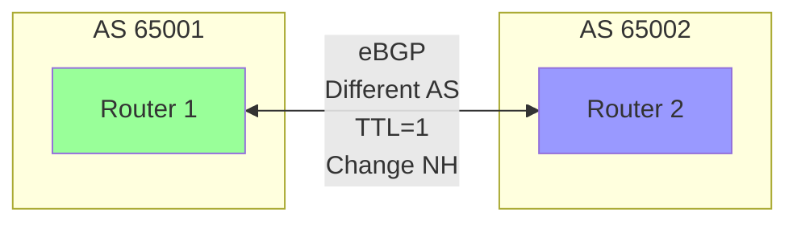

### iBGP (Internal BGP)

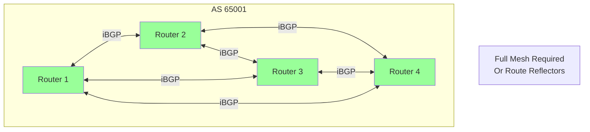

### Key Differences

| Aspect | eBGP | iBGP |
|--------|------|------|
| AS Numbers | Different | Same |
| Next Hop | Changed to self | Unchanged (usually) |
| AS_PATH | Prepend own AS | Unchanged |
| LOCAL_PREF | Not sent | Propagated |
| MED | Compared (same AS) | Not compared |
| TTL | 1 (directly connected) | 255 (multi-hop) |
| Topology | One hop (usually) | Full mesh or RR |
| Loop Prevention | AS_PATH | Split horizon (no iBGP→iBGP) |

**Speaker Notes:**
eBGP and iBGP behave very differently despite using same protocol. eBGP: between different ASs. Neighbors typically one hop apart. TTL=1 by default (security). AS_PATH modified: prepend own AS when sending. NEXT_HOP changed to self. Used for inter-AS routing, Internet connectivity. iBGP: within same AS. Neighbors can be multiple hops apart (uses IGP for reachability). TTL=255 (multi-hop okay). AS_PATH unchanged within AS. NEXT_HOP preserved from eBGP border router (unless next-hop-self). Used to propagate external routes within AS. Critical difference - loop prevention: eBGP uses AS_PATH (reject if own AS present). iBGP uses split horizon: routes learned via iBGP not advertised to other iBGP peers. This requires full mesh or route reflectors. Full mesh: N routers need N*(N-1)/2 sessions. Doesn't scale beyond ~10-20 routers. Route reflectors or confederations required for scale. Implementation: detect eBGP vs iBGP by comparing AS numbers. Apply appropriate rules: eBGP: prepend AS_PATH, change NH, decrement TTL. iBGP: don't modify AS_PATH, preserve NH, don't propagate iBGP routes to iBGP. Configuration: explicitly specify peer type or auto-detect from AS numbers. Common issues: iBGP without full mesh = missing routes. iBGP without proper NH reachability = unusable routes. Use next-hop-self or route reflectors.

---

## Slide 18: Full Mesh Problem & Route Reflectors

### Full Mesh Scaling Problem

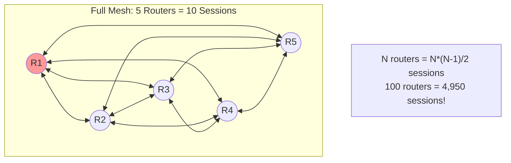

### Route Reflector Solution

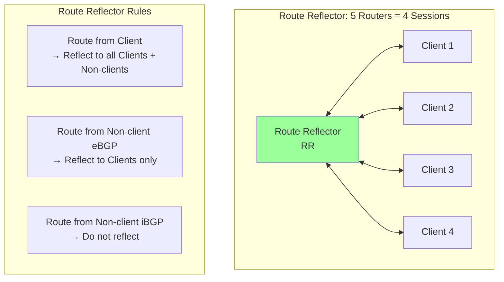

### Route Reflector Attributes

```c
// ORIGINATOR_ID (Type 9)
struct attr_originator_id {
    uint8_t flags;          // Optional non-transitive: 0x80
    uint8_t type;           // 9
    uint8_t length;         // 4
    uint32_t originator_id; // Router ID of route originator
};

// CLUSTER_LIST (Type 10)
struct attr_cluster_list {
    uint8_t flags;          // Optional non-transitive: 0x80
    uint8_t type;           // 10
    uint8_t length;         // Variable (multiple of 4)
    uint32_t cluster_ids[]; // List of cluster IDs
};
```

**Speaker Notes:**
Full mesh iBGP doesn't scale: N routers require N*(N-1)/2 BGP sessions. 100 routers = 4,950 sessions. Each router maintains full Adj-RIB-In/Out per peer. Memory and CPU prohibitive. Route reflectors solve this: designate some routers as RRs, others as clients. Clients only peer with RRs, not each other. RR reflects routes between clients. Scaling: 100 clients + 2 RRs = 102 sessions total (vs 4,950). Route reflection rules: Route from client → reflect to all other clients + non-client iBGP peers + eBGP peers. Route from non-client iBGP → reflect to clients only (not other non-clients, that's regular iBGP). Route from eBGP → reflect to clients. Loop prevention: ORIGINATOR_ID attribute stores original router ID. If router receives route with own router ID in ORIGINATOR_ID, reject (loop). CLUSTER_LIST stores cluster IDs traversed. If RR sees own cluster ID in list, reject (inter-cluster loop). Implementation: configure routers as RR or client. RR maintains list of clients. Apply reflection rules based on peer type. Add ORIGINATOR_ID when first reflecting (if not present). Add own cluster ID to CLUSTER_LIST when reflecting. Check for loops before accepting. Hierarchy: can have multiple RR layers. Clusters can peer for redundancy. Best practice: use RR pairs for redundancy. All RRs in cluster should have same clients. Configure unique cluster IDs per cluster. Common topology: core RRs serving edge routers as clients.

---

## Slide 19: Confederations

### Confederation Architecture

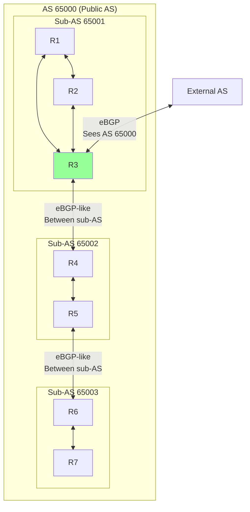

### Confederation Concepts

- **Public AS**: AS number seen externally (65000)
- **Member AS**: Internal sub-AS numbers (65001, 65002, 65003)
- **Between sub-AS**: eBGP-like behavior (prepend AS, change NH)
- **Within sub-AS**: iBGP behavior (full mesh or RR)
- **To external**: Show only public AS, hide member ASs

### AS_PATH in Confederations

```c
// AS_CONFED_SEQUENCE (Type 3): Confederation path
// AS_CONFED_SET (Type 4): Confederation set

struct as_path_confed {
    uint8_t type;           // AS_CONFED_SEQUENCE or AS_CONFED_SET
    uint8_t length;         // Number of member ASs
    uint32_t member_as[];   // Member AS numbers
};

// Example AS_PATH with confederation:
// [AS_CONFED_SEQUENCE: 65002 65001] [AS_SEQUENCE: 65000 64500]
// Member path hidden from external peers
```

**Speaker Notes:**
Confederations divide single AS into multiple sub-ASs. Alternative to route reflectors for scaling iBGP. Concept: one public AS number visible externally, multiple internal member AS numbers. Within member AS: use iBGP (full mesh or RR). Between member ASs: use eBGP-like protocol - prepend AS_PATH, change NH, but don't reset attributes like eBGP. To external peers: present single public AS, hide internal structure. Benefits: simpler than RR (no special attributes), easier troubleshooting (can see sub-AS path), more granular policy between sub-ASs. Drawbacks: requires AS number assignment for each sub-AS, complex configuration, less common than RR. AS_PATH handling: use AS_CONFED_SEQUENCE for member AS path (hidden from external). Use AS_SEQUENCE for external AS path (visible). When advertising externally: strip AS_CONFED_SEQUENCE, show only public AS in AS_SEQUENCE. AS_PATH length: confederation segments don't count in best path selection. Loop prevention: confederation segments provide loop detection within confederation. Implementation: configure public AS and member AS numbers. Detect confederation peers vs external peers. Apply appropriate rules: confederation eBGP between member ASs, regular iBGP within, regular eBGP to external. Maintain both confederation path and external path. Strip confederation segments when advertising externally. Common use: large service providers dividing network into regions, each region is member AS. Allows some eBGP-like attributes (like MED) to work between regions.

---

## Slide 20: ADD-PATH Capability

### ADD-PATH Concept

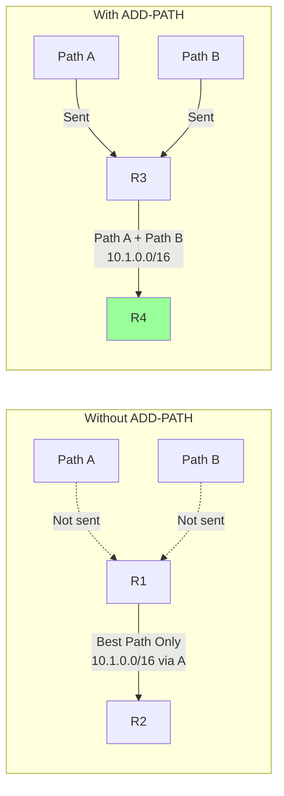

### ADD-PATH Benefits

- **Multipath**: Receive multiple paths, enable ECMP
- **Backup Paths**: Fast convergence if best path fails
- **Path Diversity**: See all paths, not just best
- **Optimal Routing**: Each router can choose best for its location

### ADD-PATH Capability Structure

```c
// ADD-PATH Capability (Type 69)
struct cap_add_path {
    uint8_t type;           // 69
    uint8_t length;         // Variable
    struct {
        uint16_t afi;       // Address Family
        uint8_t safi;       // Subsequent Address Family
        uint8_t send_receive; // Send/Receive capability
    } tuples[];
};

#define ADD_PATH_RECEIVE    0x01
#define ADD_PATH_SEND       0x02
#define ADD_PATH_BOTH       0x03

// Path Identifier in UPDATE
struct nlri_add_path {
    uint32_t path_id;       // Unique path identifier
    uint8_t prefix_len;
    uint8_t prefix[];
};
```

### ADD-PATH Implementation

```c
struct bgp_route_add_path {
    uint32_t path_id;           // Unique ID for this path
    struct bgp_route *route;
    struct list *nlri_add_path; // NLRI with path IDs
};

void advertise_with_add_path(struct bgp_peer *peer, struct prefix *pfx) {
    if (!peer->cap_add_path_send)
        return;
    
    // Get all paths to advertise (not just best)
    struct list *paths = get_eligible_paths_for_advertisement(pfx);
    
    // Assign unique path IDs
    uint32_t path_id = 1;
    for each path in paths {
        path->path_id = path_id++;
    }
    
    // Build UPDATE with path IDs
    struct bgp_update *update = create_update();
    for each path in paths {
        add_nlri_with_path_id(update, path->prefix, path->path_id);
        add_path_attributes(update, path);
    }
    
    send_update(peer, update);
}

void process_add_path_update(struct bgp_peer *peer, struct bgp_update *upd) {
    for each nlri in update {
        uint32_t path_id = nlri->path_id;
        
        // Store using (prefix, path_id) as key
        struct bgp_route *route = find_or_create_route(nlri->prefix, path_id);
        
        update_route_attributes(route, update->attributes);
        
        // Run best path selection across all path IDs
        calculate_best_path_add_path(nlri->prefix);
    }
}
```

**Speaker Notes:**
Standard BGP advertises only best path per prefix. Peer can't see alternative paths. ADD-PATH capability (RFC 7911) allows advertising multiple paths per prefix. Capability negotiation: during OPEN, indicate support for sending/receiving additional paths per AFI/SAFI. Path Identifier: 4-byte unique ID prepended to each NLRI in UPDATE. Identifies which path this advertisement refers to. Enables multiple advertisements for same prefix with different path IDs. Benefits: Multipath/ECMP: route reflector can send multiple paths to clients, clients install all for ECMP. Faster convergence: clients have backup paths ready. Path diversity: see paths hidden by RR. Optimal routing: clients choose best path for their location, not RR's location. Use cases: route reflectors sending diverse paths to clients, eBGP multipath, shadow route reflectors. Implementation: negotiate capability in OPEN. Assign unique path IDs to routes (typically sequential). Store routes indexed by (prefix, path_id) instead of just prefix. Modify UPDATE encoding to include path IDs in NLRI. During best path selection, consider all path IDs, can install multiple in Loc-RIB if multipath enabled. Memory overhead: storing multiple paths per prefix. Configuration: enable per neighbor, per address family. Specify number of paths to advertise (e.g., advertise 3 best paths). Common values: 2-4 paths sufficient for most use cases. Best practice: deploy on RRs first, enables diverse path distribution to clients. Improves convergence and load balancing significantly.

---

# Module 4: Multi-Protocol BGP (MP-BGP)

---

## Slide 21: MP-BGP Architecture

### Address Family Identifier (AFI) & Subsequent AFI (SAFI)

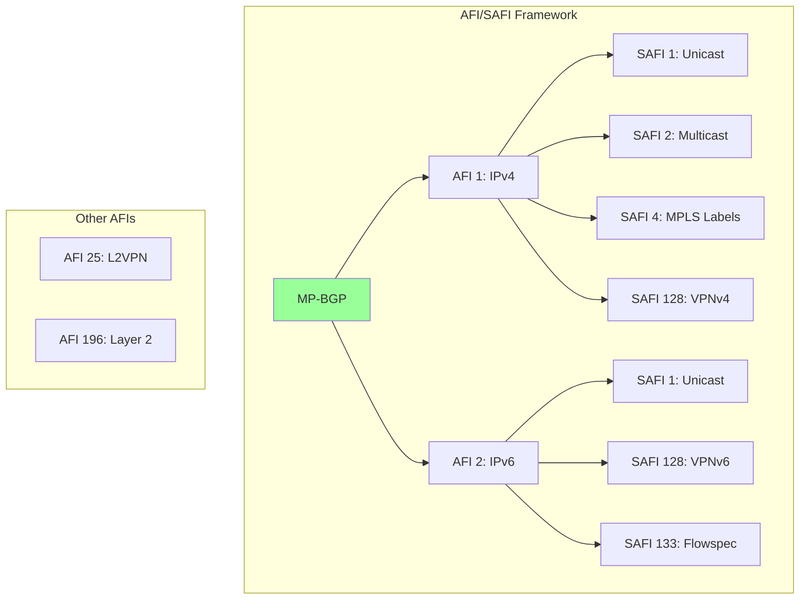

### Common AFI/SAFI Combinations

| AFI | SAFI | Name | Purpose |
|-----|------|------|---------|
| 1 | 1 | IPv4 Unicast | Standard IPv4 routing |
| 1 | 2 | IPv4 Multicast | IPv4 multicast RPF |
| 1 | 4 | IPv4 MPLS | MPLS-labeled IPv4 |
| 1 | 128 | VPNv4 | MPLS Layer 3 VPN (IPv4) |
| 1 | 133 | IPv4 FlowSpec | Flow specification |
| 2 | 1 | IPv6 Unicast | Standard IPv6 routing |
| 2 | 2 | IPv6 Multicast | IPv6 multicast RPF |
| 2 | 4 | IPv6 MPLS | MPLS-labeled IPv6 |
| 2 | 128 | VPNv6 | MPLS Layer 3 VPN (IPv6) |
| 25 | 65 | VPLS | Virtual Private LAN Service |
| 25 | 70 | EVPN | Ethernet VPN |

**Speaker Notes:**
Original BGP-4 (RFC 1771) only supported IPv4 unicast. MP-BGP (RFC 4760) extends BGP to carry any protocol. Uses AFI/SAFI framework: AFI (Address Family Identifier): identifies protocol family. AFI 1 = IPv4, AFI 2 = IPv6, AFI 25 = L2VPN. SAFI (Subsequent Address Family Identifier): identifies specific use within AFI. SAFI 1 = unicast, SAFI 2 = multicast, SAFI 128 = VPN. Combination uniquely identifies route type. Example: AFI=1, SAFI=128 = IPv4 VPN routes. Capability negotiation: during OPEN, peers advertise supported AFI/SAFI combinations using Multiprotocol BGP capability (type 1). Sessions can support multiple address families. Each AFI/SAFI has separate RIB: maintains independent Adj-RIB-In, Loc-RIB, Adj-RIB-Out per AFI/SAFI per peer. Routes don't mix between families. Implementation: index routes by (AFI, SAFI, prefix). Separate best path calculation per AFI/SAFI. Policy applied per AFI/SAFI. Memory: each active AFI/SAFI multiplies memory requirements. Modern routers support 10+ AFI/SAFI combinations simultaneously. Attributes: most attributes work across AFI/SAFIs (AS_PATH, LOCAL_PREF, COMMUNITY). Some are AFI/SAFI specific (NEXT_HOP encoded differently per AFI). MP-BGP attributes: MP_REACH_NLRI (type 14): advertises reachable routes for specific AFI/SAFI. MP_UNREACH_NLRI (type 15): withdraws routes for specific AFI/SAFI. Best practice: enable only required AFI/SAFIs. Use separate sessions or address families based on scaling needs.

---

## Slide 22: MP_REACH_NLRI Attribute (Type 14)

### MP_REACH_NLRI Structure

```
 0                   1                   2                   3
 0 1 2 3 4 5 6 7 8 9 0 1 2 3 4 5 6 7 8 9 0 1 2 3 4 5 6 7 8 9 0 1
+-+-+-+-+-+-+-+-+-+-+-+-+-+-+-+-+-+-+-+-+-+-+-+-+-+-+-+-+-+-+-+-+
|   Address Family Identifier (2 octets)        |
+-+-+-+-+-+-+-+-+-+-+-+-+-+-+-+-+-+-+-+-+-+-+-+-+-+-+-+-+-+-+-+-+
| Subsequent AFI (1 octet)      | Length of Next Hop (1 octet)  |
+-+-+-+-+-+-+-+-+-+-+-+-+-+-+-+-+-+-+-+-+-+-+-+-+-+-+-+-+-+-+-+-+
|                    Network Address of Next Hop                |
+-+-+-+-+-+-+-+-+-+-+-+-+-+-+-+-+-+-+-+-+-+-+-+-+-+-+-+-+-+-+-+-+
| Reserved (1 octet) = 0        |
+-+-+-+-+-+-+-+-+-+-+-+-+-+-+-+-+-+-+-+-+-+-+-+-+-+-+-+-+-+-+-+-+
|           Network Layer Reachability Information              |
+-+-+-+-+-+-+-+-+-+-+-+-+-+-+-+-+-+-+-+-+-+-+-+-+-+-+-+-+-+-+-+-+
```

### Code Structure

```c
struct attr_mp_reach_nlri {
    uint8_t flags;          // Optional non-transitive: 0x80
    uint8_t type;           // 14
    uint16_t length;        // Variable
    uint16_t afi;           // Address Family Identifier
    uint8_t safi;           // Subsequent AFI
    uint8_t nh_len;         // Length of next-hop address
    uint8_t next_hop[];     // Next-hop address (variable)
    uint8_t reserved;       // Must be 0
    uint8_t nlri[];         // NLRI (variable)
};

// Example: IPv6 Unicast (AFI=2, SAFI=1)
struct mp_reach_ipv6_unicast {
    uint16_t afi;           // 2 (IPv6)
    uint8_t safi;           // 1 (Unicast)
    uint8_t nh_len;         // 16 or 32 (link-local + global)
    uint8_t next_hop[32];   // IPv6 next-hop address(es)
    uint8_t reserved;
    // NLRI: IPv6 prefixes
};

// Example: VPNv4 (AFI=1, SAFI=128)
struct mp_reach_vpnv4 {
    uint16_t afi;           // 1 (IPv4)
    uint8_t safi;           // 128 (VPN)
    uint8_t nh_len;         // 12 (RD + IPv4)
    uint64_t rd;            // Route Distinguisher
    uint32_t next_hop;      // IPv4 next-hop
    uint8_t reserved;
    // NLRI: VPNv4 prefixes (label + RD + prefix)
};
```

### NLRI Encoding Per AFI/SAFI

```c
// IPv4 Unicast NLRI
struct nlri_ipv4 {
    uint8_t prefix_len;     // 0-32
    uint8_t prefix[];       // Variable length
};

// IPv6 Unicast NLRI
struct nlri_ipv6 {
    uint8_t prefix_len;     // 0-128
    uint8_t prefix[];       // Variable length
};

// VPNv4 NLRI with MPLS label
struct nlri_vpnv4 {
    uint8_t prefix_len;     // Total bits (label + RD + prefix)
    uint32_t label : 24;    // MPLS label (20 bits + 3 control bits)
    uint64_t rd;            // Route Distinguisher (8 bytes)
    uint8_t prefix[];       // IPv4 prefix
};

// EVPN NLRI (various route types)
struct nlri_evpn {
    uint8_t route_type;     // 1-5 (Ethernet AD, MAC/IP, etc.)
    uint8_t length;         // Length in bytes
    uint8_t route_data[];   // Route-type specific data
};
```

**Speaker Notes:**
MP_REACH_NLRI replaces standard NLRI and NEXT_HOP for MP-BGP. Carries routes for non-IPv4-unicast address families. Structure: AFI/SAFI identify address family. Next-hop encoded in attribute (not separate attribute 3). Length varies by AFI - IPv4=4 bytes, IPv6=16 or 32 bytes, VPNv4=12 bytes. NLRI encodes prefixes, format depends on AFI/SAFI. IPv6 next-hop: can be 16 bytes (global) or 32 bytes (global + link-local). Link-local used on multi-access networks. VPNv4 next-hop: 8-byte RD + 4-byte IPv4 address. RD usually 0 for next-hop. NLRI encoding: IPv4/IPv6 unicast: prefix length + prefix bytes (same as standard BGP). VPNv4/VPNv6: label (3 bytes) + RD (8 bytes) + prefix. Label used for MPLS forwarding. EVPN: route type + type-specific data (MAC addresses, IP addresses, Ethernet tags). Implementation: parse AFI/SAFI first to determine format. Extract next-hop based on length field. Parse NLRI according to AFI/SAFI encoding rules. Store in appropriate RIB indexed by (AFI, SAFI, prefix). Validate: AFI/SAFI must be negotiated in capability. Next-hop length must match expected for AFI. NLRI encoding must be valid. Multiple NLRI can be in single attribute. Memory: separate storage per AFI/SAFI. Don't mix routes from different families. Common issues: forgetting to negotiate capability, incorrect next-hop encoding, mixing AFI/SAFI encodings.

---

## Slide 23: IPv6 Unicast BGP (AFI=2, SAFI=1)

### IPv6 BGP Session

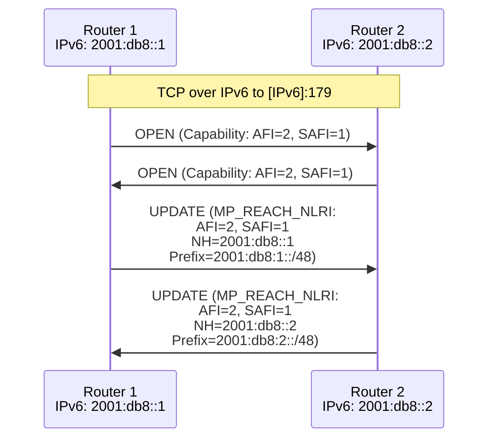

### IPv6 Next-Hop Encoding

```c
// Global next-hop only (16 bytes)
struct ipv6_nh_global {
    uint8_t addr[16];       // Global IPv6 address
};

// Global + Link-local (32 bytes)
struct ipv6_nh_global_linklocal {
    uint8_t global[16];     // Global IPv6 address
    uint8_t link_local[16]; // Link-local IPv6 address
};

void encode_ipv6_next_hop(struct attr_mp_reach *mp, 
                          struct in6_addr *global,
                          struct in6_addr *link_local) {
    if (link_local != NULL) {
        mp->nh_len = 32;
        memcpy(mp->next_hop, global, 16);
        memcpy(mp->next_hop + 16, link_local, 16);
    } else {
        mp->nh_len = 16;
        memcpy(mp->next_hop, global, 16);
    }
}
```

### IPv4 over IPv6 BGP (RFC 5549)

- **Use Case**: IPv4 routes with IPv6 next-hop
- **AFI**: 1 (IPv4)
- **SAFI**: 1 (Unicast)
- **Next-hop**: IPv6 address
- **Purpose**: IPv6-only core transporting IPv4

```c
// Extended Next Hop Encoding Capability
struct cap_extended_nexthop {
    uint8_t type;           // 5
    uint8_t length;
    struct {
        uint16_t afi;       // NLRI AFI (1 = IPv4)
        uint16_t safi;      // NLRI SAFI (1 = Unicast)
        uint16_t nh_afi;    // Next-hop AFI (2 = IPv6)
    } tuples[];
};
```

**Speaker Notes:**
IPv6 unicast BGP uses MP-BGP framework. AFI=2, SAFI=1. Session establishment: can run over IPv4 or IPv6 transport. Modern deployments prefer IPv6 transport. Advertise AFI=2, SAFI=1 capability in OPEN. Exchange routes using MP_REACH_NLRI and MP_UNREACH_NLRI. No use of standard NLRI or NEXT_HOP attribute for IPv6 routes. Next-hop encoding: two formats. 16-byte (global only): single global IPv6 address. Used for eBGP and point-to-point links. 32-byte (global + link-local): global address plus link-local address. Used for multi-access networks. Link-local provides unambiguous next-hop on shared medium. Selection: on multi-access with eBGP, include link-local. Otherwise global only. IPv6 BGP features: all standard BGP attributes work (AS_PATH, LOCAL_PREF, COMMUNITY). Decision process identical to IPv4. Extended Next-Hop (RFC 5549): allows IPv4 prefixes with IPv6 next-hops. Enables IPv6-only core to transport IPv4 traffic. AFI=1 (IPv4) with next-hop in IPv6 format. Requires Extended Next Hop Encoding capability. Implementation: separate RIB for IPv6 unicast. Index by (AFI=2, SAFI=1, IPv6 prefix). Parse MP_REACH_NLRI: extract AFI/SAFI, validate next-hop length (16 or 32), extract next-hop addresses, parse IPv6 NLRI. Next-hop validation: ensure reachable via IPv6 routing table. For link-local, associate with receiving interface. Common issues: forgetting to advertise capability, incorrect next-hop length, missing IPv6 connectivity to next-hop. Best practice: use global next-hop for simplicity unless multi-access requires link-local. Enable IPv6 eBGP on IPv6 transport for consistency.

---

# Module 5: L3VPN & Advanced Services

---

## Slide 24: MPLS L3VPN Architecture

### L3VPN Components

```mermaid
graph TB
    subgraph "Customer Site 1"
        CE1[CE Router 1]
    end
    
    subgraph "Service Provider MPLS Network"
        PE1[PE Router 1<br/>VRF: CustomerA] -->|iBGP VPNv4<br/>Route Reflector| RR[Route Reflector]
        RR --> PE2[PE Router 2<br/>VRF: CustomerA]
        
        PE1 <-->|MPLS LSP| P[P Router<br/>Core]
        P <-->|MPLS LSP| PE2
    end
    
    subgraph "Customer Site 2"
        CE2[CE Router 2]
    end
    
    CE1 <-->|PE-CE: BGP/OSPF/Static| PE1
    CE2 <-->|PE-CE: BGP/OSPF/Static| PE2
    
    style PE1 fill:#9f9
    style PE2 fill:#9f9
    style RR fill:#99f
```

### L3VPN Terminology

| Term | Description |
|------|-------------|
| **CE** | Customer Edge - customer's router |
| **PE** | Provider Edge - SP router connecting to customer |
| **P** | Provider core - SP core router (no VPN awareness) |
| **VRF** | Virtual Routing and Forwarding - per-customer routing table |
| **RD** | Route Distinguisher - makes routes unique globally |
| **RT** | Route Target - controls route import/export |
| **VPNv4** | AFI=1, SAFI=128 - IPv4 VPN routes |
| **MP-BGP** | Carries VPNv4 routes between PEs |

**Speaker Notes:**
MPLS L3VPN (RFC 4364) provides private IP routing over shared MPLS infrastructure. Architecture: CE (Customer Edge): customer's router, unaware of VPN. PE (Provider Edge): SP router with VRFs, terminates VPN. P (Provider core): MPLS LSP only, no VPN state. VRF (Virtual Routing and Forwarding): separate routing table per customer on PE. Isolates customer traffic. Multiple VRFs per PE for multiple customers. PE-CE protocols: BGP, OSPF, IS-IS, RIP, EIGRP, or static routes. Each VRF has independent PE-CE routing. PE-PE communication: iBGP with VPNv4 address family (AFI=1, SAFI=128). Exchanges VPN routes with RD and RT. MPLS data plane: packets forwarded using MPLS labels. Two-label stack: outer label (LDP/RSVP) for PE-to-PE path, inner label (BGP) for VRF identification. Core (P) routers only examine outer label. Key concepts: Route Distinguisher (RD): 8-byte value prepended to IPv4 prefix. Makes overlapping customer prefixes unique. Format: Type:Administrator:Assigned. Example: 65000:1:10.1.1.0/24. RD creates globally unique VPNv4 prefix. Route Target (RT): Extended community controlling route import/export. Export RT attached when exporting from VRF. Import RT determines which routes to import into VRF. Enables flexible topologies: hub-and-spoke, any-to-any, extranet. Implementation: maintain VRF table per customer. Separate RIB/FIB per VRF. BGP VPNv4 table contains all customers' routes (global). RT filtering determines which routes go into which VRF. MPLS label allocated per VRF (or per prefix in VRF) for forwarding. Benefits: privacy, overlapping addresses, traffic isolation, scalability. P routers don't maintain customer routes - only PE has VPN state.

---

## Slide 25: Route Distinguisher (RD) & Route Target (RT)

### Route Distinguisher (RD)

```c
// RD Structure (8 bytes)
struct route_distinguisher {
    uint16_t type;          // 0, 1, or 2
    uint8_t value[6];       // Type-dependent
};

// Type 0: AS:NN (16-bit AS : 32-bit number)
struct rd_type0 {
    uint16_t type;          // 0
    uint16_t as_number;     // 2-byte AS
    uint32_t assigned;      // Assigned number
};

// Type 1: IP:NN (32-bit IP : 16-bit number)
struct rd_type1 {
    uint16_t type;          // 1
    uint32_t ip_address;    // IPv4 address
    uint16_t assigned;      // Assigned number
};

// Type 2: 4-byte-AS:NN (32-bit AS : 16-bit number)
struct rd_type2 {
    uint16_t type;          // 2
    uint32_t as_number;     // 4-byte AS
    uint16_t assigned;      // Assigned number
};
```

### Route Target (RT)

```c
// RT is Extended Community (Type 0x00 or 0x02, Subtype 0x02)
struct route_target {
    uint8_t type;           // 0x00 (2-byte AS) or 0x02 (4-byte AS)
    uint8_t subtype;        // 0x02 (Route Target)
    uint8_t value[6];       // Type-dependent value
};

// 2-byte AS Route Target
struct rt_2byte_as {
    uint16_t as_number;     // AS number
    uint32_t assigned;      // Assigned value
};

// IPv4 Address Route Target
struct rt_ipv4 {
    uint32_t ip_address;    // IPv4 address
    uint16_t assigned;      // Assigned value
};
```

### RD vs RT

```mermaid
graph TB
    subgraph "Route Distinguisher (RD)"
        RD1[Purpose: Make prefixes unique]
        RD2[Scope: Global]
        RD3[Format: Type:Admin:Assigned]
        RD4[Example: 65000:1]
        RD5[One per VRF typically]
    end
    
    subgraph "Route Target (RT)"
        RT1[Purpose: Control import/export]
        RT2[Scope: Per VRF]
        RT3[Format: AS:Value or IP:Value]
        RT4[Example: 65000:100]
        RT5[Multiple per VRF possible]
    end
    
    subgraph "VPNv4 Prefix"
        VP[RD:Prefix]
        VP1[65000:1:10.1.1.0/24]
        VP2[65000:2:10.1.1.0/24]
        VP3[Both unique despite<br/>same customer prefix]
    end
    
    style RD1 fill:#9f9
    style RT1 fill:#99f
    style VP fill:#ff9
```

### RD and RT Usage Example

```c
// VRF configuration
struct vrf {
    char name[32];              // VRF name
    uint32_t vrf_id;
    struct route_distinguisher rd;  // RD for this VRF
    struct list *import_rt;     // Import route targets
    struct list *export_rt;     // Export route targets
    struct routing_table *rib;  // VRF routing table
};

// Example configuration:
// vrf CustomerA
//   rd 65000:100
//   route-target import 65000:100
//   route-target import 65000:999  // Shared services
//   route-target export 65000:100

void export_route_from_vrf(struct vrf *vrf, struct route *route) {
    // Create VPNv4 route
    struct vpnv4_route *vpn_route = allocate_vpnv4_route();
    
    // Add RD to prefix
    vpn_route->rd = vrf->rd;
    vpn_route->prefix = route->prefix;
    
    // Attach export RTs as extended communities
    for each rt in vrf->export_rt {
        add_extended_community(vpn_route, rt);
    }
    
    // Attach other attributes (AS_PATH, etc.)
    copy_attributes(vpn_route, route);
    
    // Advertise via BGP VPNv4
    bgp_advertise_vpnv4(vpn_route);
}

void import_vpnv4_route(struct vpnv4_route *vpn_route) {
    // Check all VRFs for matching import RT
    for each vrf in vrf_table {
        for each import_rt in vrf->import_rt {
            if (vpn_route_has_rt(vpn_route, import_rt)) {
                // Import into this VRF
                struct route *local_route = create_route();
                
                // Strip RD, use just prefix
                local_route->prefix = vpn_route->prefix;
                
                // Copy attributes
                copy_attributes(local_route, vpn_route);
                
                // Install in VRF RIB
                install_route_in_vrf(vrf, local_route);
            }
        }
    }
}
```

**Speaker Notes:**
RD and RT are fundamental to L3VPN but serve different purposes. RD (Route Distinguisher): Makes customer prefixes globally unique. Two customers can use same private IP space (10.1.1.0/24). With different RDs, they become unique VPNv4 routes: 65000:1:10.1.1.0/24 vs 65000:2:10.1.1.0/24. RD is per-VRF, typically one RD per VRF. Format: Type 0: AS:NN (65000:100), Type 1: IP:NN (1.1.1.1:100), Type 2: 4-byte-AS:NN. 8 bytes total. RT (Route Target): Controls which routes are imported/exported between VRFs. Extended community attached to VPNv4 routes. Export RT: attached when route leaves VRF. Import RT: VRF imports routes with matching RT. Format similar to RD but as extended community: AS:Value or IP:Value. Multiple RTs per VRF enable complex topologies. Hub-and-spoke: hub VRF exports RT-hub, imports RT-spoke. Spoke VRFs export RT-spoke, import RT-hub. Result: spokes can reach hub, hub can reach all spokes, spokes cannot reach each other directly. Any-to-any: all sites use same import/export RT. Extranet: shared services VRF exports RT-shared, customer VRFs import RT-shared. Implementation: RD prepended to create VPNv4 prefix during export. Stored in BGP VPNv4 table globally. RT filtering during import: check route's extended communities against VRF's import RTs. If match, install in VRF RIB (strip RD). Multiple VRFs can import same route if RT matches. Memory: single VPNv4 route in global BGP table, referenced by multiple VRF RIBs. Common patterns: unique RD per VRF, common RT for VRFs needing connectivity. Best practice: plan RD/RT scheme consistently. Document which RTs for which services. Use hierarchical allocation (per region, per service type).

---

## Slide 26: VPNv4 Route Advertisement

### VPNv4 NLRI Structure

```c
// VPNv4 NLRI in MP_REACH_NLRI
struct nlri_vpnv4 {
    uint8_t total_length;       // Total bits: label + RD + prefix
    
    // MPLS Label Stack (3 bytes per label)
    struct {
        uint32_t label : 20;    // 20-bit label value
        uint8_t exp : 3;        // Experimental bits
        uint8_t s : 1;          // Bottom of stack
        uint8_t ttl : 8;        // TTL
    } labels[];                 // Usually 1 label for L3VPN
    
    // Route Distinguisher (8 bytes)
    struct route_distinguisher rd;
    
    // IPv4 Prefix (variable)
    uint8_t prefix_len;         // Prefix length in bits
    uint8_t prefix[];           // IPv4 address bytes
};

// Complete MP_REACH_NLRI for VPNv4
struct mp_reach_vpnv4 {
    uint16_t afi;               // 1 (IPv4)
    uint8_t safi;               // 128 (MPLS VPN)
    uint8_t nh_len;             // 12 (RD + IPv4)
    struct {
        uint64_t rd;            // Usually 0
        uint32_t next_hop;      // PE router's IPv4 address
    } next_hop;
    uint8_t reserved;
    struct nlri_vpnv4 nlri[];   // One or more VPNv4 routes
};
```

### VPNv4 Route Flow

```mermaid
sequenceDiagram
    participant CE1 as CE1<br/>Customer Site 1
    participant PE1 as PE1<br/>VRF: CustomerA<br/>RD: 65000:100
    participant RR as Route Reflector
    participant PE2 as PE2<br/>VRF: CustomerA<br/>RD: 65000:200
    participant CE2 as CE2<br/>Customer Site 2
    
    CE1->>PE1: 10.1.1.0/24 via BGP/OSPF
    Note over PE1: Install in VRF CustomerA<br/>Attach Label: 100<br/>Add RD: 65000:100:10.1.1.0/24<br/>Add RT: 65000:100
    
    PE1->>RR: VPNv4 UPDATE<br/>Label:100, RD:65000:100, 10.1.1.0/24<br/>RT:65000:100, NH:PE1
    
    RR->>PE2: VPNv4 UPDATE<br/>Label:100, RD:65000:100, 10.1.1.0/24<br/>RT:65000:100, NH:PE1
    
    Note over PE2: Check import RT matches<br/>Install in VRF CustomerA<br/>Next-hop: PE1, Label: 100
    
    Note over CE2,PE2: CE2 sends to 10.1.1.0/24
    PE2->>PE1: MPLS: [LDP Label][VPN Label:100][IP Packet]
    
    Note over PE1: Pop VPN Label 100<br/>Lookup in VRF CustomerA<br/>Forward to CE1
    
    PE1->>CE1: IP Packet to 10.1.1.0/24
```

**Speaker Notes:**
VPNv4 route advertisement uses MP-BGP with AFI=1, SAFI=128. Process: PE receives route from CE (BGP, OSPF, static). PE looks up VRF configuration. Allocates MPLS label for route (or per-VRF label). Prepends RD to create globally unique VPNv4 prefix. Attaches export RTs as extended communities. Advertises via iBGP VPNv4 to route reflector or other PEs. Route reflector propagates to other PEs. Receiving PE checks import RTs against VRF configurations. If RT matches, imports route into VRF (strips RD), installs with label and next-hop pointing to originating PE. NLRI encoding: total length in bits includes label (24 bits) + RD (64 bits) + prefix. Example: 10.1.1.0/24 with label and RD = 24 + 64 + 24 = 112 bits total. Label stack: typically one label for L3VPN. Label used by originating PE to identify VRF. Bottom-of-stack (S) bit set to 1 (last label). Next-hop: encoded as RD (usually 0) + IPv4 address. IPv4 address is originating PE's loopback. Must be reachable via IGP. Data plane forwarding: ingress PE receives packet from CE, looks up in VRF, finds route with remote PE as next-hop and VPN label. Pushes VPN label onto packet. Pushes transport label (LDP/RSVP) for path to remote PE. Forwards into MPLS core. Core P routers forward based on outer (transport) label only. Egress PE receives packet, pops transport label (PHP or explicit pop), sees VPN label, looks up in label table, identifies VRF, pops VPN label, performs IP lookup in VRF, forwards to CE. Implementation: maintain label table mapping labels to VRFs. Allocate labels from label space (16-384K range typically). Support per-VRF or per-prefix label allocation. Store VPNv4 routes in global BGP table indexed by (RD, prefix). Import to VRFs based on RT matching. Memory: global VPNv4 table can be large (all customers' routes). Optimize with RT filtering at RR. Common issues: RT mismatch = no route import. Next-hop unreachable = route unusable. Label exhaustion on high-scale.

---

## Slide 27: PE-CE Routing Protocols

### PE-CE Protocol Options

```mermaid
graph TB
    subgraph "PE-CE Routing Options"
        STATIC[Static Routes] --> PE[PE Router<br/>VRF]
        BGP[BGP] --> PE
        OSPF[OSPF] --> PE
        EIGRP[EIGRP] --> PE
        RIP[RIPv2] --> PE
        ISIS[IS-IS] --> PE
    end
    
    subgraph "Protocol Considerations"
        STATIC2[Static:<br/>Simple, no protocol overhead<br/>Manual configuration]
        BGP2[BGP:<br/>Preserves AS_PATH<br/>Rich policy<br/>Scalable]
        OSPF2[OSPF:<br/>Area support<br/>Sham links<br/>DN bit]
    end
    
    style BGP fill:#9f9
    style OSPF fill:#99f
```

### BGP as PE-CE Protocol

```c
// PE-CE BGP Configuration
struct pe_ce_bgp {
    uint32_t customer_as;       // Customer's AS number
    uint32_t pe_as;             // PE's AS (or VPN AS)
    bool as_override;           // Replace customer AS with PE AS
    bool allow_as_in;           // Allow own AS in path (count)
    bool soo;                   // Site of Origin
    uint32_t soo_value;         // Site identifier
};

// AS Override: Prevent loop detection issues
void apply_as_override(struct bgp_route *route, struct pe_ce_bgp *cfg) {
    // Replace customer AS in AS_PATH with PE AS
    // Prevents customer from rejecting route due to own AS in path
    
    struct as_path *path = route->as_path;
    for each segment in path {
        for each asn in segment {
            if (asn == cfg->customer_as) {
                asn = cfg->pe_as;
            }
        }
    }
}

// Site of Origin (SoO): Prevent routing loops in dual-homed sites
void add_site_of_origin(struct bgp_route *route, uint32_t soo) {
    // Add SoO extended community
    struct extended_community *soo_comm = create_extended_community(
        EXTCOMM_TYPE_SOO, soo);
    add_to_route(route, soo_comm);
}

bool check_site_of_origin(struct bgp_route *route, uint32_t local_soo) {
    // If route has SoO matching our site, reject (loop prevention)
    for each ext_comm in route->communities {
        if (ext_comm->type == EXTCOMM_TYPE_SOO &&
            ext_comm->value == local_soo) {
            return false;  // Reject route
        }
    }
    return true;  // Accept route
}
```

### OSPF as PE-CE Protocol

```c
// OSPF PE-CE with Down Bit (DN bit)
struct ospf_pe_ce {
    uint32_t area;              // OSPF area
    uint32_t domain_id;         // VPN domain identifier
    bool sham_link;             // Use sham link
    struct in_addr sham_local;
    struct in_addr sham_remote;
};

// DN Bit in OSPF LSA Options field
#define OSPF_DN_BIT         0x01

void originate_lsa_from_bgp(struct vrf *vrf, struct bgp_route *route) {
    // PE converts BGP VPNv4 route to OSPF LSA
    struct ospf_lsa *lsa = create_type3_lsa();
    
    // Set DN bit to prevent redistribution loop
    lsa->options |= OSPF_DN_BIT;
    
    // Populate LSA with route info
    lsa->network = route->prefix;
    lsa->mask = route->mask;
    
    // Set metric from BGP MED or default
    lsa->metric = route->med ? route->med : 1;
    
    flood_lsa(vrf->ospf, lsa);
}

bool should_redistribute_to_bgp(struct ospf_lsa *lsa) {
    // Don't redistribute LSAs with DN bit back to BGP
    // Prevents PE-PE-PE loops
    if (lsa->options & OSPF_DN_BIT)
        return false;
    
    return true;
}

// Sham Link: Backdoor link between PEs in same area
// Makes OSPF prefer PE-PE BGP route over PE-CE-CE-PE
void configure_sham_link(struct vrf *vrf, struct ospf_pe_ce *cfg) {
    // Create virtual OSPF link between PEs
    // Advertises PE loopback reachability within OSPF
    // Lower cost than CE-CE links
    
    struct ospf_interface *sham = create_sham_link_interface(
        cfg->sham_local, cfg->sham_remote);
    
    sham->cost = 1;  // Very low cost
    sham->type = OSPF_IFTYPE_POINTOPOINT;
    
    add_interface_to_area(vrf->ospf, cfg->area, sham);
}
```

**Speaker Notes:**
PE-CE routing protocols redistribute routes between CE and PE's VRF. Multiple options available. Static routes: simplest, manual configuration. No protocol overhead. Suitable for small sites. Difficult to manage at scale. No failover support. BGP: most common in enterprise VPNs. Preserves AS_PATH across VPN. Rich policy capabilities. Scalable. Challenges: customer AS in AS_PATH causes loop detection issues. Solutions: AS override (replace customer AS with PE AS), allow-as-in (permit own AS in path). Site of Origin (SoO): extended community preventing loops in dual-homed sites. Attached at ingress PE, checked at egress PE. If SoO matches, reject route (originated from same site). OSPF: common in enterprise networks. PE redistributes between OSPF and BGP. Challenges: backdoor paths, routing loops. Down bit (DN): PE sets DN bit in LSA options when originating from BGP. CE sees DN bit, doesn't redistribute back to BGP (loop prevention). Sham link: virtual OSPF link between PEs in same area. Makes BGP route appear as intra-area OSPF link. Lower cost than CE-CE paths. Prevents suboptimal routing. Domain ID: identifies OSPF/VPN domain. Carried in extended community. Used for determining route type when redistributing. EIGRP: preserves EIGRP metrics across VPN. Site of Origin for loop prevention. Cost community for metric. RIP: simple, limited features. Rarely used. Implementation: PE must support multiple routing protocols per VRF. Independent instances per VRF. Redistribution between PE-CE protocol and BGP VPNv4. Careful policy to prevent loops. Store routes in VRF RIB, redistribute to BGP with RD/RT. Import BGP routes to VRF, redistribute to PE-CE protocol. Best practice: BGP for most deployments (scalable, preserves attributes). OSPF for OSPF-only customers (with sham links). Static for small sites. Consistent policy across all PEs.

---

## Slide 28: Inter-AS VPN Options

### Option A: VRF-to-VRF

```mermaid
graph LR
    subgraph "AS 65001"
        PE1[PE1<br/>VRF: CustomerA] <--> ASBR1[ASBR1<br/>VRF: CustomerA]
    end
    
    subgraph "AS 65002"
        ASBR2[ASBR2<br/>VRF: CustomerA] <--> PE2[PE2<br/>VRF: CustomerA]
    end
    
    ASBR1 <-->|VRF interface<br/>IPv4 + labels<br/>or BGP IPv4| ASBR2
    
    style ASBR1 fill:#9f9
    style ASBR2 fill:#9f9
```

**Option A Characteristics:**
- VRF on ASBRs
- Separate interface per VPN
- No VPNv4 between ASs
- Simple but doesn't scale

### Option B: eBGP VPNv4

```mermaid
graph LR
    subgraph "AS 65001"
        PE1[PE1] <-->|iBGP VPNv4| ASBR1[ASBR1]
    end
    
    subgraph "AS 65002"
        ASBR2[ASBR2] <-->|iBGP VPNv4| PE2[PE2]
    end
    
    ASBR1 <-->|eBGP VPNv4<br/>MP-BGP| ASBR2
    
    style ASBR1 fill:#99f
    style ASBR2 fill:#99f
```

**Option B Characteristics:**
- ASBRs exchange VPNv4 routes
- Next-hop self on ASBR
- Label per VPN or per prefix
- Scalable

### Option C: Multi-hop eBGP

```mermaid
graph LR
    subgraph "AS 65001"
        PE1[PE1<br/>VRF] <-->|eBGP VPNv4<br/>Multi-hop| PE2[PE2<br/>VRF]
        PE1 <--> ASBR1[ASBR1]
    end
    
    subgraph "AS 65002"
        ASBR2[ASBR2] <--> PE2
    end
    
    ASBR1 <-->|IPv4 + labels<br/>PE loopbacks| ASBR2
    
    style PE1 fill:#9f9
    style PE2 fill:#9f9
```

**Option C Characteristics:**
- PEs directly exchange VPNv4
- ASBRs only provide reachability
- Most scalable
- Requires trust between SPs

### Implementation

```c
// Option A: VRF-to-VRF
struct inter_as_option_a {
    struct vrf *vrf;            // VRF on ASBR
    struct interface *link;      // Physical link to other AS
    enum {
        STATIC,
        BGP_IPV4,                // BGP IPv4 unicast (not VPNv4)
        OSPF
    } protocol;
};

// Option B: eBGP VPNv4
struct inter_as_option_b {
    struct bgp_peer *ebgp_peer; // eBGP peer in other AS
    bool vpnv4_enabled;          // AFI=1, SAFI=128
    bool next_hop_self;          // Always true for Option B
    enum {
        PER_VRF_LABEL,
        PER_PREFIX_LABEL
    } label_allocation;
};

void option_b_advertise_vpnv4(struct bgp_peer *peer, 
                              struct vpnv4_route *route) {
    // Change next-hop to self (ASBR)
    route->next_hop = my_address;
    
    // Allocate new label (per-VRF or per-prefix)
    route->label = allocate_label_for_vpn(route->rd);
    
    // Advertise to eBGP peer with new label
    send_vpnv4_update(peer, route);
}

// Option C: Multi-hop eBGP between PEs
struct inter_as_option_c {
    struct bgp_peer *ebgp_peer;  // eBGP to PE in other AS
    bool multihop;                // Enable multi-hop eBGP
    uint8_t ttl;                  // TTL for multi-hop
    bool vpnv4_enabled;
    
    // Label distribution
    bool ldp_enabled;             // LDP for label distribution
};

void option_c_setup_pe_pe_session(struct bgp_peer *remote_pe) {
    // Multi-hop eBGP between PEs
    remote_pe->ebgp = true;
    remote_pe->multihop = true;
    remote_pe->ttl = 255;
    
    // Enable VPNv4
    enable_address_family(remote_pe, AFI_IPV4, SAFI_MPLS_VPN);
    
    // Exchange VPNv4 routes directly
    remote_pe->next_hop_self = false;  // Keep original next-hop
    
    // Ensure PE loopbacks reachable via ASBRs (BGP labeled unicast)
    redistribute_pe_loopbacks();
}
```

**Speaker Notes:**
Inter-AS VPN connects VPNs across multiple service provider networks. Three standard options with different trade-offs. Option A (VRF-to-VRF): ASBRs have VRFs, separate interface per VPN. Exchange routes via IPv4 BGP, static, or IGP. Simple configuration. No VPNv4 between ASs. Doesn't scale - one interface per VPN. Used for limited inter-AS connectivity. Option B (eBGP VPNv4): ASBRs exchange VPNv4 routes via eBGP. ASBRs maintain all VPNv4 routes but no VRFs. Next-hop changed to ASBR (next-hop-self). New label allocated at ASBR boundary. Scalable - no per-VPN interfaces. ASBRs must store all VPN routes. Most common for inter-provider VPNs. Option C (Multi-hop eBGP): PEs directly peer via multi-hop eBGP. Exchange VPNv4 routes end-to-end. ASBRs only provide IP+label reachability to PE loopbacks. Most scalable - ASBRs don't see VPN routes. Requires trust and reachability between SPs. Uses BGP labeled unicast (AFI=1, SAFI=4) or LDP for label distribution between ASBRs. Implementation considerations: Option A: configure VRF per VPN on ASBRs, redistribute between VRF and BGP/IGP. Option B: eBGP VPNv4 session between ASBRs, always next-hop-self, allocate labels per-VRF or per-prefix. Option C: multi-hop eBGP VPNv4 between PEs, distribute PE loopback labels via LDP or BGP-LU, ASBRs forward based on PE loopback labels. Label stacking: Option A: single label. Option B: two labels (ASBR label + VRF label). Option C: three labels (ASBR label + remote ASBR label + VRF label). Security: Option A and B - ASBRs see VPN routes, can filter. Option C - end-to-end, requires trust. Best practice: Option B most common for inter-provider scenarios. Option C for trusted relationships or single organization multi-AS. Option A for legacy or very small scale.

---

# Module 6: EVPN & Layer 2 Services

---

## Slide 29: EVPN Fundamentals

### EVPN Overview

```mermaid
graph TB
    subgraph "EVPN Architecture"
        HOST1[Host 1<br/>MAC: M1] <--> PE1[PE1<br/>VTEP]
        HOST2[Host 2<br/>MAC: M2] <--> PE2[PE2<br/>VTEP]
        HOST3[Host 3<br/>MAC: M3] <--> PE3[PE3<br/>VTEP]
        
        PE1 <-->|BGP EVPN<br/>Route Type 2| RR[Route Reflector]
        PE2 <-->|BGP EVPN| RR
        PE3 <-->|BGP EVPN| RR
        
        PE1 <-.->|VXLAN/MPLS<br/>Data Plane| PE2
        PE2 <-.->|VXLAN/MPLS<br/>Data Plane| PE3
        PE1 <-.->|VXLAN/MPLS<br/>Data Plane| PE3
    end
    
    style PE1 fill:#9f9
    style PE2 fill:#9f9
    style PE3 fill:#9f9
    style RR fill:#99f
```

### EVPN Characteristics

- **AFI/SAFI**: AFI=25 (L2VPN), SAFI=70 (EVPN)
- **Control Plane**: BGP distributes MAC addresses, IP addresses, MAC Mobility
- **Data Plane**: VXLAN, MPLS, or MPLS over GRE
- **Features**: Multi-homing, MAC mobility, ARP suppression, distributed anycast gateway

### EVPN vs Traditional L2VPN

| Aspect | Traditional L2VPN | EVPN |
|--------|-------------------|------|
| MAC Learning | Data plane (flooding) | Control plane (BGP) |
| BUM Traffic | Flood to all PEs | Selective, optimized |
| Multi-homing | Limited | Full active-active |
| ARP/ND | Flood | Suppressed, distributed |
| Scalability | Limited by flooding | High (BGP distribution) |
| Convergence | Slow | Fast (BGP withdrawal) |

**Speaker Notes:**
EVPN (Ethernet VPN, RFC 7432) is modern Layer 2 VPN solution using BGP for control plane. Addresses limitations of traditional VPLS. Key innovation: MAC addresses learned via BGP, not data plane flooding. Control plane: BGP with AFI=25, SAFI=70 distributes MAC addresses, IP bindings, reachability information. PEs (VTEPs - VXLAN Tunnel Endpoints) exchange EVPN routes containing MAC addresses, IP addresses, next-hops. Route reflector scales distribution. Data plane: multiple encapsulations supported - VXLAN (UDP-based, data center standard), MPLS (SP networks), MPLS over GRE. Benefits over VPLS: Control plane MAC learning eliminates unknown unicast flooding. BGP withdrawals provide fast convergence. Multi-homing with active-active load balancing. ARP suppression reduces broadcast. Integrated routing and bridging (IRB). Use cases: data center fabrics (most common), DCI (Data Center Interconnect), SP Layer 2 services, campus networks. Components: EVI (EVPN Instance): similar to VRF for Layer 2. EVPN ESI (Ethernet Segment Identifier): identifies multi-homed segment. Route types: 5 different route types for different purposes (MAC/IP advertisement, Ethernet Auto-Discovery, etc.). Implementation: separate RIB per EVI. BGP EVPN route processing. VXLAN or MPLS forwarding plane. Integration with underlay routing (OSPF, BGP). Memory: MAC table distributed via BGP. Stores MAC-to-VTEP/PE mappings. ARP cache distributed, reduces local storage. Scalability: tens of thousands of MACs per EVI, thousands of EVIs per PE. Modern standard for data center overlay networks.

---

## Slide 30: EVPN Route Types

### EVPN Route Types Overview

```mermaid
graph TB
    subgraph "EVPN Route Types"
        RT1[Route Type 1<br/>Ethernet Auto-Discovery<br/>Per EVI, Per ESI]
        RT2[Route Type 2<br/>MAC/IP Advertisement<br/>Host reachability]
        RT3[Route Type 3<br/>Inclusive Multicast<br/>BUM traffic]
        RT4[Route Type 4<br/>Ethernet Segment<br/>Multi-homing]
        RT5[Route Type 5<br/>IP Prefix<br/>Inter-subnet routing]
    end
    
    subgraph "Most Common"
        RT2 --> USAGE1[MAC learning<br/>ARP/ND binding]
        RT3 --> USAGE2[BUM replication<br/>tree]
        RT5 --> USAGE3[Routing between<br/>subnets]
    end
    
    style RT2 fill:#9f9
    style RT3 fill:#99f
    style RT5 fill:#ff9
```

### Route Type 2: MAC/IP Advertisement

```c
// EVPN Route Type 2 NLRI
struct evpn_rt2 {
    uint8_t route_type;         // 2
    uint8_t length;             // Length of route data
    
    // Route Distinguisher (8 bytes)
    struct route_distinguisher rd;
    
    // Ethernet Segment Identifier (10 bytes)
    uint8_t esi[10];            // 0 if single-homed
    
    // Ethernet Tag ID (4 bytes)
    uint32_t ethernet_tag_id;   // 0 for VLAN-based service
    
    // MAC Address Length (1 byte)
    uint8_t mac_len;            // 48 bits = 48
    
    // MAC Address (6 bytes)
    uint8_t mac[6];
    
    // IP Address Length (1 byte)
    uint8_t ip_len;             // 0, 32 (IPv4), or 128 (IPv6)
    
    // IP Address (0, 4, or 16 bytes)
    uint8_t ip_address[];       // Optional
    
    // MPLS Label1 (3 bytes)
    uint32_t label1 : 24;       // VNI or MPLS label
    
    // MPLS Label2 (3 bytes) - optional
    uint32_t label2 : 24;       // L3 VNI for IRB
};

// Extended communities for Route Type 2
#define EVPN_EXTCOMM_MAC_MOBILITY   0x00    // MAC mobility sequence
#define EVPN_EXTCOMM_ESI_LABEL      0x01    // ESI MPLS label
#define EVPN_EXTCOMM_ROUTER_MAC     0x03    // Router's MAC for IRB
```

### Route Type 3: Inclusive Multicast

```c
// EVPN Route Type 3 NLRI
struct evpn_rt3 {
    uint8_t route_type;         // 3
    uint8_t length;
    
    struct route_distinguisher rd;
    
    uint32_t ethernet_tag_id;
    
    uint8_t ip_len;             // 32 (IPv4) or 128 (IPv6)
    uint8_t originator_ip[];    // PE/VTEP IP address
};

// Used for BUM (Broadcast, Unknown Unicast, Multicast) traffic
// Each PE advertises RT3 with its VTEP IP
// Other PEs add to multicast replication list
```

### Route Type 5: IP Prefix

```c
// EVPN Route Type 5 NLRI
struct evpn_rt5 {
    uint8_t route_type;         // 5
    uint8_t length;
    
    struct route_distinguisher rd;
    
    uint32_t ethernet_tag_id;
    
    uint8_t ip_prefix_len;      // Prefix length
    uint8_t ip_prefix[];        // IPv4 or IPv6 prefix
    
    uint32_t gw_ip_len;         // Gateway IP address length
    uint8_t gw_ip[];            // Gateway IP address
    
    uint32_t label;             // VNI or MPLS label
};

// Used for inter-subnet routing (symmetric IRB)
// Advertises IP prefixes reachable via this PE
```

**Speaker Notes:**
EVPN defines 5 route types, each serving specific purpose. Route Type 1 (Ethernet Auto-Discovery): announces Ethernet segment reachability. Two sub-types: per-EVI (per EVPN instance) and per-ES (per Ethernet segment). Used for fast convergence and aliasing in multi-homing. Route Type 2 (MAC/IP Advertisement): most important, announces MAC addresses and optionally IP addresses. Replaces data plane MAC learning. Contains: RD, ESI (0 if single-homed), Ethernet tag, MAC address, optional IP address, MPLS label/VNI. Extended communities: MAC mobility (sequence number for moves), ESI label (for multi-homing), Router MAC (for IRB). When host sends frame, ingress PE learns MAC locally, advertises via RT2 to BGP. Other PEs receive RT2, install MAC-to-VTEP mapping. Forwarding: lookup MAC, find remote VTEP from RT2, encapsulate (VXLAN/MPLS), send. Route Type 3 (Inclusive Multicast): establishes BUM (Broadcast, Unknown Unicast, Multicast) replication tree. Each PE advertises RT3 with its VTEP IP. Others add to replication list. When BUM traffic received, replicate to all VTEPs in RT3 list. Ingress replication: simple, each PE maintains list. P2MP tree: more efficient, single copy in core. Route Type 4 (Ethernet Segment): announces Ethernet segment and its PEs. Used for multi-homing coordination. Contains ESI and list of PEs. Route Type 5 (IP Prefix): announces IP prefixes for inter-subnet routing. Symmetric IRB: route between subnets via overlay. Contains IP prefix, gateway IP, L3 VNI. Enables distributed anycast gateway. Implementation: separate handling per route type. RT2: populate MAC table, install forwarding entry. RT3: build BUM replication list. RT5: install IP routes for inter-subnet. Store in EVPN RIB per EVI. Memory: RT2 dominates (one per MAC), must scale to 10K-100K MACs per EVI. RT3 small (one per PE per EVI). RT5 moderate (one per prefix). Best practice: RT2 for all MAC learning (eliminates flooding). RT3 for BUM optimization. RT5 for inter-subnet routing. Tune timers for MAC aging and mobility.

---

## Slide 31: EVPN Multi-Homing

### All-Active Multi-Homing

```mermaid
graph TB
    subgraph "Server Multi-Homing"
        SERVER[Server<br/>LAG/Bond<br/>MAC: M1] <--> ESI{Ethernet Segment<br/>ESI: 00:11:22:...:99}
    end
    
    ESI <--> PE1[PE1/VTEP1]
    ESI <--> PE2[PE2/VTEP2]
    
    PE1 <-->|BGP EVPN<br/>RT1, RT2, RT4| RR[Route Reflector]
    PE2 <-->|BGP EVPN<br/>RT1, RT2, RT4| RR
    RR <--> PE3[PE3/VTEP3]
    
    PE3 -.->|VXLAN/MPLS<br/>Load balanced<br/>across PE1 & PE2| ESI
    
    note1[Active-Active:<br/>Traffic to/from server<br/>load balanced]
    
    style PE1 fill:#9f9
    style PE2 fill:#9f9
    style ESI fill:#ff9
```

### ESI (Ethernet Segment Identifier)

```c
// ESI Structure (10 bytes)
struct ethernet_segment_id {
    uint8_t type;           // ESI type (0-5)
    uint8_t value[9];       // Type-specific value
};

// Type 0: Arbitrary (operator configured)
struct esi_type0 {
    uint8_t type;           // 0
    uint8_t value[9];       // Arbitrary 9-byte value
};

// Type 1: LACP-based (from LACP)
struct esi_type1 {
    uint8_t type;           // 1
    uint8_t lacp_sys_mac[6];// LACP system MAC
    uint16_t lacp_port_key; // LACP port key
    uint8_t reserved;
};

// Type 3: MAC-based
struct esi_type3 {
    uint8_t type;           // 3
    uint8_t sys_mac[6];     // System MAC address
    uint24_t local_disc;    // Local discriminator
};
```

### Designated Forwarder Election

```c
struct evpn_multihoming {
    uint8_t esi[10];            // Ethernet Segment ID
    struct list *pe_list;       // List of PEs in segment
    uint32_t df_pe;             // Designated Forwarder PE
    enum {
        ALL_ACTIVE,             // All PEs forward (default)
        SINGLE_ACTIVE           // Only DF forwards
    } mode;
};

// DF Election Algorithm (modulo-based)
uint32_t elect_designated_forwarder(struct evpn_multihoming *mh,
                                     uint32_t vlan_or_evi) {
    // Sort PE list by IP address
    sort_pe_list(mh->pe_list);
    
    // Calculate DF based on VLAN/EVI
    uint32_t index = vlan_or_evi % list_size(mh->pe_list);
    
    return mh->pe_list[index];
}

// Aliasing: Load balance traffic to multi-homed segment
void install_aliasing_routes(struct evpn_multihoming *mh) {
    // Remote PEs install ECMP next-hops to all PEs in segment
    // Traffic load balanced across all PEs
    
    for each remote_pe in mh->pe_list {
        add_nexthop_for_esi(mh->esi, remote_pe);
    }
    
    // Result: ECMP load balancing to multi-homed destination
}

// Split Horizon: Prevent loops in multi-homing
bool check_split_horizon(struct packet *pkt, struct esi *esi) {
    // If packet received from multi-homed segment,
    // don't forward back to same segment
    
    if (pkt->ingress_esi == esi) {
        // Drop - would loop back to source
        return false;
    }
    
    return true;  // Forward
}
```

**Speaker Notes:**
EVPN multi-homing provides active-active connectivity for hosts/servers attached to multiple PEs. Server uses LAG (Link Aggregation) bonding links to multiple PEs. ESI (Ethernet Segment Identifier): 10-byte identifier for multi-homed segment. All PEs attached to same segment use same ESI. Type 0: arbitrary (manually configured). Type 1: derived from LACP (automatic). Type 3: MAC-based (automatic). Type 1 most common for automatic provisioning. Route Types for Multi-homing: RT1 (Ethernet AD): announces segment and PE membership. Fast convergence - if PE fails, remote PEs get withdrawal. RT4 (Ethernet Segment): announces ESI and all PEs. Synchronization across PEs. RT2: MACs learned with ESI attached. Remote PEs know MAC is multi-homed. Designated Forwarder (DF): for BUM traffic from network to segment, only one PE forwards (avoid duplication). Election algorithm: modulo-based on VLAN/EVI. Different VLANs may have different DFs (load balancing). Non-DF drops BUM traffic to avoid duplication. Aliasing: traffic from network to multi-homed destination load balanced across all PEs. Remote PEs install ECMP paths to all PEs in segment. Per-flow load balancing (5-tuple hash). All-Active mode: all PEs forward traffic to/from segment. Single-Active mode: only DF forwards (used for non-LAG scenarios). Split Horizon: prevent loops. Packet received from multi-homed segment not forwarded back to same segment. Check ESI on received packets. Mass Withdraw: if PE fails, single RT1 withdrawal removes all MACs from that PE. Fast convergence without per-MAC withdrawals. Implementation: maintain ESI table with PE list per ESI. Synchronize MAC learning across PEs in segment. Perform DF election per VLAN/EVI. Install ECMP paths for remote PEs. Apply split-horizon filtering. Benefits: active-active load balancing (2x throughput vs active-standby). Sub-second convergence on failure. Efficient bandwidth utilization. Common in data center leaf-spine fabrics with server dual-homing.

---

## Slide 32: VXLAN Data Plane

### VXLAN Packet Format

```
 Outer Ethernet Header:
 +-+-+-+-+-+-+-+-+-+-+-+-+-+-+-+-+-+-+-+-+-+-+-+-+-+-+-+-+-+-+-+-+
 |             Outer Destination MAC Address                     |
 +-+-+-+-+-+-+-+-+-+-+-+-+-+-+-+-+-+-+-+-+-+-+-+-+-+-+-+-+-+-+-+-+
 |             Outer Source MAC Address                          |
 +-+-+-+-+-+-+-+-+-+-+-+-+-+-+-+-+-+-+-+-+-+-+-+-+-+-+-+-+-+-+-+-+
 |       Outer VLAN Tag (optional)       |
 +-+-+-+-+-+-+-+-+-+-+-+-+-+-+-+-+-+-+-+-+-+-+-+-+-+-+-+-+-+-+-+-+
 
 Outer IP Header:
 +-+-+-+-+-+-+-+-+-+-+-+-+-+-+-+-+-+-+-+-+-+-+-+-+-+-+-+-+-+-+-+-+
 |Version|  IHL  |Type of Service|          Total Length         |
 +-+-+-+-+-+-+-+-+-+-+-+-+-+-+-+-+-+-+-+-+-+-+-+-+-+-+-+-+-+-+-+-+
 |         Identification        |Flags|      Fragment Offset    |
 +-+-+-+-+-+-+-+-+-+-+-+-+-+-+-+-+-+-+-+-+-+-+-+-+-+-+-+-+-+-+-+-+
 |  Time to Live |  Protocol=17  |         Header Checksum       |
 +-+-+-+-+-+-+-+-+-+-+-+-+-+-+-+-+-+-+-+-+-+-+-+-+-+-+-+-+-+-+-+-+
 |                       Outer Source IPv4 Address               |
 +-+-+-+-+-+-+-+-+-+-+-+-+-+-+-+-+-+-+-+-+-+-+-+-+-+-+-+-+-+-+-+-+
 |                    Outer Destination IPv4 Address             |
 +-+-+-+-+-+-+-+-+-+-+-+-+-+-+-+-+-+-+-+-+-+-+-+-+-+-+-+-+-+-+-+-+
 
 Outer UDP Header:
 +-+-+-+-+-+-+-+-+-+-+-+-+-+-+-+-+-+-+-+-+-+-+-+-+-+-+-+-+-+-+-+-+
 |       Source Port = xxxx      |       Dest Port = 4789        |
 +-+-+-+-+-+-+-+-+-+-+-+-+-+-+-+-+-+-+-+-+-+-+-+-+-+-+-+-+-+-+-+-+
 |           UDP Length          |        UDP Checksum           |
 +-+-+-+-+-+-+-+-+-+-+-+-+-+-+-+-+-+-+-+-+-+-+-+-+-+-+-+-+-+-+-+-+
 
 VXLAN Header:
 +-+-+-+-+-+-+-+-+-+-+-+-+-+-+-+-+-+-+-+-+-+-+-+-+-+-+-+-+-+-+-+-+
 |R|R|R|R|I|R|R|R|            Reserved                           |
 +-+-+-+-+-+-+-+-+-+-+-+-+-+-+-+-+-+-+-+-+-+-+-+-+-+-+-+-+-+-+-+-+
 |                VXLAN Network Identifier (VNI)                 |
 +-+-+-+-+-+-+-+-+-+-+-+-+-+-+-+-+-+-+-+-+-+-+-+-+-+-+-+-+-+-+-+-+
 |                        Reserved                               |
 +-+-+-+-+-+-+-+-+-+-+-+-+-+-+-+-+-+-+-+-+-+-+-+-+-+-+-+-+-+-+-+-+
 
 Inner Ethernet Frame:
 +-+-+-+-+-+-+-+-+-+-+-+-+-+-+-+-+-+-+-+-+-+-+-+-+-+-+-+-+-+-+-+-+
 |             Inner Destination MAC Address                     |
 +-+-+-+-+-+-+-+-+-+-+-+-+-+-+-+-+-+-+-+-+-+-+-+-+-+-+-+-+-+-+-+-+
 |             Inner Source MAC Address                          |
 +-+-+-+-+-+-+-+-+-+-+-+-+-+-+-+-+-+-+-+-+-+-+-+-+-+-+-+-+-+-+-+-+
 |                    Inner Ethernet Payload                     |
 +-+-+-+-+-+-+-+-+-+-+-+-+-+-+-+-+-+-+-+-+-+-+-+-+-+-+-+-+-+-+-+-+
```

### VXLAN Encapsulation/Decapsulation

```c
#define VXLAN_UDP_PORT      4789
#define VXLAN_VNI_BITS      24      // 16 million VNIs

struct vxlan_header {
    uint8_t flags;                  // I-bit must be set
    uint8_t reserved1[3];
    uint32_t vni : 24;              // VNI (VXLAN Network Identifier)
    uint8_t reserved2;
};

struct vxlan_tunnel {
    uint32_t local_vtep_ip;         // Source VTEP IP
    uint32_t remote_vtep_ip;        // Destination VTEP IP
    uint32_t vni;                   // VNI for this tunnel
    uint16_t udp_src_port_min;      // Source port range for entropy
    uint16_t udp_src_port_max;
};

void vxlan_encapsulate(struct packet *pkt, struct vxlan_tunnel *tunnel) {
    // Original packet is inner Ethernet frame
    
    // Add VXLAN header
    struct vxlan_header *vxlan = prepend_vxlan_header(pkt);
    vxlan->flags = 0x08;            // I-bit set (VNI valid)
    vxlan->vni = tunnel->vni;
    vxlan->reserved1 = 0;
    vxlan->reserved2 = 0;
    
    // Add UDP header
    struct udp_header *udp = prepend_udp_header(pkt);
    udp->dst_port = htons(VXLAN_UDP_PORT);
    
    // Source port: hash of inner frame for ECMP entropy
    udp->src_port = htons(calculate_udp_src_port(pkt, tunnel));
    
    udp->length = htons(sizeof(struct udp_header) + 
                       sizeof(struct vxlan_header) + 
                       pkt->inner_length);
    udp->checksum = 0;              // Optional for IPv4
    
    // Add outer IP header
    struct ip_header *outer_ip = prepend_ip_header(pkt);
    outer_ip->version = 4;
    outer_ip->ihl = 5;
    outer_ip->protocol = IPPROTO_UDP;
    outer_ip->src_addr = tunnel->local_vtep_ip;
    outer_ip->dst_addr = tunnel->remote_vtep_ip;
    outer_ip->ttl = 64;
    outer_ip->total_length = htons(pkt->total_length);
    
    // Add outer Ethernet header (filled by routing)
    // Outer MAC addresses from next-hop resolution
}

uint16_t calculate_udp_src_port(struct packet *pkt, 
                                struct vxlan_tunnel *tunnel) {
    // Hash inner frame 5-tuple for entropy
    // Enables ECMP load balancing in underlay
    
    uint32_t hash = 0;
    
    // Hash inner Ethernet header
    hash = hash_function(pkt->inner_eth_dst, 6, hash);
    hash = hash_function(pkt->inner_eth_src, 6, hash);
    
    // If inner IP packet, hash IP 5-tuple
    if (pkt->inner_eth_type == ETHERTYPE_IP) {
        struct ip_header *inner_ip = get_inner_ip(pkt);
        hash = hash_function(&inner_ip->src_addr, 4, hash);
        hash = hash_function(&inner_ip->dst_addr, 4, hash);
        hash = hash_function(&inner_ip->protocol, 1, hash);
        
        if (inner_ip->protocol == IPPROTO_TCP || 
            inner_ip->protocol == IPPROTO_UDP) {
            struct udp_header *inner_l4 = get_inner_l4(pkt);
            hash = hash_function(&inner_l4->src_port, 2, hash);
            hash = hash_function(&inner_l4->dst_port, 2, hash);
        }
    }
    
    // Map hash to port range (e.g., 49152-65535)
    uint16_t port = tunnel->udp_src_port_min + 
                   (hash % (tunnel->udp_src_port_max - 
                           tunnel->udp_src_port_min + 1));
    
    return port;
}

void vxlan_decapsulate(struct packet *pkt) {
    // Remove outer Ethernet header
    remove_outer_ethernet(pkt);
    
    // Remove and validate outer IP header
    struct ip_header *outer_ip = get_outer_ip(pkt);
    if (outer_ip->protocol != IPPROTO_UDP) {
        drop_packet(pkt, "Not UDP");
        return;
    }
    remove_outer_ip(pkt);
    
    // Remove and validate UDP header
    struct udp_header *udp = get_udp_header(pkt);
    if (ntohs(udp->dst_port) != VXLAN_UDP_PORT) {
        drop_packet(pkt, "Not VXLAN port");
        return;
    }
    remove_udp(pkt);
    
    // Parse and validate VXLAN header
    struct vxlan_header *vxlan = get_vxlan_header(pkt);
    if (!(vxlan->flags & 0x08)) {
        drop_packet(pkt, "VNI invalid");
        return;
    }
    
    uint32_t vni = vxlan->vni;
    remove_vxlan(pkt);
    
    // Lookup VNI in local table
    struct vxlan_interface *vxlan_if = lookup_vni(vni);
    if (!vxlan_if) {
        drop_packet(pkt, "Unknown VNI");
        return;
    }
    
    // Forward inner frame based on inner dest MAC
    forward_inner_ethernet_frame(pkt, vxlan_if);
}
```

**Speaker Notes:**
VXLAN (Virtual eXtensible LAN, RFC 7348) provides Layer 2 overlay over Layer 3 underlay. Standard data plane for EVPN in data centers. Encapsulation: original Ethernet frame encapsulated in UDP/IP. VXLAN header: 8 bytes, contains 24-bit VNI (Virtual Network Identifier). VNI identifies tenant/segment - 16 million possible values. I-bit (0x08) must be set to indicate valid VNI. UDP port: destination 4789 (IANA assigned). Source port varies per flow (entropy for ECMP). Outer IP: source = local VTEP IP, destination = remote VTEP IP. Routed through IP underlay. Outer Ethernet: MAC addresses from next-hop resolution in underlay. UDP source port entropy: critical for ECMP load balancing in underlay network. Hash inner frame 5-tuple to generate source port. Different flows get different source ports. Underlay switches use outer IP+UDP 5-tuple for ECMP hashing. Enables per-flow load balancing across multiple paths. Implementation: ingress VTEP: receive frame, lookup destination MAC in EVPN MAC table, find remote VTEP IP and VNI, encapsulate with VXLAN header, perform IP routing in underlay. Egress VTEP: receive packet on UDP 4789, validate VXLAN header, extract VNI, lookup local bridging table, decapsulate, forward inner frame. Hardware offload: modern NICs and switches offload VXLAN encap/decap. Reduces CPU load. Enables line-rate performance. MTU considerations: VXLAN adds 50 bytes overhead. Underlay MTU must be at least 50 bytes larger than overlay MTU. Typically: underlay 9000 bytes (Jumbo), overlay 8950 bytes. Or underlay 1600, overlay 1550. Path MTU discovery in underlay. Benefits vs MPLS: uses standard IP/UDP, works over any IP network. No MPLS support required in underlay. Better ECMP (UDP source port entropy). Drawbacks: higher overhead than MPLS (50 bytes vs 4-8 bytes). UDP encapsulation.

---

# Module 7: Advanced Features

---

## Slide 33: BGP Security - TCP MD5/TCP-AO

### TCP MD5 Signature Option (RFC 2385)

```c
// TCP MD5 Configuration
struct bgp_tcp_md5 {
    char password[80];          // Shared secret
    uint8_t enabled;
};

// TCP MD5 Digest Calculation
void calculate_tcp_md5_digest(struct tcp_segment *seg,
                              struct bgp_tcp_md5 *md5,
                              uint8_t digest[16]) {
    MD5_CTX ctx;
    MD5_Init(&ctx);
    
    // Hash pseudo-header
    MD5_Update(&ctx, &seg->src_ip, 4);
    MD5_Update(&ctx, &seg->dst_ip, 4);
    MD5_Update(&ctx, &seg->protocol, 1);  // TCP = 6
    MD5_Update(&ctx, &seg->tcp_length, 2);
    
    // Hash TCP header (with MD5 option zeroed)
    MD5_Update(&ctx, seg->tcp_header, seg->tcp_header_len);
    
    // Hash TCP data
    MD5_Update(&ctx, seg->tcp_data, seg->tcp_data_len);
    
    // Hash shared secret
    MD5_Update(&ctx, md5->password, strlen(md5->password));
    
    // Compute digest
    MD5_Final(digest, &ctx);
}

bool verify_tcp_md5(struct tcp_segment *seg, struct bgp_tcp_md5 *md5) {
    // Extract MD5 digest from TCP option
    uint8_t received_digest[16];
    if (!extract_md5_option(seg, received_digest))
        return false;  // No MD5 option
    
    // Calculate expected digest
    uint8_t computed_digest[16];
    calculate_tcp_md5_digest(seg, md5, computed_digest);
    
    // Compare
    if (memcmp(received_digest, computed_digest, 16) != 0) {
        log_security_event("TCP MD5 verification failed");
        return false;
    }
    
    return true;
}
```

### TCP Authentication Option (TCP-AO, RFC 5925)

```c
// TCP-AO: Improved security over TCP MD5
struct bgp_tcp_ao {
    uint8_t key_id;             // Master Key Identifier
    uint8_t rnext_key_id;       // Receive next key ID
    char master_key[256];       // Master key
    enum {
        HMAC_SHA1_96,
        HMAC_SHA256_128,
        AES_128_CMAC_96
    } algorithm;
    uint8_t enabled;
};

// TCP-AO provides:
// - Stronger crypto (SHA256 vs MD5)
// - Key rollover support
// - Replay protection
// - Better algorithm agility
```

### GTSM (Generalized TTL Security Mechanism, RFC 5082)

```c
// TTL Security / GTSM
struct bgp_gtsm {
    uint8_t enabled;
    uint8_t ttl_min;            // Minimum acceptable TTL
    uint8_t ttl_expected;       // Expected TTL (255 for eBGP)
};

bool check_gtsm(struct ip_packet *pkt, struct bgp_gtsm *gtsm) {
    if (!gtsm->enabled)
        return true;
    
    // Check TTL
    if (pkt->ip_header->ttl < gtsm->ttl_min) {
        log_security_event("GTSM: TTL too low (%d < %d)",
                          pkt->ip_header->ttl, gtsm->ttl_min);
        return false;
    }
    
    return true;
}

// eBGP: Send with TTL=255, accept only TTL=255 or 254
// Protects against off-path attacks (attacker many hops away)
```

**Speaker Notes:**
BGP security critical - compromise can blackhole traffic, intercept data, cause outages. TCP MD5: adds MD5 digest to every TCP segment. Shared secret configured on both peers. Digest calculated over pseudo-header + TCP header + data + secret. Receiver verifies digest matches. Prevents: TCP RST injection, session hijacking, man-in-the-middle. Limitations: MD5 considered weak cryptographically. No key rollover - changing password requires session reset. Single key per peer. TCP-AO (Authentication Option): modern replacement for TCP MD5. Stronger algorithms: HMAC-SHA-256, AES-CMAC. Key rollover: supports multiple keys, smooth transition. Replay protection: sequence numbers. Algorithm agility: negotiate algorithms. Master Key Tuple (MKT): identifies key by ID. Backward compatible with TCP MD5. GTSM (TTL Security): protects against off-path attacks. eBGP peers send packets with TTL=255. Only accept packets with TTL >= 254 (one hop away). Attacker far away can't spoof (TTL decrements). Simple, effective against many attacks. Implementation: TCP MD5: configure password per peer, kernel adds/checks MD5 option transparently. TCP-AO: configure master key and algorithm, kernel handles MKT and verification. GTSM: set outgoing TTL to 255, check incoming TTL >= threshold. Reject packets failing check before reaching BGP. Best practices: always use TCP MD5 or TCP-AO for eBGP, especially Internet peering. GTSM for all eBGP peers. Use strong passwords (random, 20+ characters). Rotate keys periodically (TCP-AO). Monitor failed authentication attempts. Additional security: prefix filtering (prevent bogon/martian advertisements), max-prefix limits (protect against route leaks), AS_PATH filtering (validate expected paths), IRR/RPKI validation (ensure authorization). Defense in depth: combine multiple mechanisms. TCP-AO + GTSM + prefix filtering provides strong protection.

---

## Slide 34: BGP Graceful Restart (GR)

### Graceful Restart Concepts

```mermaid
sequenceDiagram
    participant R1 as Restarting Router<br/>(Control Plane Down)
    participant FIB as Forwarding Plane<br/>(Still Forwarding)
    participant R2 as Helper Router
    
    Note over R1: Control plane crash<br/>FIB preserved
    Note over FIB: Continue forwarding<br/>using stale routes
    
    Note over R1: Control plane restarts
    R1->>R2: OPEN (GR Capability:<br/>Restart State, Restart Time)
    
    Note over R2: Enter Helper mode<br/>Mark routes as stale
    
    R2->>R1: OPEN (GR Capability)
    R1->>R2: Keepalive
    R2->>R1: Keepalive
    
    Note over R1,R2: Session established
    
    R2->>R1: UPDATE (All routes with<br/>LLGR_STALE community)
    R1->>R2: UPDATE (Re-advertise routes)
    
    Note over R1: Rebuild RIB<br/>Run best path
    Note over R2: Receive new routes<br/>Remove stale mark
    
    R1->>R2: End-of-RIB marker
    Note over R2: Exit Helper mode<br/>Delete remaining stale routes
    
    Note over R1,R2: Normal operation<br/>GR complete
```

### Graceful Restart Capability

```c
// GR Capability (Code 64)
struct cap_graceful_restart {
    uint8_t type;               // 64
    uint8_t length;
    
    // Flags and Restart Time (2 bytes)
    uint16_t restart_state : 1; // R-bit: restarting now
    uint16_t notification : 1;  // N-bit: notified restart
    uint16_t reserved : 2;
    uint16_t restart_time : 12; // Seconds (0-4095)
    
    // Per-AFI/SAFI tuples
    struct {
        uint16_t afi;
        uint8_t safi;
        uint8_t flags;          // Forwarding State preserved
    } afi_safi_tuples[];
};

#define GR_FLAG_RESTART_STATE   0x8000
#define GR_FLAG_NOTIFICATION    0x4000
#define GR_AFI_FLAG_FORWARDING  0x80

// LLGR (Long-Lived Graceful Restart)
#define BGP_COMMUNITY_LLGR_STALE    0xFFFF0006
#define BGP_COMMUNITY_NO_LLGR       0xFFFF0007
```

### GR Implementation

```c
struct bgp_graceful_restart {
    // Local configuration
    uint8_t enabled;
    uint16_t restart_time;      // Local restart time
    uint16_t stale_path_time;   // How long to keep stale routes
    uint8_t forwarding_preserved; // Per AFI/SAFI
    
    // Per-peer state
    uint8_t helper_mode;        // Acting as helper
    uint8_t restarting;         // We are restarting
    time_t restart_start;       // When restart began
    uint8_t eor_received[AFI_MAX][SAFI_MAX]; // End-of-RIB markers
    uint8_t eor_sent[AFI_MAX][SAFI_MAX];
};

void handle_peer_restart(struct bgp_peer *peer) {
    // Peer restarted (detected via OPEN with Restart State bit)
    struct bgp_graceful_restart *gr = &peer->gr;
    
    // Enter helper mode
    gr->helper_mode = 1;
    gr->restart_start = current_time();
    
    // Mark all routes from this peer as stale
    mark_routes_stale(peer);
    
    // Keep routes in RIB/FIB (don't withdraw)
    // Set stale timer
    start_stale_timer(peer, gr->stale_path_time);
    
    log_info("Peer %s restarting, entering helper mode",
             peer->peer_addr);
}

void mark_routes_stale(struct bgp_peer *peer) {
    // Mark all routes from peer as stale
    for each route from peer in RIB {
        route->stale = 1;
        
        // Add LLGR_STALE community if LLGR enabled
        if (peer->gr.llgr_enabled) {
            add_community(route, BGP_COMMUNITY_LLGR_STALE);
        }
        
        // Don't remove from RIB or FIB yet
        // Keep forwarding using stale routes
    }
}

void handle_eor_marker(struct bgp_peer *peer, uint16_t afi, uint8_t safi) {
    // Received End-of-RIB marker for AFI/SAFI
    struct bgp_graceful_restart *gr = &peer->gr;
    
    gr->eor_received[afi][safi] = 1;
    
    // Check if EoR received for all negotiated AFI/SAFIs
    if (all_eor_received(peer)) {
        // GR complete for this peer
        complete_graceful_restart(peer);
    }
}

void complete_graceful_restart(struct bgp_peer *peer) {
    struct bgp_graceful_restart *gr = &peer->gr;
    
    // Exit helper mode
    gr->helper_mode = 0;
    
    // Remove remaining stale routes (not refreshed)
    for each route from peer in RIB {
        if (route->stale) {
            // Peer didn't re-advertise this route
            remove_route(route);
        }
    }
    
    log_info("Graceful restart complete for peer %s",
             peer->peer_addr);
}

void send_eor_marker(struct bgp_peer *peer, uint16_t afi, uint8_t safi) {
    // Send End-of-RIB marker
    // Empty UPDATE with MP_UNREACH_NLRI containing no NLRI
    
    struct bgp_update *update = create_update();
    
    if (afi == AFI_IPV4 && safi == SAFI_UNICAST) {
        // IPv4 unicast: empty UPDATE (no withdrawn, no NLRI, no attrs)
        update->withdrawn_len = 0;
        update->total_attr_len = 0;
        // No NLRI
    } else {
        // Other AFI/SAFI: MP_UNREACH_NLRI with no withdrawals
        add_mp_unreach_nlri(update, afi, safi, NULL, 0);
    }
    
    send_update(peer, update);
    peer->gr.eor_sent[afi][safi] = 1;
}
```

**Speaker Notes:**
BGP Graceful Restart (RFC 4724) allows control plane restart without disrupting data plane forwarding. Problem: BGP restart traditionally tears down sessions, withdraws all routes, disrupts traffic. GR separates control and data planes. GR process: restarting router preserves FIB (forwarding plane) across restart. Advertises GR capability in OPEN with Restart State bit set. Helper peer marks routes as stale but keeps them. Helper continues forwarding using stale routes. Restarting router brings up session, receives routes from helpers. Restarting router re-advertises its routes. Helper compares new routes with stale routes, updates accordingly. End-of-RIB (EoR) marker signals completion of initial route exchange. Helper deletes remaining stale routes (not refreshed). GR capability: Restart State (R-bit): set if router is restarting now. Restart Time: how long helper should wait (typically 120s). Per-AFI/SAFI: which address families support GR. Forwarding State bit: whether FIB preserved for this AF. End-of-RIB marker: signals all routes sent for AFI/SAFI. IPv4 unicast: empty UPDATE. Other AFs: MP_UNREACH_NLRI with no NLRIs. Long-Lived GR (LLGR): extends GR for longer outages. Stale routes kept longer (minutes to hours). LLGR_STALE community attached. Lower preference (don't prefer stale routes). Implementation: preserve FIB across control plane restart (separate process or kernel state). Negotiate GR capability in OPEN. Detect restart (Restart State bit or TCP session reset with GR). Enter helper mode: mark stale, don't withdraw, set timer. After restart: advertise routes, send EoR markers. On receiving EoR: clean up stale routes. Benefits: hitless restart for maintenance, faster convergence (no routing churn), continuous forwarding. Limitations: requires GR support on both sides. FIB must be preserved. Limited restart window. Not suitable for hardware failures. Best practice: enable GR on all BGP sessions. Test GR procedures. Use LLGR for longer outages. Combine with NSR (Non-Stop Routing) for better availability.

---

## Slide 35: BFD Integration with BGP

### BFD (Bidirectional Forwarding Detection)

```mermaid
graph LR
    subgraph "Without BFD"
        BGP1[BGP Hold Timer:<br/>90-180 seconds] --> SLOW[Slow Failure Detection]
    end
    
    subgraph "With BFD"
        BFD1[BFD: 50-300ms] --> FAST[Fast Failure Detection]
        FAST --> BGP2[Immediate BGP<br/>Session Teardown]
    end
    
    style FAST fill:#9f9
    style SLOW fill:#f99
```

### BFD Configuration for BGP

```c
// BFD Session for BGP Peer
struct bgp_bfd {
    uint8_t enabled;
    
    // BFD timers (microseconds)
    uint32_t desired_min_tx;    // 50000-1000000 (50ms-1s)
    uint32_t required_min_rx;   // 50000-1000000
    uint8_t detect_mult;        // 3-10
    
    // Effective detection time = required_min_rx * detect_mult
    // Example: 300ms * 3 = 900ms failure detection
    
    struct bfd_session *session;
};

void enable_bfd_for_bgp_peer(struct bgp_peer *peer) {
    struct bgp_bfd *bfd = &peer->bfd;
    
    // Create BFD session
    bfd->session = bfd_session_create(
        peer->local_addr,
        peer->peer_addr,
        BFD_SINGLE_HOP  // or MULTI_HOP for iBGP
    );
    
    // Configure timers
    bfd_session_set_timers(bfd->session,
                          bfd->desired_min_tx,
                          bfd->required_min_rx,
                          bfd->detect_mult);
    
    // Register callback for state changes
    bfd_session_register_callback(bfd->session, bgp_bfd_state_change);
    
    // Start BFD session
    bfd_session_start(bfd->session);
    
    log_info("BFD enabled for BGP peer %s", peer->peer_addr);
}

void bgp_bfd_state_change(struct bfd_session *session, 
                          enum bfd_state new_state) {
    struct bgp_peer *peer = find_peer_by_bfd_session(session);
    
    switch (new_state) {
        case BFD_STATE_UP:
            log_info("BFD session UP for peer %s", peer->peer_addr);
            // BGP session can come up
            break;
            
        case BFD_STATE_DOWN:
            log_info("BFD session DOWN for peer %s - tearing down BGP",
                    peer->peer_addr);
            
            // Immediately tear down BGP session
            // Don't wait for hold timer
            bgp_session_down(peer, "BFD detected failure");
            
            // Withdraw all routes from this peer
            withdraw_all_routes_from_peer(peer);
            
            // Trigger immediate best path recalculation
            trigger_best_path_calculation();
            
            break;
            
        case BFD_STATE_ADMIN_DOWN:
            log_info("BFD administratively down for peer %s",
                    peer->peer_addr);
            break;
    }
}

// BFD for iBGP multi-hop
void configure_bfd_multihop(struct bgp_peer *peer) {
    struct bgp_bfd *bfd = &peer->bfd;
    
    // Multi-hop BFD for iBGP
    bfd->session = bfd_session_create(
        peer->local_addr,
        peer->peer_addr,
        BFD_MULTI_HOP
    );
    
    // Set TTL for multi-hop
    bfd_session_set_ttl(bfd->session, 255);
    
    // Slightly longer timers for multi-hop
    bfd->desired_min_tx = 300000;   // 300ms
    bfd->required_min_rx = 300000;
    bfd->detect_mult = 3;
    
    bfd_session_set_timers(bfd->session,
                          bfd->desired_min_tx,
                          bfd->required_min_rx,
                          bfd->detect_mult);
}
```

### BFD Packet Format (Simplified)

```c
struct bfd_packet {
    uint8_t version : 3;        // Version 1
    uint8_t diag : 5;           // Diagnostic code
    uint8_t state : 2;          // BFD state
    uint8_t poll : 1;
    uint8_t final : 1;
    uint8_t control_plane_independent : 1;
    uint8_t auth_present : 1;
    uint8_t demand : 1;
    uint8_t multipoint : 1;
    
    uint8_t detect_mult;        // Detection time multiplier
    uint8_t length;             // Packet length
    uint32_t my_discriminator;  // Unique session ID
    uint32_t your_discriminator; // Peer's session ID
    
    uint32_t desired_min_tx;    // Desired min TX interval (us)
    uint32_t required_min_rx;   // Required min RX interval (us)
    uint32_t required_min_echo_rx; // Required min Echo RX interval
};
```

**Speaker Notes:**
BFD provides sub-second failure detection for BGP. Problem: BGP Hold Timer typically 90-180s. Too slow for modern networks requiring sub-second convergence. BFD: lightweight hello protocol detecting forwarding path failures. Runs independently of BGP. Benefits: Fast failure detection: 50ms-1s typical (vs 90-180s BGP). Protocol-independent: works with BGP, OSPF, IS-IS, static routes. Low overhead: simple packets, efficient processing. How it works: BGP session established normally. BFD session established in parallel. BFD sends periodic hellos (50-300ms). If BFD hellos stop, BFD declares session down. BFD notifies BGP of failure. BGP immediately tears down session, withdraws routes. Timers: Desired Min TX Interval: how often to send BFD packets. Required Min RX Interval: how often expect to receive packets. Detection Multiplier: number of missed packets before failure. Detection time = Required Min RX × Detection Multiplier. Example: 300ms × 3 = 900ms failure detection. Single-hop vs Multi-hop: Single-hop BFD: for directly connected peers (eBGP). UDP port 3784, TTL=255. Multi-hop BFD: for multi-hop peers (iBGP). UDP port 4784, configurable TTL. Implementation: create BFD session per BGP peer. Register callback for BFD state changes. On BFD down: immediately close BGP session, trigger convergence. BFD runs in separate process or thread. Hardware offload: modern platforms offload BFD to hardware for consistent timing. ASIC-based BFD provides precise intervals. Best practices: enable BFD on all critical BGP sessions. Use conservative timers initially (300ms × 3). Tune based on network stability and requirements. Monitor BFD flapping - indicates link issues. Combine with BGP GR for maintenance scenarios. Typical values: Data center leaf-spine: 50ms × 3 = 150ms detection. WAN eBGP: 300ms × 3 = 900ms. iBGP core: 200ms × 3 = 600ms. Benefits: dramatically improves convergence time. Sub-second link failure detection. Proactive health monitoring. Works across multiple routing protocols.

---

## Slide 36: BGP FlowSpec

### FlowSpec Overview

```mermaid
graph TB
    subgraph "FlowSpec Architecture"
        ATTACKER[Attacker<br/>DDoS Traffic] -.->|Attack| TARGET[Target]
        
        DETECTOR[DDoS Detector] -->|Detects attack| CONTROLLER[FlowSpec Controller]
        
        CONTROLLER -->|BGP FlowSpec<br/>AFI=1, SAFI=133| RTR1[Router 1]
        CONTROLLER -->|BGP FlowSpec| RTR2[Router 2]
        CONTROLLER -->|BGP FlowSpec| RTR3[Router 3]
        
        RTR1 -->|Install filter<br/>Drop attack traffic| FIB1[FIB/ACL]
        RTR2 -->|Install filter| FIB2[FIB/ACL]
        RTR3 -->|Install filter| FIB3[FIB/ACL]
        
        ATTACKER -.->|Blocked| RTR1
        ATTACKER -.->|Blocked| RTR2
        ATTACKER -.->|Blocked| RTR3
    end
    
    style CONTROLLER fill:#9f9
    style FIB1 fill:#f99
    style FIB2 fill:#f99
    style FIB3 fill:#f99
```

### FlowSpec Components

**AFI/SAFI**: AFI=1 (IPv4) or AFI=2 (IPv6), SAFI=133 (FlowSpec)

**Flow Specification**: Match criteria (source/dest IP, protocol, ports, packet length, etc.)

**Actions**: Rate-limit, redirect, mark, discard

### FlowSpec NLRI Structure

```c
// FlowSpec NLRI Components
enum flowspec_component_type {
    FLOWSPEC_DEST_PREFIX = 1,       // Destination prefix
    FLOWSPEC_SOURCE_PREFIX = 2,     // Source prefix
    FLOWSPEC_IP_PROTOCOL = 3,       // IP protocol (TCP=6, UDP=17)
    FLOWSPEC_PORT = 4,              // Port (source or dest)
    FLOWSPEC_DEST_PORT = 5,         // Destination port
    FLOWSPEC_SOURCE_PORT = 6,       // Source port
    FLOWSPEC_ICMP_TYPE = 7,         // ICMP type
    FLOWSPEC_ICMP_CODE = 8,         // ICMP code
    FLOWSPEC_TCP_FLAGS = 9,         // TCP flags
    FLOWSPEC_PACKET_LENGTH = 10,    // Packet length
    FLOWSPEC_DSCP = 11,             // DSCP value
    FLOWSPEC_FRAGMENT = 12          // IP fragment
};

// FlowSpec Rule
struct flowspec_rule {
    // Match criteria (NLRI)
    struct prefix dest_prefix;      // Destination prefix
    struct prefix source_prefix;    // Source prefix
    uint8_t ip_protocol;            // IP protocol
    uint16_t dest_port_min;         // Dest port range
    uint16_t dest_port_max;
    uint16_t source_port_min;       // Source port range
    uint16_t source_port_max;
    uint8_t tcp_flags;              // TCP flags to match
    uint8_t tcp_flags_mask;         // TCP flags mask
    uint16_t packet_len_min;        // Packet length range
    uint16_t packet_len_max;
    uint8_t dscp;                   // DSCP value
    uint8_t fragment;               // Fragment bits
    
    // Actions (extended communities)
    enum {
        ACTION_TRAFFIC_RATE,        // Rate limit (bytes/s)
        ACTION_TRAFFIC_ACTION,      // Sample/Terminal
        ACTION_REDIRECT,            // Redirect to VRF
        ACTION_TRAFFIC_MARKING,     // DSCP remarking
        ACTION_DISCARD              // Drop traffic
    } actions[MAX_ACTIONS];
    
    uint64_t rate_limit;            // Bytes per second
    uint32_t redirect_target;       // VRF or next-hop
    uint8_t new_dscp;               // DSCP for remarking
};
```

### FlowSpec Actions (Extended Communities)

```c
// Traffic Rate (Type 0x8006)
struct flowspec_traffic_rate {
    uint16_t as_number;             // AS number
    float rate;                     // Rate in bytes/second
};

// Traffic Action (Type 0x8007)
struct flowspec_traffic_action {
    uint8_t sample : 1;             // Sample traffic
    uint8_t terminal : 1;           // Terminal action (stop processing)
    uint8_t reserved : 6;
};

// Redirect (Type 0x8008)
struct flowspec_redirect {
    uint32_t route_target;          // Route target / VRF
};

// Traffic Marking (Type 0x8009)
struct flowspec_traffic_marking {
    uint8_t dscp;                   // DSCP value to mark
};

void install_flowspec_rule(struct flowspec_rule *rule) {
    // Install FlowSpec rule in hardware/software filter
    
    // Create ACL entry
    struct acl_entry *acl = create_acl_entry();
    
    // Match criteria
    if (rule->dest_prefix.prefixlen > 0) {
        acl_add_match_dest_prefix(acl, &rule->dest_prefix);
    }
    if (rule->source_prefix.prefixlen > 0) {
        acl_add_match_source_prefix(acl, &rule->source_prefix);
    }
    if (rule->ip_protocol != 0) {
        acl_add_match_protocol(acl, rule->ip_protocol);
    }
    if (rule->dest_port_min != 0 || rule->dest_port_max != 0) {
        acl_add_match_dest_port_range(acl, 
                                      rule->dest_port_min,
                                      rule->dest_port_max);
    }
    if (rule->tcp_flags != 0) {
        acl_add_match_tcp_flags(acl, 
                               rule->tcp_flags,
                               rule->tcp_flags_mask);
    }
    if (rule->packet_len_min != 0 || rule->packet_len_max != 0) {
        acl_add_match_packet_length(acl,
                                    rule->packet_len_min,
                                    rule->packet_len_max);
    }
    
    // Actions
    for each action in rule->actions {
        switch (action) {
            case ACTION_TRAFFIC_RATE:
                if (rule->rate_limit == 0) {
                    acl_set_action_drop(acl);  // Rate=0 means drop
                } else {
                    acl_set_action_rate_limit(acl, rule->rate_limit);
                }
                break;
                
            case ACTION_TRAFFIC_MARKING:
                acl_set_action_mark_dscp(acl, rule->new_dscp);
                break;
                
            case ACTION_REDIRECT:
                acl_set_action_redirect_vrf(acl, rule->redirect_target);
                break;
                
            case ACTION_DISCARD:
                acl_set_action_drop(acl);
                break;
        }
    }
    
    // Install ACL in hardware
    install_acl_in_hardware(acl);
    
    log_info("FlowSpec rule installed: dest=%s/%d proto=%d action=%d",
             inet_ntoa(rule->dest_prefix.prefix),
             rule->dest_prefix.prefixlen,
             rule->ip_protocol,
             rule->actions[0]);
}
```

### FlowSpec Use Cases

```c
// Example: Block DDoS attack
struct flowspec_rule *create_ddos_filter(struct in_addr target,
                                         uint16_t port,
                                         uint64_t rate_limit) {
    struct flowspec_rule *rule = allocate_flowspec_rule();
    
    // Match: destination = target, dest port = port, protocol = UDP
    rule->dest_prefix.prefix = target;
    rule->dest_prefix.prefixlen = 32;  // /32 for single host
    rule->dest_port_min = port;
    rule->dest_port_max = port;
    rule->ip_protocol = IPPROTO_UDP;
    
    // Action: rate limit or drop
    if (rate_limit > 0) {
        rule->actions[0] = ACTION_TRAFFIC_RATE;
        rule->rate_limit = rate_limit;  // Bytes/second
    } else {
        rule->actions[0] = ACTION_DISCARD;
    }
    
    return rule;
}

// Example: Redirect customer traffic to scrubbing center
struct flowspec_rule *create_scrubbing_redirect(struct prefix *customer_prefix) {
    struct flowspec_rule *rule = allocate_flowspec_rule();
    
    // Match: traffic to customer prefix
    rule->dest_prefix = *customer_prefix;
    
    // Action: redirect to scrubbing VRF
    rule->actions[0] = ACTION_REDIRECT;
    rule->redirect_target = SCRUBBING_VRF_RT;
    
    return rule;
}
```

**Speaker Notes:**
BGP FlowSpec (RFC 5575, 8955) distributes firewall/ACL rules via BGP. Dynamic, scalable DDoS mitigation and traffic filtering. Use case: DDoS mitigation - detect attack, generate FlowSpec rule, distribute via BGP, install filters at network edge. QoS - enforce traffic policies across network. Blackhole routing - drop unwanted traffic. Architecture: controller detects condition (DDoS, policy violation), generates FlowSpec rule, advertises via BGP (AFI=1/2, SAFI=133), routers receive FlowSpec route, install as ACL/filter in hardware. FlowSpec NLRI: match criteria encoded in NLRI. Destination prefix, source prefix, protocol, ports, TCP flags, packet length, DSCP, fragmentation. Actions: extended communities. Traffic rate (rate limit or drop if rate=0). Traffic action (sample, terminal). Redirect (send to VRF or next-hop). Traffic marking (DSCP remarking). Benefits: centralized policy distribution. Rapid deployment (seconds vs manual ACL updates). Scalable (BGP scales well). Consistent policy across network. Implementation: separate RIB for FlowSpec routes. Validate FlowSpec rules (prevent misuse). Convert to hardware ACL/filter entries. Install in forwarding plane (TCAM). Monitor rule hits for effectiveness. Security considerations: FlowSpec can be misused to DoS legitimate traffic. Validation: ensure FlowSpec originates from trusted source. Check destination prefix is in BGP table (prevent filtering arbitrary destinations). Limit rate of FlowSpec updates. Require authentication (TCP MD5/AO). Best practices: use FlowSpec for dynamic, temporary filters. Static policies better in local config. Start with traffic sampling before dropping. Monitor false positives. Clean up old rules. Combine with other DDoS mitigation (BCP38, RTBH). Hardware limitations: TCAM size limits number of rules. Complex matches may not be hardware-supported. Typical deployments: SP DDoS scrubbing services. Enterprise security. Transit network protection. Common actions: rate limit to threshold, drop malicious traffic, redirect to scrubbing center, mark for downstream processing.

---

# Module 8: Implementation & Operations

---

## Slide 37: BGP Performance Optimization

### Performance Bottlenecks

```mermaid
graph TB
    subgraph "BGP Performance Factors"
        CPU[CPU Usage] --> BP[Best Path<br/>Calculation]
        CPU --> PE[Policy<br/>Evaluation]
        CPU --> UPD[UPDATE<br/>Generation]
        
        MEM[Memory Usage] --> RIB[RIB Storage]
        MEM --> ADJ[Adj-RIB-In/Out]
        MEM --> ATTR[Attribute Storage]
        
        NET[Network I/O] --> TCP[TCP Processing]
        NET --> SOCK[Socket Buffers]
        NET --> UPDATE[UPDATE Packing]
    end
    
    subgraph "Optimization Targets"
        OPT1[Reduce CPU per route]
        OPT2[Efficient memory usage]
        OPT3[Batch processing]
        OPT4[Hardware acceleration]
    end
    
    style BP fill:#f99
    style RIB fill:#f99
```

### Best Path Calculation Optimization

```c
// Efficient best path calculation
struct best_path_optimization {
    // Incremental update instead of full recalculation
    uint8_t incremental_enabled;
    
    // Group-based calculation
    uint8_t group_calculation;
    
    // Parallel processing
    uint8_t parallel_threads;
    
    // Caching
    struct {
        uint32_t as_path_length_cache[MAX_PATHS];
        uint32_t igp_metric_cache[MAX_NHS];
    } cache;
};

// Incremental best path
void incremental_best_path_update(struct prefix *pfx,
                                  struct bgp_route *new_route) {
    struct bgp_route *current_best = get_best_path(pfx);
    
    if (!current_best) {
        // No existing best path, this is the new best
        install_best_path(pfx, new_route);
        return;
    }
    
    // Compare only new route vs current best (not all routes)
    int cmp = bgp_route_compare(new_route, current_best);
    
    if (cmp < 0) {
        // New route is better
        install_best_path(pfx, new_route);
    } else {
        // Current best path unchanged
        // No need to recalculate or update FIB
    }
}

// Parallel best path calculation
void parallel_best_path_calculation(struct prefix_list *prefixes) {
    // Divide prefixes among threads
    int prefixes_per_thread = list_size(prefixes) / num_threads;
    
    #pragma omp parallel for
    for (int i = 0; i < num_threads; i++) {
        struct prefix_list *subset = get_prefix_subset(prefixes, i,
                                                       prefixes_per_thread);
        
        for each prefix in subset {
            calculate_best_path(prefix);
        }
    }
    
    // Merge results and update FIB in main thread
    merge_and_install_best_paths(prefixes);
}
```

### Memory Optimization

```c
// Attribute interning - share common attributes
struct attr_intern_table {
    struct hash_table *attr_hash;   // Hash table of unique attributes
    uint32_t attr_count;
};

struct bgp_attr_shared {
    struct bgp_attributes *attr;    // Actual attribute data
    uint32_t refcount;              // Reference count
    uint32_t hash;                  // Precomputed hash
};

struct bgp_attr_shared *intern_attributes(struct bgp_attributes *attr) {
    // Check if these attributes already exist
    uint32_t hash = hash_attributes(attr);
    struct bgp_attr_shared *shared = hash_lookup(attr_intern_table, hash);
    
    if (shared && attributes_equal(shared->attr, attr)) {
        // Attributes already exist, increment refcount
        shared->refcount++;
        return shared;
    }
    
    // New unique attributes, allocate and store
    shared = malloc(sizeof(struct bgp_attr_shared));
    shared->attr = copy_attributes(attr);
    shared->refcount = 1;
    shared->hash = hash;
    
    hash_insert(attr_intern_table, hash, shared);
    return shared;
}

// Multiple routes share same attribute pointer
// Massive memory savings for Internet-scale BGP
// Example: 900K routes might have only 10K unique attribute sets

// Prefix compression in RIB
struct rib_node {
    struct prefix prefix;
    uint8_t prefix_len;
    struct bgp_attr_shared *attr;   // Shared attributes
    struct rib_node *left, *right;  // Patricia trie
};

// Use Patricia trie / radix tree for efficient prefix storage
// Share common prefix bits between routes