# OSPF Protocol Deep Dive
## Developer's Implementation Perspective

**Presented by: [Your Name]**  
**Duration: Full Day Session**

---

## Agenda Overview

### Module 1: Foundation & Architecture
- OSPF Fundamentals
- Protocol Architecture
- Packet Types & Structures

### Module 2: State Machines
- Interface State Machine (IFSM)
- Neighbor State Machine (NFSM)
- Adjacency Formation

### Module 3: Database & LSAs
- LSA Types Deep Dive
- LSDB Management
- Flooding Mechanism
- LSA Origination

### Module 4: Routing & Calculation
- SPF Algorithm
- Route Calculation per LSA Type
- Route Download to RIB/FIB

### Module 5: Advanced Features
- Fast Reroute (FRR)
- Incremental SPF
- Remote LFA (RLFA)
- Topology Independent LFA (TILFA)

---

# Module 1: Foundation & Architecture

---

## Slide 1: OSPF Protocol Fundamentals

### Key Characteristics
- **Link State Protocol**: Complete topology knowledge
- **Hierarchical Design**: Areas reduce flooding scope
- **Classless**: Supports VLSM and CIDR
- **Protocol Number**: 89 (runs directly over IP)
- **Multicast Addresses**: 
  - AllSPFRouters: 224.0.0.5
  - AllDRouters: 224.0.0.6

### OSPFv2 vs OSPFv3
- OSPFv2: IPv4 (RFC 2328)
- OSPFv3: IPv6 (RFC 5340)

**Speaker Notes:**
OSPF is fundamentally different from distance-vector protocols. Each router builds a complete topology map. As developers, we need to understand that OSPF maintains three key databases: neighbor table, topology database (LSDB), and routing table. The protocol runs directly over IP with protocol number 89, which means we handle IP fragmentation ourselves. The use of multicast addresses is critical for efficient communication - AllSPFRouters for general communication and AllDRouters for efficient flooding in broadcast networks.

---

## Slide 2: OSPF Architecture - The Big Picture

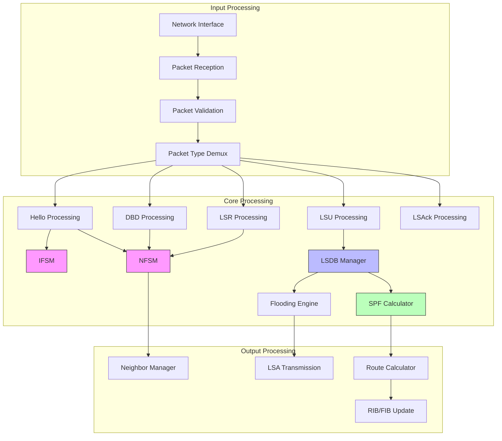

**Speaker Notes:**
This diagram shows the complete OSPF processing pipeline from a developer's perspective. Input flows through packet reception and validation. The core contains two state machines (IFSM and NFSM), the LSDB manager, and SPF calculator. Key implementation consideration: these components must be thread-safe or properly serialized. The packet type demultiplexer routes packets to specific handlers. Modern implementations use event-driven architectures with message queues between components.

---

## Slide 3: OSPF Packet Structure - Base Header

### Common Header (24 bytes)

```
 0                   1                   2                   3
 0 1 2 3 4 5 6 7 8 9 0 1 2 3 4 5 6 7 8 9 0 1 2 3 4 5 6 7 8 9 0 1
+-+-+-+-+-+-+-+-+-+-+-+-+-+-+-+-+-+-+-+-+-+-+-+-+-+-+-+-+-+-+-+-+
|   Version #   |     Type      |         Packet Length         |
+-+-+-+-+-+-+-+-+-+-+-+-+-+-+-+-+-+-+-+-+-+-+-+-+-+-+-+-+-+-+-+-+
|                          Router ID                            |
+-+-+-+-+-+-+-+-+-+-+-+-+-+-+-+-+-+-+-+-+-+-+-+-+-+-+-+-+-+-+-+-+
|                           Area ID                             |
+-+-+-+-+-+-+-+-+-+-+-+-+-+-+-+-+-+-+-+-+-+-+-+-+-+-+-+-+-+-+-+-+
|           Checksum            |             AuType            |
+-+-+-+-+-+-+-+-+-+-+-+-+-+-+-+-+-+-+-+-+-+-+-+-+-+-+-+-+-+-+-+-+
|                       Authentication                          |
+-+-+-+-+-+-+-+-+-+-+-+-+-+-+-+-+-+-+-+-+-+-+-+-+-+-+-+-+-+-+-+-+
|                       Authentication                          |
+-+-+-+-+-+-+-+-+-+-+-+-+-+-+-+-+-+-+-+-+-+-+-+-+-+-+-+-+-+-+-+-+
```

### Packet Types
1. **Hello** (Type 1): Neighbor discovery
2. **Database Description** (Type 2): LSDB synchronization
3. **Link State Request** (Type 3): Request specific LSAs
4. **Link State Update** (Type 4): Flood LSAs
5. **Link State Acknowledgment** (Type 5): Reliable flooding

**Speaker Notes:**
Every OSPF packet starts with this 24-byte header. Key validation points: Version must be 2 (OSPFv2), checksum must be valid, area ID must match (except virtual links), authentication must pass. Router ID is critical - it's the unique identifier for this router in the OSPF domain. Implementation tip: use structure padding awareness and network byte order conversions. The authentication field supports null, simple password, and cryptographic authentication. Modern implementations should use cryptographic authentication only.

---

## Slide 4: OSPF Packet Types - Detailed View

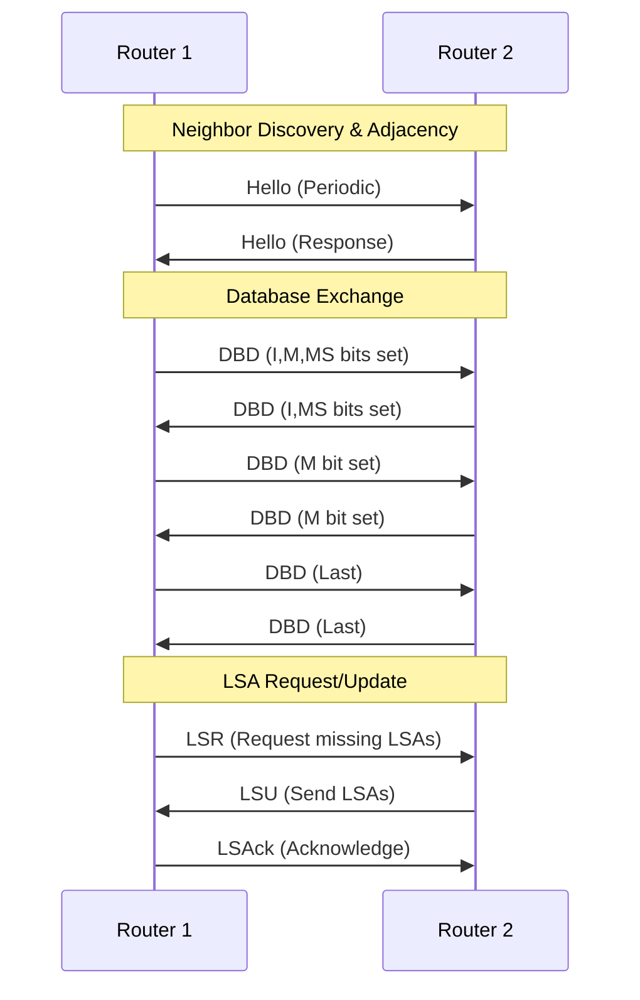

**Speaker Notes:**
This sequence shows the typical OSPF conversation. Hello packets are sent every HelloInterval (typically 10s on broadcast, 30s on NBMA). The DBD exchange is the master/slave negotiation - the router with higher Router ID becomes master. I-bit is Initial, M-bit is More, MS-bit is Master/Slave. Implementation consideration: maintain separate retransmission lists per neighbor for unacknowledged LSAs. LSR packets request specific LSAs by type, advertising router, and link state ID. LSAck can acknowledge multiple LSAs in one packet for efficiency.

---

# Module 2: State Machines

---

## Slide 5: Interface State Machine (IFSM)

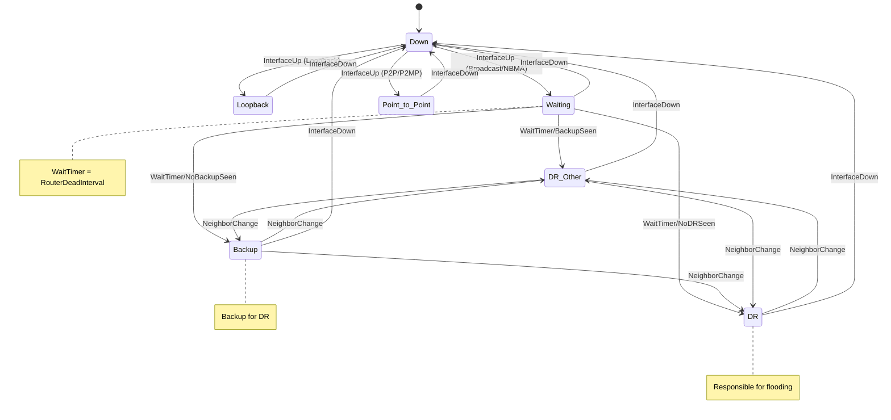

**Speaker Notes:**
The IFSM manages interface states based on network type. Key implementation points: On broadcast/NBMA networks, we wait for WaitTimer (equal to RouterDeadInterval, typically 40s) before electing DR/BDR. This prevents premature elections. The DR election uses priority (0-255) first, then highest Router ID. Priority 0 means never become DR/BDR. On point-to-point links, we skip DR election entirely. State transitions trigger neighbor relationship changes. Each interface maintains its own IFSM instance. Loopback interfaces are always in Loopback state and advertise /32 routes.

---

## Slide 6: IFSM Implementation Considerations

### Interface Types & Behavior

| Network Type | DR Election | Neighbors | Hello/Dead |
|--------------|-------------|-----------|------------|
| Broadcast | Yes | Auto-discover | 10/40 |
| NBMA | Yes | Manual config | 30/120 |
| Point-to-Point | No | Auto-discover | 10/40 |
| Point-to-Multipoint | No | Auto-discover | 30/120 |
| Loopback | No | None | N/A |
| Virtual Link | No | 1 peer | 10/40 |

### Key Data Structures

```c
struct ospf_interface {
    uint32_t router_id;
    uint32_t area_id;
    uint8_t state;              // IFSM state
    uint8_t type;               // Network type
    uint8_t priority;           // DR election priority
    uint32_t dr;                // Designated Router ID
    uint32_t bdr;               // Backup DR ID
    uint16_t hello_interval;
    uint16_t dead_interval;
    uint32_t cost;              // Interface cost
    struct list *neighbors;     // Neighbor list
    struct timer *hello_timer;
    struct timer *wait_timer;
};
```

**Speaker Notes:**
Implementation must maintain per-interface context with all OSPF parameters. Network type determines behavior - broadcast uses multicast, NBMA needs neighbor configuration, P2P is simplest. Cost calculation: reference bandwidth / interface bandwidth. Default reference is 100Mbps, so GigE gets cost 1. Wait timer prevents flapping during initialization. Hello timer must be precise - jitter can cause adjacency flaps. Use separate threads/tasks for timer management. DR/BDR addresses are IP addresses, not Router IDs. Store both for efficient flooding.

---

## Slide 7: Neighbor State Machine (NFSM)

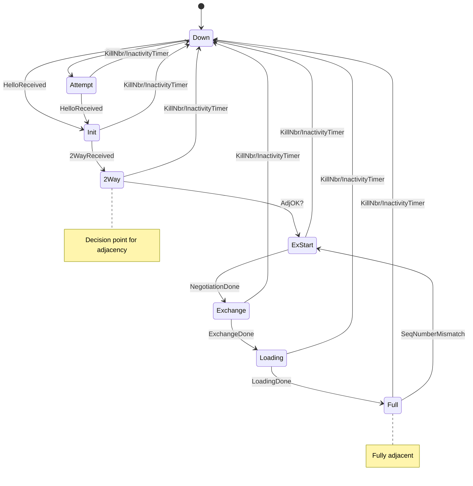

**Speaker Notes:**
NFSM is more complex than IFSM. Down state: no recent Hello received. Attempt state: used only on NBMA networks. Init: Hello received but our Router ID not in neighbor's Hello. 2-Way: bidirectional communication established, we see ourselves in neighbor's Hello. Key decision at 2-Way: form adjacency if we're DR, BDR, or neighbor is DR/BDR, or on point-to-point links. ExStart: negotiate master/slave. Exchange: exchange Database Description packets. Loading: send LSRs for missing LSAs. Full: databases synchronized. Implementation: each neighbor has independent NFSM instance. Dead timer per neighbor must be monitored.

---

## Slide 8: NFSM Implementation Deep Dive

### Neighbor Data Structure

```c
struct ospf_neighbor {
    uint32_t router_id;
    uint8_t state;                  // NFSM state
    uint8_t priority;
    uint32_t dr;                    // Neighbor's DR
    uint32_t bdr;                   // Neighbor's BDR
    
    // Master/Slave
    uint8_t is_master;
    uint32_t dd_seqnum;
    
    // Timers
    struct timer *inactivity_timer;
    
    // Retransmission
    struct list *ls_rxmt_list;      // LSAs to retransmit
    struct timer *rxmt_timer;
    
    // Database exchange
    struct list *db_summary_list;   // DBD summary list
    struct list *ls_request_list;   // Pending LSRs
    
    // Last received packet
    struct ospf_packet *last_recv;
    time_t last_hello;
};
```

**Speaker Notes:**
This structure encapsulates all neighbor state. Inactivity timer must be reset on every Hello received - if it fires, neighbor is declared Down. Master/slave bit determines who increments DD sequence number. Three critical lists: rxmt_list for unacknowledged LSAs (flood reliability), db_summary_list for DBD exchange, ls_request_list for LSAs we're requesting. RxmtInterval typically 5 seconds - retransmit LSAs from rxmt_list. Implementation tip: use efficient list structures (skip lists or hash tables for large LSDBs). Last packet storage helps with duplicate detection and out-of-order handling.

---

## Slide 9: Adjacency Formation Process

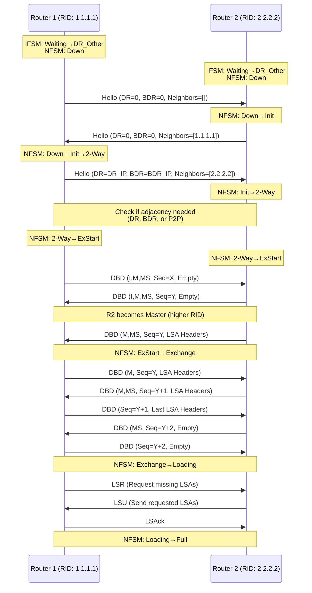

**Speaker Notes:**
This shows the complete adjacency formation. Initial Hello exchange establishes bidirectional communication (2-Way). Critical: we must see our own Router ID in neighbor's Hello to move from Init to 2-Way. DR election happens during Waiting state. After 2-Way, decide if adjacency needed based on DR/BDR status. ExStart negotiates master/slave - higher Router ID wins, becomes master. Master controls sequence numbers. Exchange state swaps database descriptions - each DBD contains LSA headers (not full LSAs). M-bit indicates more DBDs coming. In Loading, request missing LSAs via LSR. Full state means databases synchronized. Implementation: handle DBD retransmissions, out-of-order packets, and sequence number mismatches.

---

# Module 3: Database & LSAs

---

## Slide 10: LSA Types Overview

### LSA Type Classification

| Type | Name | Flooding Scope | Generated By | Purpose |
|------|------|----------------|--------------|---------|
| 1 | Router LSA | Area | All routers | Router's links |
| 2 | Network LSA | Area | DR | Multi-access networks |
| 3 | Summary LSA | Area | ABR | Inter-area routes |
| 4 | ASBR Summary | Area | ABR | Path to ASBR |
| 5 | AS External | AS | ASBR | External routes |
| 7 | NSSA External | Area | ASBR (NSSA) | External in NSSA |
| 9 | Opaque (Link) | Link-local | Any | Extensions |
| 10 | Opaque (Area) | Area | Any | Extensions |
| 11 | Opaque (AS) | AS | Any | Extensions |

**Speaker Notes:**
LSA types define what information is advertised and flooding scope. Type 1/2 are intra-area, describe topology within an area. Type 3/4 are inter-area, ABRs inject these into areas. Type 5 are AS-external, flooded everywhere except stub areas. Type 7 are special for NSSA areas - converted to Type 5 by ABR. Opaque LSAs (9/10/11) enable protocol extensions like Traffic Engineering. Each LSA has 20-byte header plus type-specific body. Implementation: separate storage per LSA type, indexed by LS Type, LS ID, and Advertising Router (the key triple). Age out LSAs reaching MaxAge (3600 seconds).

---

## Slide 11: LSA Header Structure

```
 0                   1                   2                   3
 0 1 2 3 4 5 6 7 8 9 0 1 2 3 4 5 6 7 8 9 0 1 2 3 4 5 6 7 8 9 0 1
+-+-+-+-+-+-+-+-+-+-+-+-+-+-+-+-+-+-+-+-+-+-+-+-+-+-+-+-+-+-+-+-+
|            LS Age             |    Options    |    LS Type    |
+-+-+-+-+-+-+-+-+-+-+-+-+-+-+-+-+-+-+-+-+-+-+-+-+-+-+-+-+-+-+-+-+
|                        Link State ID                          |
+-+-+-+-+-+-+-+-+-+-+-+-+-+-+-+-+-+-+-+-+-+-+-+-+-+-+-+-+-+-+-+-+
|                     Advertising Router                        |
+-+-+-+-+-+-+-+-+-+-+-+-+-+-+-+-+-+-+-+-+-+-+-+-+-+-+-+-+-+-+-+-+
|                     LS Sequence Number                        |
+-+-+-+-+-+-+-+-+-+-+-+-+-+-+-+-+-+-+-+-+-+-+-+-+-+-+-+-+-+-+-+-+
|         LS Checksum           |             Length            |
+-+-+-+-+-+-+-+-+-+-+-+-+-+-+-+-+-+-+-+-+-+-+-+-+-+-+-+-+-+-+-+-+
```

### Key Fields
- **LS Age**: Seconds since origination (0-3600)
- **Options**: E-bit (External), NP-bit (NSSA), etc.
- **LS Type**: 1-11 (see previous slide)
- **Link State ID**: Depends on LS Type
- **Advertising Router**: Originator's Router ID
- **LS Sequence Number**: 0x80000001 to 0x7FFFFFFF
- **LS Checksum**: Fletcher checksum
- **Length**: Total LSA length in bytes

**Speaker Notes:**
Every LSA starts with this header. LS Age increments every second - implementation must have age timer. When age reaches MaxAge (3600), LSA is flushed. Link State ID meaning varies: for Type 1, it's the Router ID; for Type 2, it's DR's interface IP; for Type 3, it's the destination network; for Type 5, it's the external network. LS Sequence Number provides instance identification - higher number is more recent. Initial sequence is 0x80000001, wraps to 0x80000001 after 0x7FFFFFFF. Checksum is Fletcher checksum over entire LSA except age field. Implementation: age all LSAs in LSDB periodically, reoriginate our own LSAs every LSRefreshTime (30 minutes).

---

## Slide 12: Type 1 Router LSA - Detailed Structure

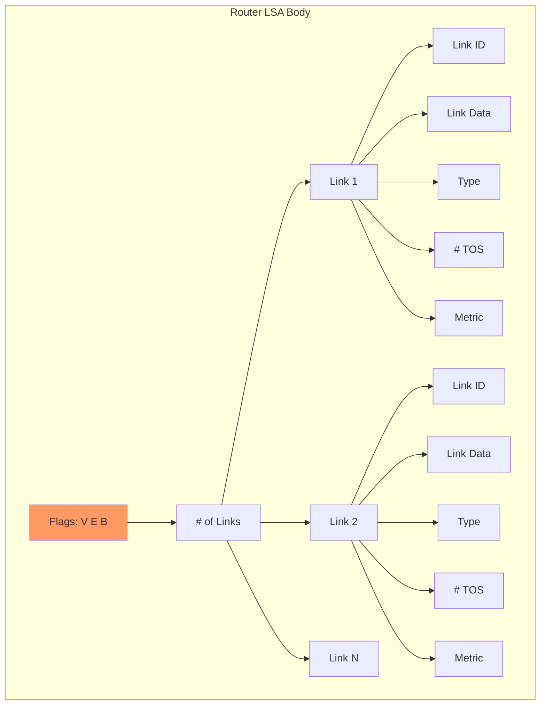

### Link Types in Router LSA

```c
// Link Types
#define ROUTER_LSA_P2P           1  // Point-to-Point
#define ROUTER_LSA_TRANSIT       2  // Transit Network
#define ROUTER_LSA_STUB          3  // Stub Network
#define ROUTER_LSA_VIRTUAL       4  // Virtual Link

// Flags
#define ROUTER_LSA_V_FLAG        0x04  // Virtual endpoint
#define ROUTER_LSA_E_FLAG        0x02  // External (ASBR)
#define ROUTER_LSA_B_FLAG        0x01  // Border (ABR)

struct router_lsa_link {
    uint32_t link_id;      // Neighbor RID or DR IP or Network
    uint32_t link_data;    // IP address or interface index
    uint8_t type;          // Link type (1-4)
    uint8_t num_tos;       // Number of TOS (usually 0)
    uint16_t metric;       // Cost
};
```

**Speaker Notes:**
Type 1 LSA describes router's interfaces. Each router originates one Type 1 LSA per area. Flags: V-bit if virtual link endpoint, E-bit if ASBR, B-bit if ABR. Critical for SPF. Each link entry describes one connection. Type 1 (P2P): Link ID is neighbor Router ID, Link Data is local IP. Type 2 (Transit): Link ID is DR's IP, Link Data is local IP. Type 3 (Stub): Link ID is network address, Link Data is subnet mask. Type 4 (Virtual): similar to P2P. Implementation: automatically generate Type 1 LSA when interface state changes, cost changes, or every LSRefreshTime. Must handle multiple links per interface (e.g., secondary IPs).

---

## Slide 13: Type 2 Network LSA

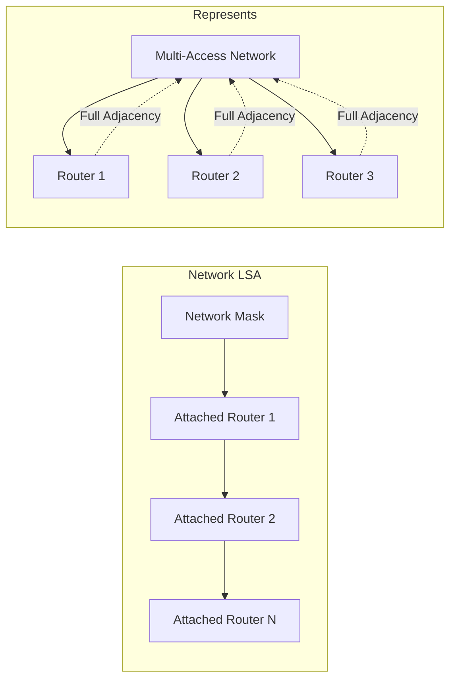

### Network LSA Structure

```c
struct network_lsa {
    uint32_t network_mask;     // Subnet mask
    uint32_t attached_routers[]; // Array of Router IDs
};

// Link State ID = DR's Interface IP Address
// Advertising Router = DR's Router ID
```

### When Originated
- Only by Designated Router (DR)
- When at least one neighbor reaches Full state
- Withdrawn when no Full neighbors exist

**Speaker Notes:**
Type 2 LSA represents multi-access network (broadcast, NBMA). Only DR originates this - represents the network as a pseudo-node in SPF graph. Link State ID is DR's interface IP. Network mask defines subnet. Attached routers list includes DR itself plus all neighbors in Full state. This creates a star topology in SPF calculation - all routers connect through the network node. Implementation: DR must update Type 2 LSA when any neighbor reaches Full or leaves Full state. If DR changes, old DR must flush its Type 2 LSA (MaxAge), new DR originates fresh one. Type 2 LSA eliminates need for full mesh of adjacencies on broadcast networks.

---

## Slide 14: Type 3 Summary LSA

### Purpose: Inter-Area Route Advertisement

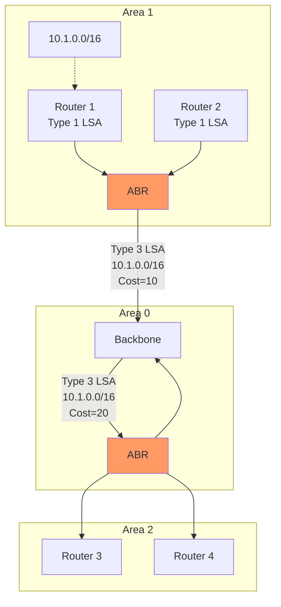

### Type 3 LSA Structure

```c
struct summary_lsa {
    uint32_t network_mask;     // Destination mask
    uint32_t metric;           // Cost (24-bit)
    // Multiple TOS entries possible (rarely used)
};

// Link State ID = Destination Network Address
// Advertising Router = ABR's Router ID
```

**Speaker Notes:**
Type 3 LSAs enable inter-area routing while maintaining area boundaries. ABRs inject Type 3 LSAs into areas for routes learned from other areas. Key: Link State ID is the destination network. Metric is cumulative cost from ABR to destination. ABR performs route summarization here if configured. Implementation: ABR must examine its routing table for each area, generate Type 3 LSAs for destinations in other areas. Do not advertise back into source area. Do not advertise inter-area routes into totally stubby areas. Type 3 LSAs do not carry topology info, only reachability - prevents full LSDB replication. This is distance-vector between areas but link-state within areas.

---

## Slide 15: Type 4 ASBR Summary LSA

### Purpose: Advertise Path to ASBR

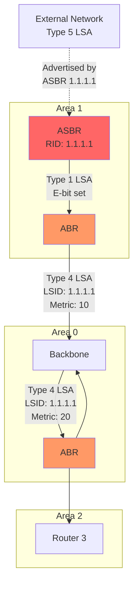

### Type 4 LSA Structure

```c
struct asbr_summary_lsa {
    uint32_t reserved;         // Must be 0
    uint32_t metric;           // Cost to ASBR
};

// Link State ID = ASBR's Router ID
// Advertising Router = ABR's Router ID
```

**Speaker Notes:**
Type 4 LSAs advertise reachability to ASBRs. Required because Type 5 LSAs (external routes) are flooded AS-wide but don't carry intra-OSPF path information. Link State ID is the ASBR's Router ID. Metric is cumulative cost from this ABR to the ASBR. Routers use Type 4 LSAs to determine which ABR provides the best path to reach an ASBR, then use that path to reach Type 5 external routes advertised by that ASBR. Implementation: ABR generates Type 4 LSA when it sees Type 1 LSA with E-bit set in another area. Maintain mapping of ASBR Router IDs to costs. Update when intra-area topology changes.

---

## Slide 16: Type 5 AS-External LSA

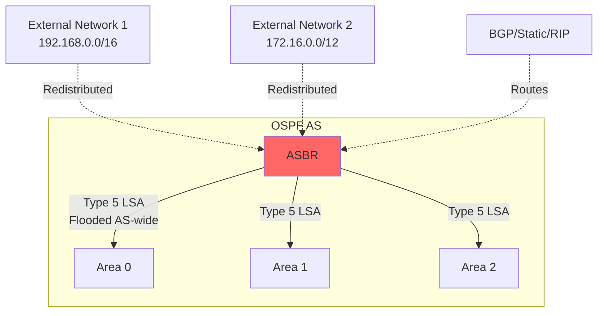

### Type 5 LSA Structure

```c
struct external_lsa {
    uint32_t network_mask;
    uint32_t metric : 24;
    uint8_t e_bit : 1;           // External metric type
    uint8_t reserved : 7;
    uint32_t forwarding_address; // Next hop
    uint32_t external_route_tag; // External route tag
};

// E-bit: 0 = Type 1 metric, 1 = Type 2 metric
// Link State ID = External Network Address
// Advertising Router = ASBR's Router ID
```

**Speaker Notes:**
Type 5 LSAs advertise external routes learned from other protocols (BGP, static, etc.). Flooded throughout the OSPF AS except stub areas. E-bit determines metric type: Type 1 adds OSPF internal cost to external cost; Type 2 uses only external cost (default). Forwarding address: if non-zero, use this as next hop instead of ASBR; useful when ASBR has direct connection to external network. External route tag: administrative field for policy, commonly used with route maps. Implementation: ASBR must maintain external route database separate from LSDB. Reoriginate Type 5 LSAs when external routes change. Handle redistribution carefully - tag routes to prevent loops.

---

## Slide 17: Type 7 NSSA External LSA

### NSSA (Not-So-Stubby Area) Concept

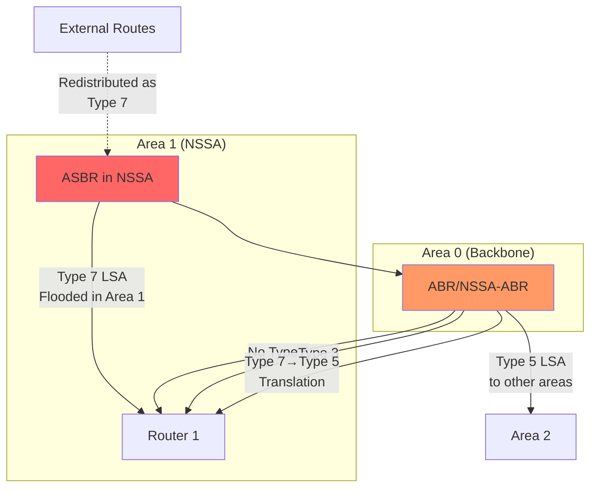

### Type 7 LSA Structure

```c
struct nssa_lsa {
    uint32_t network_mask;
    uint32_t metric : 24;
    uint8_t e_bit : 1;           // External metric type
    uint8_t reserved : 7;
    uint32_t forwarding_address;
    uint32_t external_route_tag;
    // Identical to Type 5 body
};

// Link State ID = External Network Address
// Advertising Router = ASBR's Router ID (in NSSA)
```

**Speaker Notes:**
NSSA allows ASBRs in stub-like areas. Type 7 LSAs are like Type 5 but flooded only within NSSA area. The NSSA-ABR (ABR with highest Router ID or configured translator) translates Type 7 to Type 5 when flooding into backbone/other areas. This allows external routes in "semi-stub" areas without full Type 5 flooding. P-bit (Propagate) in Options field controls translation. Implementation: NSSA-ABR must watch for Type 7 LSAs, perform translation when P-bit set. Original Type 7 remains in NSSA for local routing. Metric can be modified during translation. Handle conflicts when multiple ABRs could translate - use Router ID as tiebreaker.

---

## Slide 18: LSDB Management - Data Structures

### Primary Data Structures

```c
// LSDB organized per area
struct ospf_lsdb {
    struct hash_table *type1_table;  // Router LSAs
    struct hash_table *type2_table;  // Network LSAs
    struct hash_table *type3_table;  // Summary LSAs
    struct hash_table *type4_table;  // ASBR Summary
    // Type 5 stored in AS-wide LSDB
    struct hash_table *type7_table;  // NSSA External (per area)
    struct hash_table *opaque_area;  // Type 10 Opaque
};

// Key for LSDB lookup
struct lsa_key {
    uint8_t type;
    uint32_t id;               // Link State ID
    uint32_t adv_router;       // Advertising Router
};

// LSDB Entry
struct ospf_lsa {
    struct lsa_header header;
    void *data;                // Type-specific body
    time_t installed;          // When received
    struct list *received_from; // Which neighbors sent it
    uint8_t originated_local;  // Did we originate this?
};
```

**Speaker Notes:**
LSDB implementation requires efficient indexing. Use hash tables indexed by (Type, LSID, Adv Router) tuple. Separate tables per type enable faster lookups. For Type 1/2/3/4/7/10, maintain per-area LSDB. Type 5 and Type 11 are AS-wide, single instance. Implementation tip: use hash table with chaining or open addressing. Precompute hash for fast lookup during SPF. Store received_from list to track which neighbors sent this LSA - needed for flooding scope rules (don't flood back to sender). originated_local flag prevents self-flooding and enables automatic reorigination. installed timestamp tracks age - increment age of all LSAs periodically (typically every second).

---

## Slide 19: LSA Installation & Comparison

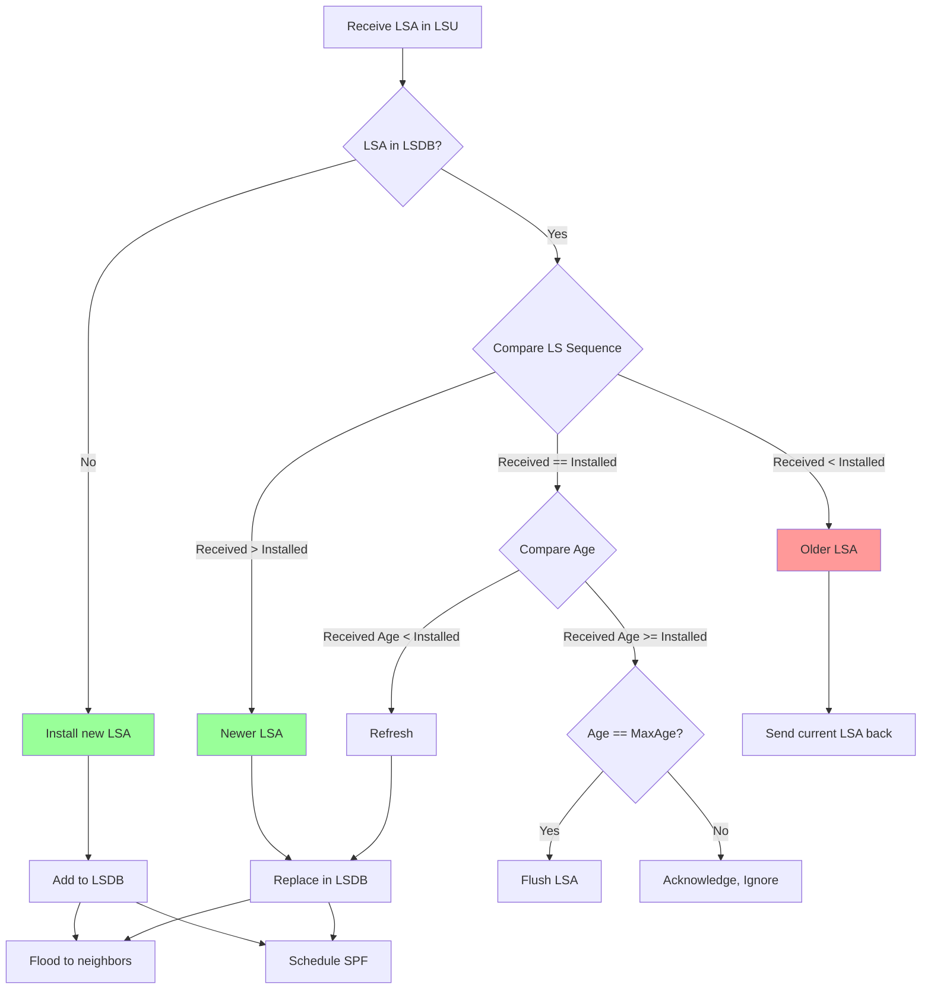

**Speaker Notes:**
LSA comparison algorithm is critical. When LSA received: 1) Check if exists in LSDB using key triple. 2) If not, install. 3) If exists, compare sequence numbers. Higher sequence = newer. 4) If sequences equal, compare age - if received age is much smaller (difference > MaxAgeDiff=900s), it's refreshed copy. 5) If received LSA older, send current version back. 6) MaxAge LSAs are always newest - used for flushing. Implementation: sequence number comparison handles wraparound (0x80000001 after 0x7FFFFFFF). Age difference check prevents accepting slightly older refreshes. Must handle MaxAge specially - install MaxAge LSA, flood, then remove after MinLSInterval.

---

## Slide 20: LSA Flooding Algorithm

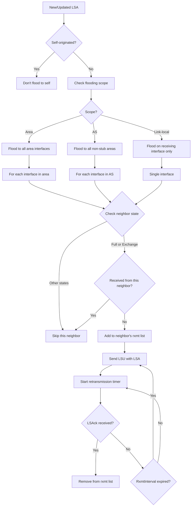

**Speaker Notes:**
Flooding ensures all routers have synchronized LSDBs. Key rules: Never flood back to sender. Only flood to neighbors in Exchange or Full state. Maintain per-neighbor retransmission list for reliability. Flood scope varies: Type 9 (link-local) only on receiving interface, Type 1/2/3/4/7/10 within area, Type 5/11 AS-wide but not into stub areas. Implementation: LSUpdate packet can carry multiple LSAs for efficiency. Group LSAs when possible. RxmtInterval typically 5 seconds - retransmit from rxmt list. Remove from rxmt list on explicit LSAck or when neighbor sends same LSA back in LSUpdate (implicit ack). Handle MaxAge LSAs specially - flood immediately, higher priority.

---

## Slide 21: LSA Origination Triggers

### When to Originate LSAs

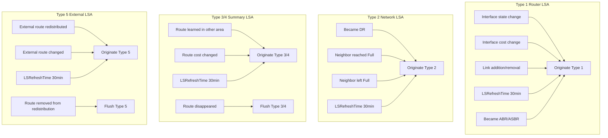

**Speaker Notes:**
LSA origination must be event-driven. Type 1: Interface state changes (up/down, cost change) trigger immediate origination. Type 2: DR status and Full neighbor changes. Type 3/4: ABRs watch routing table - when route to destination in another area appears/changes/disappears, update Type 3 LSA. Type 5: ASBRs monitor external routes from redistribution. Critical: rate-limit origination using MinLSInterval (5 seconds) to prevent flooding storms. Queue changes, batch process. LSRefreshTime: proactively reoriginate all self-originated LSAs every 1800 seconds (30 minutes) even if unchanged - prevents age-out. Sequence number increments on reorigination. Implementation: maintain separate list of self-originated LSAs for efficient refresh processing.

---

# Module 4: Routing & Calculation

---

## Slide 22: Dijkstra SPF Algorithm - Overview

### SPF Calculation Trigger Events
- New LSA received (Type 1, 2, 3, 4)
- LSA content changed
- LSA aged out (MaxAge)
- Neighbor state changed to/from Full

### SPF Process

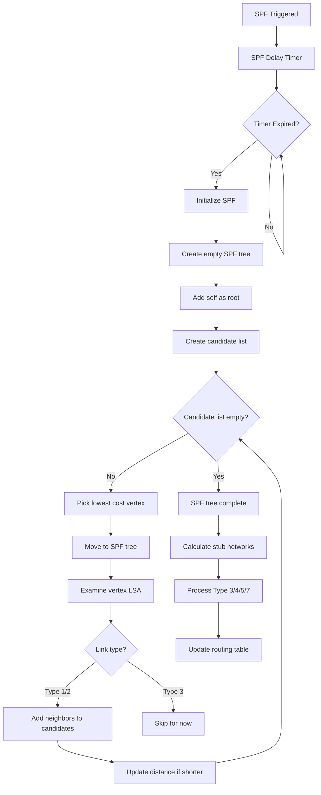

**Speaker Notes:**
SPF uses Dijkstra's algorithm on the LSDB graph. Trigger: wait SPFDelay (typically 1-5 seconds) to batch changes. Algorithm: Start with self as root (cost 0). Maintain two lists: SPF tree (completed) and candidate list (under consideration). Iteratively pick lowest-cost candidate, add to SPF tree, examine its LSA, add neighbors to candidates with updated cost. Continue until candidate list empty. Only Type 1/2 LSAs used for SPF tree - they form the topology. Type 3/4/5/7 processed separately after tree built. Implementation: use priority queue (heap) for candidate list. Cost ties broken by Router ID. Handle equal-cost multipath (ECMP) - keep multiple nexthops.

---

## Slide 23: SPF Algorithm - Detailed Implementation

```c
struct spf_vertex {
    uint8_t type;                // Router or Network
    uint32_t id;                 // Router ID or Network IP
    uint32_t cost;               // Distance from root
    struct vertex *parent;
    struct list *nexthops;       // List of nexthops (ECMP)
    struct list *children;
    struct ospf_lsa *lsa;        // Associated LSA
};

void ospf_spf_calculate(struct ospf_area *area) {
    struct spf_vertex *root;
    struct heap *candidate_list;
    struct tree *spf_tree;
    
    // Initialize
    root = create_vertex(ROUTER, area->ospf->router_id, 0);
    root->lsa = find_router_lsa(area, area->ospf->router_id);
    spf_tree = tree_create();
    tree_add(spf_tree, root);
    
    candidate_list = heap_create();
    
    // Add self's links to candidate list
    process_router_links(root, candidate_list);
    
    // Main loop
    while (!heap_empty(candidate_list)) {
        struct spf_vertex *v = heap_extract_min(candidate_list);
        tree_add(spf_tree, v);
        
        if (v->type == ROUTER) {
            process_router_links(v, candidate_list);
        } else { // NETWORK
            process_network_links(v, candidate_list);
        }
    }
    
    // Calculate routes
    calculate_stub_routes(spf_tree, area);
    calculate_summary_routes(area);
    calculate_external_routes(area);
}
```

**Speaker Notes:**
Implementation details: Root vertex represents self, cost 0. For each vertex added to tree, examine its LSA. Router LSA: iterate through links. For P2P/Virtual links, add neighbor router as candidate. For Transit links, add network vertex. Network LSA: add all attached routers. When adding to candidates, check if already exists - if so, compare costs. If new path equal cost, add to nexthop list (ECMP). If better, replace. Use heap for efficient min-cost extraction. After SPF tree complete, process stub networks (Type 3 links in Router LSAs) - these are leaves, not intermediate nodes. Then process Type 3/4 LSAs for inter-area routes, Type 5/7 for external routes.

---

## Slide 24: Nexthop Calculation

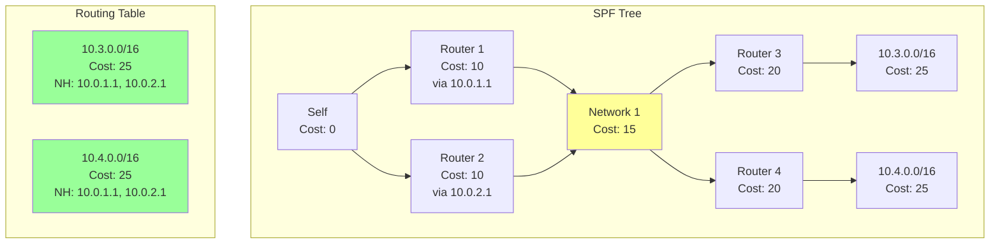

### Nexthop Calculation Rules

```c
struct nexthop {
    uint32_t ip_address;    // Next-hop IP
    uint32_t interface_id;  // Outgoing interface
};

void calculate_nexthop(struct spf_vertex *v) {
    if (v->parent == root) {
        // Direct connection
        if (v->type == ROUTER) {
            // P2P: nexthop is neighbor's address
            v->nexthop = get_p2p_neighbor_address(v);
        } else {
            // Transit network: nexthop is own address
            v->nexthop = get_own_address_on_network(v);
        }
    } else {
        // Inherit nexthop from parent
        v->nexthops = copy_list(v->parent->nexthops);
    }
}
```

**Speaker Notes:**
Nexthop calculation is crucial. Nexthop is always directly connected router or network. Rules: If parent is root (self), nexthop is the connection details - for P2P, neighbor's IP; for transit network, own interface IP. If parent is not root, inherit parent's nexthop. This recursive inheritance ensures nexthop is always the first-hop router/interface. ECMP: when vertex reached via multiple equal-cost paths, store all nexthops. Implementation: propagate nexthop list down the tree during SPF. For stub networks, nexthop comes from parent router. For inter-area routes (Type 3), nexthop is the ABR that advertised it. For external routes (Type 5), nexthop can be specified in LSA's forwarding address field or defaults to ASBR.

---

## Slide 25: Route Calculation - Type 1 & 2 (Intra-Area)

### Type 1 Router LSA - Stub Networks

```c
void calculate_stub_routes(struct spf_tree *tree) {
    for each router_vertex in tree {
        struct router_lsa *rlsa = router_vertex->lsa;
        
        for each link in rlsa->links {
            if (link->type == STUB) {
                // Calculate network address
                uint32_t network = link->link_id & link->link_data;
                uint32_t mask = link->link_data;
                uint32_t cost = router_vertex->cost + link->metric;
                
                // Add to routing table
                add_route(network, mask, cost, 
                         INTRA_AREA, 
                         router_vertex->nexthops);
            }
        }
    }
}
```

### Type 2 Network LSA - Transit Networks

```c
void calculate_transit_routes(struct spf_tree *tree) {
    for each network_vertex in tree {
        struct network_lsa *nlsa = network_vertex->lsa;
        
        // Network address from LS ID, mask from LSA body
        uint32_t network = network_vertex->id & nlsa->network_mask;
        uint32_t mask = nlsa->network_mask;
        uint32_t cost = network_vertex->cost;
        
        add_route(network, mask, cost,
                 INTRA_AREA,
                 network_vertex->nexthops);
    }
}
```

**Speaker Notes:**
Intra-area routes come from Type 1/2 LSAs processed during SPF. Type 1 stub links: these are leaf networks attached to routers. Link ID is network address (for multi-access) or IP address (for P2P unnumbered). Link Data is mask. Cost is router's cost from SPF plus link metric. Type 2 networks: represented as vertices in SPF tree. Network address calculated from LS ID masked with network mask. These routes have highest preference (intra-area > inter-area > external). Implementation: while processing SPF tree, collect all stub links. After SPF completes, add to routing table. Handle conflicts - if same prefix appears multiple times, prefer lower cost.

---

## Slide 26: Route Calculation - Type 3 (Inter-Area)

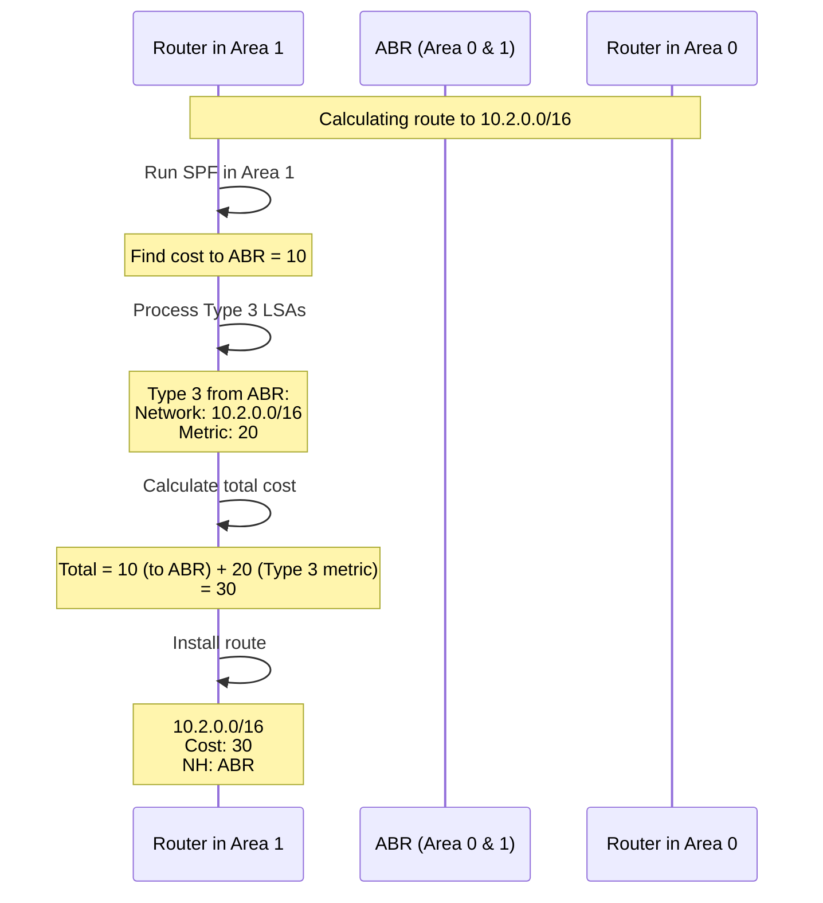

### Type 3 Processing Algorithm

```c
void calculate_summary_routes(struct ospf_area *area) {
    struct ospf_lsdb *lsdb = area->lsdb;
    
    for each summary_lsa in lsdb->type3_table {
        uint32_t network = summary_lsa->header.id;
        uint32_t mask = summary_lsa->body.network_mask;
        uint32_t lsa_cost = summary_lsa->body.metric;
        uint32_t abr_id = summary_lsa->header.adv_router;
        
        // Find cost to ABR from SPF tree
        struct route *abr_route = find_route_to_router(abr_id);
        if (!abr_route) continue; // ABR unreachable
        
        uint32_t total_cost = abr_route->cost + lsa_cost;
        
        // Check if better than existing route
        struct route *existing = find_route(network, mask);
        if (!existing || total_cost < existing->cost) {
            add_route(network, mask, total_cost,
                     INTER_AREA,
                     abr_route->nexthops);
        } else if (total_cost == existing->cost) {
            // Equal cost - add to ECMP
            merge_nexthops(existing, abr_route->nexthops);
        }
    }
}
```

**Speaker Notes:**
Type 3 processing happens after SPF completes. For each Type 3 LSA in area: 1) Extract destination network/mask from LS ID and body. 2) Find ABR (advertising router) - must be reachable via intra-area route (from SPF). 3) Total cost = cost to ABR (from SPF) + metric in Type 3 LSA. 4) Compare with existing route - prefer intra-area over inter-area at same cost. 5) Multiple ABRs might advertise same prefix - choose lowest cost, or ECMP if equal. Implementation: ABR must be in same area's SPF tree. If multiple Type 3 LSAs for same prefix, process all, keep best. Do not accept Type 3 for prefixes we learned intra-area (ignore). Handle summarization at ABR - ABR only advertises summary routes, not individual components.

---

## Slide 27: Route Calculation - Type 4 & 5 (External)

### Type 4 ASBR Summary - Finding ASBR Path

```c
void calculate_asbr_routes(struct ospf_area *area) {
    for each asbr_summary_lsa in lsdb->type4_table {
        uint32_t asbr_id = asbr_summary_lsa->header.id;
        uint32_t lsa_cost = asbr_summary_lsa->body.metric;
        uint32_t abr_id = asbr_summary_lsa->header.adv_router;
        
        struct route *abr_route = find_route_to_router(abr_id);
        if (!abr_route) continue;
        
        uint32_t total_cost = abr_route->cost + lsa_cost;
        
        // Store in ASBR routing table
        add_asbr_route(asbr_id, total_cost, abr_route->nexthops);
    }
}
```

### Type 5 External Routes

```c
void calculate_external_routes() {
    for each external_lsa in as_lsdb->type5_table {
        uint32_t network = external_lsa->header.id;
        uint32_t mask = external_lsa->body.network_mask;
        uint32_t ext_cost = external_lsa->body.metric;
        uint8_t metric_type = external_lsa->body.e_bit;
        uint32_t asbr_id = external_lsa->header.adv_router;
        uint32_t fwd_addr = external_lsa->body.forwarding_address;
        
        // Determine nexthop
        struct route *path;
        if (fwd_addr != 0) {
            path = find_route_to_address(fwd_addr);
        } else {
            path = find_asbr_route(asbr_id);
        }
        if (!path) continue;
        
        // Calculate cost
        uint32_t total_cost;
        if (metric_type == 1) { // Type 1 External
            total_cost = path->cost + ext_cost;
        } else { // Type 2 External
            total_cost = ext_cost; // Only external cost
        }
        
        add_route(network, mask, total_cost,
                 metric_type == 1 ? EXTERNAL_1 : EXTERNAL_2,
                 path->nexthops);
    }
}
```

**Speaker Notes:**
External route calculation requires Type 4 and Type 5 LSAs. First, process Type 4 LSAs to learn paths to ASBRs - similar to Type 3 processing, find ABR, calculate cost to ASBR through ABR. Store ASBR routes separately. Then process Type 5 LSAs: Check forwarding address - if non-zero, use route to that address; otherwise use ASBR route from Type 4. Metric type critical: Type 1 (E1) adds internal cost, Type 2 (E2, default) uses only external cost. Type 2 preferred at equal cost, then Type 1. Implementation: maintain separate ASBR routing table. Handle unreachable ASBRs gracefully. For Type 1, cost increases as you move away from ASBR. For Type 2, cost constant regardless of internal path - tiebreak using internal cost. Forwarding address optimization avoids extra hop through ASBR when ASBR has direct external connection.

---

## Slide 28: Route Table Installation & Priority

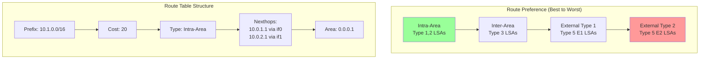

### Route Installation Process

```c
struct ospf_route {
    uint32_t prefix;
    uint32_t mask;
    uint32_t cost;
    enum route_type type;  // INTRA, INTER, E1, E2
    uint32_t area_id;      // Source area
    struct list *nexthops;
    uint32_t tag;          // External route tag
};

int compare_routes(struct ospf_route *r1, struct ospf_route *r2) {
    // Same prefix/mask comparison
    
    // 1. Prefer by type (intra > inter > E1 > E2)
    if (r1->type != r2->type) {
        return route_type_preference[r1->type] - 
               route_type_preference[r2->type];
    }
    
    // 2. Prefer by cost
    if (r1->cost != r2->cost) {
        return r1->cost - r2->cost;
    }
    
    // 3. Equal cost - ECMP
    return 0;
}

void install_routes_to_rib() {
    for each route in ospf_routing_table {
        // Compare with existing route
        struct route *existing = rib_lookup(route->prefix, route->mask);
        
        if (!existing || compare_routes(route, existing) < 0) {
            // Install or update
            rib_add_route(route->prefix, route->mask,
                         route->nexthops, PROTO_OSPF);
        } else if (compare_routes(route, existing) == 0) {
            // Merge ECMP paths
            rib_add_nexthops(existing, route->nexthops);
        }
    }
}
```

**Speaker Notes:**
After all route calculations, install into main routing table (RIB), then download to forwarding plane (FIB). Route preference: Intra-area best, then inter-area, then E1, finally E2. Within same type, lowest cost wins. Equal cost enables ECMP. Implementation: maintain OSPF-specific routing table separate from main RIB. After SPF completes, compare all OSPF routes with RIB. RIB arbitrates between protocols (OSPF, BGP, static) using administrative distance. OSPF typically has AD 110. Within OSPF, follow above preference. Download to FIB must be efficient - batch updates, use incremental changes. Handle nexthop resolution - ensure nexthops are reachable. For recursive routes (Type 3/5), nexthop might require another lookup.

---

## Slide 29: Route Download to FIB

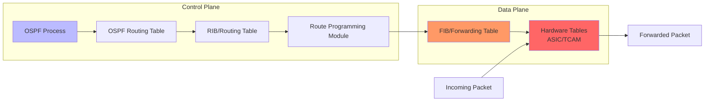

### FIB Programming Considerations

```c
struct fib_entry {
    uint32_t prefix;
    uint32_t mask;
    uint8_t prefix_len;
    struct fib_nexthop *nexthops;
    uint32_t nexthop_count;
    void *hw_handle;           // Hardware entry handle
};

void download_to_fib(struct ospf_route *route) {
    struct fib_entry *fib = allocate_fib_entry();
    
    fib->prefix = route->prefix;
    fib->mask = route->mask;
    fib->prefix_len = mask_to_prefixlen(route->mask);
    
    // Program nexthops
    fib->nexthop_count = list_size(route->nexthops);
    fib->nexthops = allocate_nexthop_array(fib->nexthop_count);
    
    int i = 0;
    for each nexthop in route->nexthops {
        fib->nexthops[i].ip = nexthop->ip_address;
        fib->nexthops[i].interface = nexthop->interface_id;
        fib->nexthops[i].weight = 1; // Equal weight for ECMP
        
        // Resolve nexthop to MAC address (ARP/ND)
        fib->nexthops[i].mac = arp_resolve(nexthop->ip_address);
        i++;
    }
    
    // Program hardware
    hw_program_route(fib);
}
```

**Speaker Notes:**
Route download bridges control and data planes. RIB maintains routes from all protocols. OSPF installs routes to RIB. RIB selects best routes per prefix (administrative distance), then downloads to FIB. FIB is optimized for fast lookup - typically hash table or trie (LPC trie, DIR-24-8). Hardware FIB (TCAM) has size limits - must handle overflow gracefully. Implementation: Use incremental updates - add/delete/modify rather than full table refresh. Batch updates for efficiency. Handle ECMP in hardware - program nexthop group. Nexthop resolution critical: map IP nexthop to MAC address via ARP/ND. On hardware platforms, coordinate with ASIC drivers. Handle failures: if hardware programming fails, mark route as pending, retry. Monitor FIB capacity, warn on near-full.

---

# Module 5: Advanced Features

---

## Slide 30: Fast Reroute (FRR) - Overview

### FRR Motivation

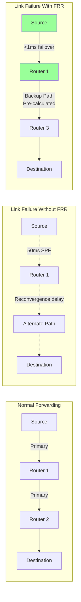

### FRR Concepts
- **Repair Path**: Pre-computed backup nexthop
- **Protected Resource**: Link or node being protected
- **Point of Local Repair (PLR)**: Router detecting failure
- **Loop-Free**: Backup path must not loop
- **Sub-50ms Convergence**: Use backup immediately

**Speaker Notes:**
Traditional OSPF reconvergence takes 50-200ms: failure detection (10-40ms), SPF calculation (10-50ms), FIB update (10-100ms). For carrier networks and real-time applications, this is too slow. FRR pre-calculates backup paths during normal SPF. On failure detection, PLR immediately switches traffic to backup path (sub-1ms). Then SPF runs in background for final convergence. Key requirement: backup path must be loop-free - it must not send traffic back to PLR or through failed resource. Types: Link Protection (backup for single link) and Node Protection (backup that avoids failed node entirely). Implementation: calculate backup nexthops during SPF, store in FIB alongside primary nexthop. On failure, toggle to backup.

---

## Slide 31: Loop-Free Alternate (LFA)

```mermaid
graph TB
    subgraph "Topology"
        S[S<br/>Source/PLR] -->|5| D[D<br/>Destination]
        S -->|10| N1[N1<br/>LFA Candidate]
        N1 -->|1| D
        S -->|15| N2[N2]
        N2 -->|20| D
        S -->|8| N3[N3]
        N3 -->|50| D
    end
    
    subgraph "Distance Table"
        DT[From S's perspective:<br/>S→D = 5 (primary)<br/>N1→D = 1<br/>N2→D = 20<br/>N3→D = 50<br/><br/>From N1's perspective:<br/>N1→S = 10<br/>N1→D = 1]
    end
    
    style N1 fill:#9f9
```

### LFA Condition

**Loop-Free Alternate Condition:**
```
Distance(N, D) < Distance(N, S) + Distance(S, D)
```

**For N1:**
```
Distance(N1, D) = 1
Distance(N1, S) + Distance(S, D) = 10 + 5 = 15
1 < 15 ✓ N1 is LFA
```

### LFA Calculation

```c
void calculate_lfa(struct ospf_area *area) {
    struct spf_tree *tree = area->spf_tree;
    
    for each destination in tree {
        struct route *primary = destination->route;
        struct nexthop *primary_nh = primary->nexthops[0];
        
        // Try each neighbor as LFA candidate
        for each neighbor in area->neighbors {
            if (neighbor == primary_nh->router) continue; // Skip primary
            
            // LFA condition: Dist(N,D) < Dist(N,S) + Dist(S,D)
            uint32_t dist_n_d = get_distance(neighbor, destination);
            uint32_t dist_n_s = get_distance(neighbor, self);
            uint32_t dist_s_d = primary->cost;
            
            if (dist_n_d < dist_n_s + dist_s_d) {
                // Found LFA
                destination->backup_nexthop = neighbor;
                break;
            }
        }
    }
}
```

**Speaker Notes:**
LFA is simplest FRR mechanism. Condition: neighbor N is LFA for destination D if distance from N to D is less than distance from N to S (self) plus S to D. This ensures N won't send packet back to S, preventing loops. In example, N1 is LFA: it's 1 hop to D, but would be 15 hops if it sent back through S. N2 and N3 fail condition. Implementation: During SPF, calculate all distances. After primary SPF, iterate through neighbors, check LFA condition for each destination. Store best LFA as backup nexthop. Coverage: LFA doesn't always exist - typical coverage 85-95% in ISP networks. For uncovered destinations, need advanced techniques (RLFA, TILFA).

---

## Slide 32: Remote LFA (RLFA)

```mermaid
graph TB
    subgraph "Topology - LFA Not Available"
        S[S<br/>PLR] -->|5 FAIL| D[D<br/>Destination]
        S -->|10| N1[N1]
        N1 -->|1| D
        S -->|15| N2[N2]
        N2 -->|3| D
    end
    
    subgraph "Problem"
        P[N1→D = 1<br/>N1→S = 10<br/>N1→S→D = 15<br/>1 < 15 ✓ LFA<br/><br/>But N1 unreachable<br/>without crossing failure!]
    end
    
    subgraph "RLFA Solution"
        S2[S] -.->|Tunnel| PQ[PQ-node<br/>N2]
        PQ -->|Normal routing| D2[D]
    end
    
    style PQ fill:#9f9
```

### RLFA Concept
- **PQ-node**: Reachable from S without failure (P-space) AND can reach D without going through S (Q-space)
- **Mechanism**: Encapsulate traffic in tunnel to PQ-node
- **At PQ-node**: Decapsulate and forward normally

### RLFA Calculation

```c
void calculate_rlfa(struct ospf_area *area) {
    // Step 1: Calculate P-space (reachable from S not via failed link)
    struct spf_tree *p_space = calculate_spf_exclude_link(failed_link);
    
    // Step 2: Calculate Q-space (can reach D not via S)
    // Run reverse SPF from D
    struct spf_tree *q_space = calculate_reverse_spf(destination);
    
    // Step 3: Find PQ-nodes (intersection)
    for each node in topology {
        if (in_p_space(node) && in_q_space(node)) {
            // Found PQ-node
            pq_nodes.add(node);
        }
    }
    
    // Step 4: Select best PQ-node (closest to S)
    struct vertex *best_pq = find_min_cost(pq_nodes);
    
    // Step 5: Create tunnel to PQ-node
    create_tunnel(self, best_pq, destination);
}
```

**Speaker Notes:**
RLFA extends LFA coverage by using tunnels. When direct LFA doesn't exist, find remote node (PQ-node) that satisfies both: (1) reachable from S without using failed link (P-space), (2) can reach D without going through S (Q-space). Encapsulate packets in IP/GRE tunnel to PQ-node. PQ-node decapsulates and forwards normally to D. Implementation requires: Running SPF excluding failed link for P-space. Running reverse SPF from each destination for Q-space. Finding intersection. Shortest PQ-node preferred. Tunnel can be LDP or GRE. RLFA achieves ~99% coverage in ISP topologies. Complexity: requires tunnel infrastructure, more memory for P/Q spaces. Modern implementations optimize by calculating P-space once for all destinations.

---

## Slide 33: Topology-Independent LFA (TILFA)

```mermaid
graph TB
    subgraph "Segment Routing Based TILFA"
        S[S<br/>PLR] -->|FAIL| D[D<br/>Destination]
        S -->|Backup Path| N1[N1]
        N1 -->|Segment List:<br/>{N2, D}| N2[N2]
        N2 --> D
    end
    
    subgraph "Segment Routing Concepts"
        SR1[Node Segment:<br/>Shortest path to node]
        SR2[Adjacency Segment:<br/>Specific link]
        SR3[Stack of segments<br/>enables source routing]
    end
    
    style S fill:#f96
    style N2 fill:#9f9
```

### TILFA Advantages
- **100% Coverage**: Always finds backup path
- **No Tunnels**: Uses Segment Routing labels
- **Topology Independent**: Works in any topology
- **Explicit Path**: Source routing with segment stack

### TILFA Implementation

```c
struct segment {
    uint32_t label;
    enum seg_type type;  // NODE_SID or ADJ_SID
    uint32_t node_id;
};

void calculate_tilfa(struct destination *dest) {
    struct segment_list *backup_path;
    
    // Step 1: Find post-convergence path
    struct path *post_conv = calculate_spf_without_failure(dest);
    
    // Step 2: Find node that isn't affected by failure
    struct vertex *repair_node = find_unaffected_node(dest);
    
    // Step 3: Build segment list
    backup_path = create_segment_list();
    
    // Segment to repair node (avoids failure)
    segment_list_add(backup_path, 
                    create_node_segment(repair_node));
    
    // Segment to destination
    segment_list_add(backup_path,
                    create_node_segment(dest));
    
    // Step 4: Install backup path with segment list
    fib_install_backup(dest, backup_path);
}

void forward_with_tilfa(struct packet *pkt) {
    if (primary_path_failed()) {
        // Push segment list onto packet
        push_segment_stack(pkt, backup_segment_list);
        // Forward based on top segment
        forward_to_nexthop(pkt, 
                          segment_to_nexthop(pkt->segments[0]));
    }
}
```

**Speaker Notes:**
TILFA uses Segment Routing to achieve 100% coverage. Segment Routing: source router encodes explicit path as stack of segments. Node segment (Node-SID) = shortest path to node. Adjacency segment (Adj-SID) = specific link. TILFA calculation: Find node not affected by failure that can reach destination. Build segment list to steer traffic around failure. On failure, push segment stack onto packet. Each router pops top segment and forwards accordingly. Benefits: No tunnel overhead, 100% coverage, topology-independent. Requirements: SR-OSPF extensions (Opaque LSAs), SR-capable hardware. Implementation: Allocate Node-SIDs (typically node index + base value). Advertise in Type 10 Opaque LSAs. Calculate backup segment lists for all destinations. Program FIB with segment lists. Modern approach: uses MPLS or SRv6 labels.

---

## Slide 34: Incremental SPF (iSPF)

```mermaid
graph TB
    subgraph "Full SPF"
        F1[LSA Change] --> F2[Rebuild entire tree]
        F2 --> F3[Recalculate all routes]
        F3 --> F4[Update entire RIB]
    end
    
    subgraph "Incremental SPF"
        I1[LSA Change] --> I2[Identify affected subtree]
        I2 --> I3[Recalculate only affected routes]
        I3 --> I4[Update only changed routes]
    end
    
    subgraph "Complexity Comparison"
        C1[Full SPF: O(N log N)]
        C2[iSPF: O(K log K)]
        C3[where K << N]
    end
    
    style I2 fill:#9f9
    style I3 fill:#9f9
```

### iSPF Triggers & Actions

| LSA Change | Affected Area | iSPF Action |
|------------|---------------|-------------|
| Type 1 Link Metric | Subtree below link | Recalc subtree only |
| Type 1 New Link | Affected node's children | Add link, recalc subtree |
| Type 1 Remove Link | Affected node's children | Remove link, recalc subtree |
| Type 2 Attached Router | Network vertex children | Update network vertex |
| Type 3 Metric | Inter-area routes | Recalc summary only |

**Speaker Notes:**
Full SPF is expensive: O(N log N) for N routers. Large networks with 1000s of routers take 10-50ms. Incremental SPF optimizes by recalculating only affected portions. Key insight: many LSA changes affect only part of topology. Leaf link cost change only affects routes through that leaf. Implementation: Maintain SPF tree between calculations. When LSA changes, identify affected vertices. Mark subtree as invalid. During iSPF, only recalculate invalid subtrees. For leaf changes (Type 1 stub links), no SPF needed - just update route cost. For topology changes, identify attachment point in tree, recalculate from there down. Complexity: iSPF is O(K log K) where K = affected vertices. In practice, 10-100x faster than full SPF for typical changes. Limitations: Some changes require full SPF (backbone topology change, area merge).

---

## Slide 35: Incremental SPF - Implementation

```c
struct spf_vertex {
    // ... existing fields ...
    uint8_t valid;              // Is this vertex still valid?
    uint32_t calculation_id;    // Which SPF run calculated this?
};

void incremental_spf(struct ospf_area *area, struct ospf_lsa *changed_lsa) {
    struct spf_tree *tree = area->spf_tree;
    
    // Step 1: Identify change type
    enum change_type type = classify_change(changed_lsa);
    
    switch(type) {
        case LEAF_COST_CHANGE:
            // Simplest case: just update cost
            update_leaf_cost(tree, changed_lsa);
            break;
            
        case STUB_LINK_CHANGE:
            // No topology change, update route
            update_stub_route(tree, changed_lsa);
            break;
            
        case TOPOLOGY_CHANGE:
            // Find affected vertex in tree
            struct spf_vertex *affected = find_vertex_in_tree(
                tree, changed_lsa->header.adv_router);
            
            if (!affected) {
                // New router, need full SPF
                full_spf(area);
                return;
            }
            
            // Mark subtree as invalid
            mark_subtree_invalid(affected);
            
            // Recalculate from affected vertex
            recalculate_subtree(affected);
            break;
            
        case AREA_CHANGE:
            // Inter-area change
            recalculate_summary_routes(area);
            break;
    }
    
    // Update routing table with changes only
    update_routing_table_incremental(area);
}

void mark_subtree_invalid(struct spf_vertex *root) {
    root->valid = 0;
    for each child in root->children {
        mark_subtree_invalid(child);
    }
}

void recalculate_subtree(struct spf_vertex *root) {
    // Re-run Dijkstra from this vertex down
    struct heap *candidates = heap_create();
    
    // Add root's children as candidates
    for each link in root->lsa->links {
        add_candidate(candidates, link);
    }
    
    // Standard Dijkstra for subtree
    while (!heap_empty(candidates)) {
        struct spf_vertex *v = heap_extract_min(candidates);
        if (v->valid) continue; // Already calculated
        
        v->valid = 1;
        process_vertex_links(v, candidates);
    }
}
```

**Speaker Notes:**
iSPF implementation maintains SPF tree between runs. Each vertex marked valid/invalid. On LSA change: Classify change type. Leaf cost changes: update route cost directly, O(1). Stub link changes: update route, no SPF. Topology changes: find affected vertex, mark subtree invalid, rerun Dijkstra for subtree only. Area boundary changes: recalculate only summary routes. Implementation must handle: New routers (full SPF needed). Vertices not in tree (full SPF). Multiple simultaneous changes (batch processing). Tree consistency - verify parent-child relationships. Memory: persistent tree between runs. Trade-off: memory for speed. Optimization: rate-limit using SPF throttling. First SPF fast, subsequent SPFs exponential backoff to batch changes.

---

## Slide 36: SPF Throttling & Optimization

```mermaid
stateDiagram-v2
    [*] --> Quiet: No changes
    
    Quiet --> InitDelay: LSA change
    InitDelay --> FastSPF: Initial delay expires<br/>(50ms)
    
    FastSPF --> Quiet: No more changes<br/>for hold time
    FastSPF --> BackOff: More changes
    
    BackOff --> MediumSPF: Exponential backoff<br/>(200ms, 500ms, 1s...)
    
    MediumSPF --> BackOff: More changes
    MediumSPF --> Quiet: No changes<br/>for hold time
    
    note right of InitDelay: Batch initial changes
    note right of BackOff: Prevent SPF storm
```

### SPF Throttling Parameters

```c
struct spf_throttle {
    uint32_t initial_delay;      // 50-100ms
    uint32_t short_delay;         // 200-500ms
    uint32_t long_delay;          // 1000-5000ms
    uint32_t hold_time;           // 5000-10000ms
    uint32_t max_delay;           // 30000ms
    
    // State
    time_t last_spf;
    time_t last_change;
    uint32_t current_delay;
    uint32_t spf_count;
};

void throttle_spf(struct ospf *ospf, struct ospf_lsa *changed_lsa) {
    struct spf_throttle *thr = &ospf->spf_throttle;
    time_t now = current_time();
    
    // Queue LSA change
    queue_lsa_change(changed_lsa);
    
    // Calculate delay
    if (now - thr->last_change > thr->hold_time) {
        // Been quiet, use initial delay
        thr->current_delay = thr->initial_delay;
        thr->spf_count = 0;
    } else {
        // Still churning, exponential backoff
        thr->current_delay = MIN(thr->current_delay * 2,
                                thr->max_delay);
        thr->spf_count++;
    }
    
    thr->last_change = now;
    
    // Schedule SPF
    if (!timer_is_running(thr->spf_timer)) {
        schedule_spf_timer(thr->current_delay);
    }
}

void spf_timer_expired(struct ospf *ospf) {
    // Process all queued changes
    struct list *changes = dequeue_all_changes();
    
    // Determine if incremental or full SPF needed
    bool need_full_spf = requires_full_spf(changes);
    
    if (need_full_spf) {
        for each area in ospf->areas {
            full_spf(area);
        }
    } else {
        for each area in ospf->areas {
            incremental_spf(area, changes);
        }
    }
    
    ospf->spf_throttle.last_spf = current_time();
}
```

**Speaker Notes:**
SPF throttling prevents CPU overload during instability. Without throttling: each LSA change triggers immediate SPF, causing CPU spikes during flaps. Throttling strategy: Initial delay (50-100ms) batches immediate changes. If changes continue, exponentially increase delay (200ms, 400ms, 800ms...). Max delay caps at 5-30s. Hold time: if quiet for 5-10s, reset to initial delay. Implementation: Queue all LSA changes. Timer at current delay. When timer fires, process all queued changes in one SPF run. Determine if full or incremental SPF needed based on queued changes. Optimization: multiple areas share one SPF schedule but calculate separately. Benefits: reduces SPF frequency by 10-100x during instability. Improves convergence during stability (fast initial delay). Trade-off: delayed convergence during persistent instability, but better than CPU overload.

---

## Slide 37: Advanced Optimization Techniques

### Partial SPF (pSPF)

```mermaid
graph TB
    subgraph "Router 1 LSA Change"
        R1[Router 1<br/>Leaf change] -.->|No SPF needed| RT[Route Table]
        RT -->|Direct update| R1_ROUTE[Update R1's stub networks]
    end
    
    subgraph "Network 1 LSA Change"
        N1[Network 1<br/>Attached router change] -->|Partial SPF| SUBTREE[Recalc subtree<br/>below N1]
    end
    
    subgraph "Router 2 LSA Change"
        R2[Router 2<br/>New transit link] -->|Full SPF| FULL[Recalculate<br/>entire tree]
    end
    
    style R1 fill:#9f9
    style N1 fill:#ff9
    style R2 fill:#f99
```

### Optimization Techniques Summary

| Technique | Complexity | Coverage | Use Case |
|-----------|------------|----------|----------|
| Full SPF | O(N log N) | 100% | Major topology changes |
| Incremental SPF | O(K log K) | ~80% | Minor topology changes |
| Partial SPF | O(1) - O(K) | ~60% | Leaf/stub changes |
| Summary-only | O(S) | 100% of summaries | Inter-area changes |

### Memory & CPU Optimization

```c
// Memory pools for LSA storage
struct lsa_memory_pool {
    struct fixed_pool *type1_pool;  // Pre-allocated Router LSAs
    struct fixed_pool *type2_pool;  // Pre-allocated Network LSAs
    // ... per type
};

// CPU optimization: Pre-computed hash tables
struct ospf_optimization {
    // Fast LSA lookup
    struct hash_table *lsa_hash;     // Key: (Type, LSID, AdvRouter)
    
    // Fast neighbor lookup
    struct hash_table *nbr_hash;     // Key: Router ID
    
    // Pre-computed costs
    struct route_cache *cost_cache;  // Cached SPF results
    
    // Incremental SPF support
    struct spf_tree *persistent_tree; // Keep tree between runs
};
```

**Speaker Notes:**
Further optimizations beyond iSPF: Partial SPF distinguishes change granularity. Type 1 stub link change: no SPF, just route update. Type 2 attached router change: recalculate affected network and children. New transit link: full SPF needed. Memory optimization: Use memory pools for LSAs - reduces malloc/free overhead. Pre-allocate common sizes. Cache structures: Maintain hash tables for fast lookup. Cache LSA checksums. CPU optimization: Avoid redundant calculations. Cache results of expensive operations. Batch processing: Group multiple changes. Process in one pass. Lazy evaluation: Don't calculate routes for destinations with no traffic. Trade-offs: Memory for speed. Complexity for performance. Optimization diminishing returns on small networks. Critical for large networks (1000+ routers).

---

## Slide 38: Protocol Extensions & Opaque LSAs

### Opaque LSA Framework

```c
struct opaque_lsa {
    struct lsa_header header;
    uint8_t opaque_type;         // Application-specific
    uint32_t opaque_id : 24;     // Application-specific
    uint8_t reserved : 8;
    uint8_t data[];              // Application payload
};

// Opaque types
#define OPAQUE_TYPE_LINK_LOCAL      9
#define OPAQUE_TYPE_AREA_LOCAL      10
#define OPAQUE_TYPE_AS_WIDE         11

// Common Opaque LSA Applications
#define OPAQUE_GRACE_LSA            3   // Graceful restart
#define OPAQUE_ROUTER_INFO          4   // Router capabilities
#define OPAQUE_TE_LSA               1   // Traffic Engineering
#define OPAQUE_SRLG                 7   // Shared Risk Link Groups
```

### Traffic Engineering (TE) LSA

```mermaid
graph LR
    subgraph "TE Information in Type 10 Opaque LSA"
        LINK[Link Info] --> BW[Max Bandwidth]
        LINK --> RES[Reserved BW]
        LINK --> UNRES[Unreserved BW]
        LINK --> METRIC[TE Metric]
        LINK --> COLOR[Admin Color]
        LINK --> SRLG[SRLG Info]
    end
```

```c
struct te_link_tlv {
    uint16_t type;
    uint16_t length;
    uint8_t link_type;
    uint32_t link_id;
    uint32_t local_ip;
    uint32_t remote_ip;
    uint32_t te_metric;
    uint32_t max_bandwidth;        // bps
    uint32_t max_reservable_bw;    // bps
    uint32_t unreserved_bw[8];     // Per priority
    uint32_t admin_group;          // Color/affinity
};
```

**Speaker Notes:**
Opaque LSAs enable protocol extensions without changing base OSPF. Type 9 (link-local), Type 10 (area), Type 11 (AS) differ in flooding scope. Traffic Engineering: Advertises link attributes for constraint-based routing. Max bandwidth: physical link capacity. Reservable bandwidth: available for reservation. Unreserved bandwidth: per-priority available bandwidth (8 priorities). TE metric: can differ from IGP metric for TE path calculation. Admin groups: 32-bit mask for policy-based routing (color links). Implementation: Parse Opaque LSAs using TLV (Type-Length-Value) format. Store in separate TE database. Use for CSPF (Constrained Shortest Path First) in MPLS-TE, SR-TE. Graceful Restart uses Opaque LSAs to signal restart state.

---

## Slide 39: Graceful Restart (GR)

```mermaid
sequenceDiagram
    participant R1 as Restarting Router
    participant R2 as Helper Router
    participant FIB as Forwarding Plane
    
    Note over R1: Control plane crash
    Note over FIB: Data plane continues
    
    R1->>R1: Detect restart<br/>Read preserved state
    R1->>R2: Hello (GR bit set)
    Note over R2: Enter Helper mode
    
    R2->>R1: Hello (with GR support)
    Note over R2: Keep adjacencies up<br/>Continue forwarding
    
    R1->>R2: DBD Exchange
    R2->>R1: LSAs
    
    Note over R1: Rebuild LSDB<br/>Rebuild RIB
    
    R1->>R1: SPF calculation
    R1->>FIB: Update FIB
    
    R1->>R2: Grace LSA Flush
    Note over R2: Exit Helper mode
    
    Note over R1,R2: Normal operation resumed
```

### Graceful Restart Implementation

```c
struct graceful_restart {
    uint8_t enabled;
    uint8_t helper_mode;           // Can help others
    uint32_t grace_period;         // Typically 120s
    uint8_t restart_reason;
    
    // State during restart
    uint8_t restarting;
    time_t restart_time;
    struct lsa_list *pre_restart_lsas; // Preserved LSAs
};

// Grace LSA (Type 9 Opaque)
struct grace_lsa {
    struct opaque_lsa_header header;
    uint32_t grace_period;         // Seconds
    uint8_t restart_reason;        // Unknown/Software/SignalAbort/Upgrade
    uint32_t restart_addr;         // IP of restarting interface
};

void handle_graceful_restart(struct ospf *ospf) {
    if (ospf->gr.restarting) {
        // Step 1: Preserve forwarding state
        preserve_fib_state();
        
        // Step 2: Originate Grace LSA on all interfaces
        for each interface in ospf->interfaces {
            struct grace_lsa *glsa = create_grace_lsa(
                ospf->gr.grace_period,
                RESTART_REASON_UNKNOWN,
                interface->address
            );
            flood_lsa(glsa, LINK_LOCAL);
        }
        
        // Step 3: Bring up adjacencies
        bring_up_interfaces();
        
        // Step 4: Exchange database
        for each neighbor in ospf->neighbors {
            start_db_exchange(neighbor);
        }
        
        // Step 5: Wait for LSDB sync
        wait_for_full_adjacencies();
        
        // Step 6: Run SPF
        calculate_spf_all_areas();
        
        // Step 7: Compare old vs new routes
        compare_routes_after_restart();
        
        // Step 8: Flush Grace LSAs
        flush_all_grace_lsas();
        
        ospf->gr.restarting = 0;
    }
}

void helper_mode_handle_grace_lsa(struct neighbor *nbr, 
                                  struct grace_lsa *glsa) {
    // Neighbor is restarting
    nbr->gr_helper = 1;
    nbr->gr_grace_period = glsa->grace_period;
    nbr->gr_restart_time = current_time();
    
    // Keep adjacency up
    // Don't tear down on Hello timeout
    // Continue forwarding to this neighbor
    
    // Start helper timer
    start_timer(&nbr->gr_timer, glsa->grace_period);
}
```

**Speaker Notes:**
Graceful Restart allows control plane restart without data plane disruption. Scenario: software crash, upgrade, process restart. Key concept: separate control and data planes. FIB continues forwarding while OSPF rebuilds. Restarting router: Originates Grace LSA (Type 9 Opaque) on startup. Grace period (typically 120s) tells neighbors how long to help. Rebuilds LSDB and resyncs with neighbors. Helper router: Detects Grace LSA, enters Helper mode. Maintains adjacency as Full, continues forwarding. Doesn't run SPF based on restarting router's LSAs during grace period. Implementation: Preserve critical state (Router ID, areas, interfaces) across restart. Use non-volatile storage or checkpoint. Handle timeout: if restart takes too long, helpers exit Helper mode, converge normally. Benefits: hitless software upgrades, improved availability. Limitations: requires both sides to support GR, only works for control plane failures.

---

## Slide 40: Stub Area Types

```mermaid
graph TB
    subgraph "Area Types Comparison"
        NORMAL[Normal Area] --> LSA_NORMAL[Type 1,2,3,4,5]
        STUB[Stub Area] --> LSA_STUB[Type 1,2,3<br/>No Type 5]
        TSTUB[Totally Stubby] --> LSA_TSTUB[Type 1,2<br/>Default route only]
        NSSA[NSSA] --> LSA_NSSA[Type 1,2,3,7<br/>No Type 5]
        TNSSA[Totally NSSA] --> LSA_TNSSA[Type 1,2,7<br/>Default route]
    end
    
    style NORMAL fill:#ccc
    style STUB fill:#9f9
    style TSTUB fill:#9f9
    style NSSA fill:#ff9
    style TNSSA fill:#ff9
```

### Stub Area Configuration Impact

| Area Type | Type 3 | Type 4 | Type 5 | Type 7 | Default Route | ASBR Allowed |
|-----------|--------|--------|--------|--------|---------------|--------------|
| Normal | Yes | Yes | Yes | No | Optional | Yes |
| Stub | Yes | No | No | No | Yes | No |
| Totally Stubby | No* | No | No | No | Yes | No |
| NSSA | Yes | No | No | Yes | Optional | Yes |
| Totally NSSA | No* | No | No | Yes | Yes | Yes |

*Except default route (0.0.0.0/0)

### Implementation

```c
enum area_type {
    AREA_NORMAL = 0,
    AREA_STUB = 1,
    AREA_NSSA = 2,
    AREA_TOTALLY_STUB = 3,
    AREA_TOTALLY_NSSA = 4
};

struct ospf_area {
    // ... existing fields ...
    enum area_type type;
    uint8_t no_summary;           // Totally stubby
    uint32_t default_cost;        // Default route metric
};

void handle_lsa_by_area_type(struct ospf_area *area, 
                             struct ospf_lsa *lsa) {
    switch(area->type) {
        case AREA_STUB:
            if (lsa->header.type == 5) {
                // Drop Type 5 LSAs in stub areas
                return;
            }
            if (lsa->header.type == 4) {
                // Drop Type 4 (no ASBRs in stub)
                return;
            }
            break;
            
        case AREA_TOTALLY_STUB:
            if (lsa->header.type == 3 && 
                lsa->header.id != 0) { // Not default route
                // Drop Type 3 except default
                return;
            }
            // Fall through to stub handling
            
        case AREA_NSSA:
            if (lsa->header.type == 5) {
                // Drop Type 5, allow Type 7
                return;
            }
            break;
            
        case AREA_TOTALLY_NSSA:
            if (lsa->header.type == 3 && 
                lsa->header.id != 0) {
                return;
            }
            // Fall through to NSSA handling
            break;
    }
    
    // Process LSA normally
    install_lsa(area, lsa);
}

void abr_generate_default_route(struct ospf_area *area) {
    if (area->type == AREA_STUB || 
        area->type == AREA_TOTALLY_STUB ||
        area->type == AREA_TOTALLY_NSSA) {
        
        // Generate Type 3 LSA for 0.0.0.0/0
        struct summary_lsa *default_lsa = create_summary_lsa(
            0,              // Network: 0.0.0.0
            0,              // Mask: 0.0.0.0
            area->default_cost
        );
        
        flood_lsa_into_area(default_lsa, area);
    }
}
```

**Speaker Notes:**
Stub areas reduce routing table size and LSDB size. Normal area: all LSA types allowed. Stub area: no AS-external (Type 5) LSAs, no ASBRs. ABR injects default route. Totally stubby: no inter-area (Type 3) LSAs either, only default route. NSSA: allows ASBRs (Type 7 LSAs) but blocks Type 5 from other areas - useful for branch sites with local Internet connection. Totally NSSA: NSSA + no Type 3 summaries. Implementation: ABR must check area type before flooding LSAs into area. Block Type 5 for stub/NSSA, block Type 3 for totally stubby (except default). Generate Type 3 default route in stub areas. Translate Type 7 to Type 5 at NSSA-ABR. Configuration must match on all routers in area - mismatch prevents adjacency (E-bit in Hello). Benefits: reduces memory/CPU in stub areas, useful for spoke sites, branch offices.

---

## Slide 41: Virtual Links

```mermaid
graph TB
    subgraph "Physical Topology"
        A0[Area 0<br/>Backbone] --> ABR1[ABR1]
        ABR1 --> A1[Area 1<br/>Transit Area]
        A1 --> ABR2[ABR2]
        ABR2 --> A2[Area 2<br/>Disconnected!]
    end
    
    subgraph "Virtual Link Solution"
        ABR1 -.->|Virtual Link<br/>Through Area 1| ABR2
        Note[Area 2 now connected<br/>to backbone via VL]
    end
    
    style A2 fill:#f99
    style ABR1 fill:#9f9
    style ABR2 fill:#9f9
```

### Virtual Link Concepts
- **Purpose**: Connect non-backbone area to backbone through another area
- **Transit Area**: Area through which VL passes (must not be stub)
- **Endpoints**: Two ABRs (both in backbone and transit area)
- **Tunnel**: Logical tunnel through transit area

### Virtual Link Implementation

```c
struct virtual_link {
    uint32_t area_id;              // Transit area
    uint32_t neighbor_router_id;   // Other VL endpoint
    uint32_t hello_interval;
    uint32_t dead_interval;
    struct neighbor *vl_neighbor;  // Virtual neighbor
    struct route *intra_area_path; // Path through transit area
};

void establish_virtual_link(struct ospf *ospf, 
                            struct virtual_link *vl) {
    // Step 1: Find intra-area path to VL neighbor through transit area
    struct ospf_area *transit = find_area(ospf, vl->area_id);
    struct route *path = find_router_route(transit, 
                                           vl->neighbor_router_id);
    
    if (!path) {
        // VL neighbor unreachable
        vl->vl_neighbor = NULL;
        return;
    }
    
    vl->intra_area_path = path;
    
    // Step 2: Create virtual neighbor structure
    if (!vl->vl_neighbor) {
        vl->vl_neighbor = create_neighbor(vl->neighbor_router_id);
        vl->vl_neighbor->is_virtual = 1;
    }
    
    // Step 3: Send Hello over VL (unicast)
    send_vl_hello(vl, path->nexthops[0].ip_address);
}

void send_vl_hello(struct virtual_link *vl, uint32_t dest_ip) {
    struct ospf_hello *hello = create_hello_packet();
    
    // Hello sent to VL neighbor's IP (unicast)
    hello->network_mask = 0;       // VL has no network mask
    hello->hello_interval = vl->hello_interval;
    hello->dead_interval = vl->dead_interval;
    hello->dr = 0;                 // No DR on VL
    hello->bdr = 0;                // No BDR on VL
    hello->area_id = 0;            // VL belongs to Area 0
    
    send_unicast_packet(hello, dest_ip);
}

void process_vl_packet(struct ospf *ospf, 
                       struct ospf_packet *pkt) {
    // Virtual link packets have Area ID = 0.0.0.0
    // But travel through transit area
    
    if (pkt->header.area_id != 0) {
        // Not a VL packet
        return;
    }
    
    // Find VL by source router ID
    struct virtual_link *vl = find_vl_by_neighbor(
        ospf, pkt->header.router_id);
    
    if (!vl) return;
    
    // Process as normal neighbor packet
    process_neighbor_packet(vl->vl_neighbor, pkt);
}
```

**Speaker Notes:**
Virtual links solve topology constraint: all areas must connect to Area 0. Sometimes physical topology doesn't allow this. VL creates logical connection through transit area. Requirements: Transit area must be normal (not stub). Both endpoints must be ABRs. Configuration: specify transit area and neighbor Router ID. Operation: VL treated as unnumbered point-to-point link in Area 0. Hello packets unicast to VL neighbor (unlike multicast on physical links). Area ID in packet is 0 (backbone). Path through transit area determined by intra-area SPF. If path breaks, VL goes down. Implementation: Discover VL neighbor's IP using intra-area route. Send Hellos unicast. Handle VL as special interface type. Database exchange over VL like normal P2P. LSAs flooded over VL count as backbone flooding. Use cases: temporary fix during topology migration, connecting discontiguous backbone areas. Best practice: avoid VLs in permanent designs, fix physical topology instead.

---

## Slide 42: Multi-Area Adjacencies

```mermaid
graph LR
    subgraph "Traditional"
        R1[Router 1<br/>Area 0] -->|One adjacency<br/>per link| R2[Router 2<br/>Area 0 & 1]
        R1 -->|Separate link| R2B[Router 2<br/>Area 1 if]
    end
    
    subgraph "Multi-Area Adjacency"
        R3[Router 1<br/>Area 0] -->|Primary: Area 0<br/>Secondary: Area 1| R4[Router 2<br/>Area 0 & 1]
    end
    
    style R4 fill:#9f9
```

### Multi-Area Adjacency Benefits
- **Reduced Links**: One physical link serves multiple areas
- **Faster Convergence**: Changes propagate through fewer areas
- **Simpler Topology**: Fewer physical connections required
- **RFC 5185**: Standardized multi-area adjacency

### Implementation

```c
struct multi_area_adj {
    struct interface *primary_if;    // Primary interface
    uint32_t primary_area;           // Primary area
    uint32_t secondary_areas[MAX_AREAS]; // Additional areas
    uint8_t num_secondary;
};

void create_multi_area_adjacency(struct neighbor *nbr,
                                 struct multi_area_adj *ma) {
    // Primary adjacency in primary area (normal)
    nbr->area_id = ma->primary_area;
    establish_adjacency(nbr);
    
    // Create virtual adjacency for each secondary area
    for (int i = 0; i < ma->num_secondary; i++) {
        struct neighbor *virt_nbr = clone_neighbor(nbr);
        virt_nbr->area_id = ma->secondary_areas[i];
        virt_nbr->is_multi_area = 1;
        virt_nbr->primary_neighbor = nbr;
        
        // Share same physical connection
        virt_nbr->interface = nbr->interface;
        
        // Establish adjacency in secondary area
        establish_adjacency(virt_nbr);
    }
}

void flood_over_multi_area(struct ospf_lsa *lsa, 
                          struct neighbor *nbr) {
    // LSA flooding respects area boundaries
    // but can use multi-area adjacency
    
    if (nbr->is_multi_area) {
        // Check if LSA should flood in this area
        if (lsa_area_matches(lsa, nbr->area_id)) {
            flood_lsa_to_neighbor(lsa, nbr);
        }
    } else {
        // Normal flooding
        flood_lsa_to_neighbor(lsa, nbr);
    }
}
```

**Speaker Notes:**
Multi-area adjacencies allow single link to serve multiple areas. Traditional: separate physical links required for each area between two routers. Multi-area: one link, multiple logical adjacencies. Primary adjacency in one area, secondary virtual adjacencies in others. Benefits: reduced cabling, faster convergence (changes don't need to go through multiple ABRs), simpler topology. Implementation: Primary interface operates normally. Virtual neighbors created for secondary areas. Each adjacency has separate LSDB exchange. LSAs flooded per area rules. Packets share physical link but logically separate per area. Use case: high-speed backbone links connecting multiple areas, data center interconnections. Configuration: specify primary and secondary areas on interface. Limitations: both routers must support multi-area adjacencies. More complex than traditional single-area links. Best practice: use for high-bandwidth backbone connections, not access links.

---

## Slide 43: Demand Circuits

```mermaid
sequenceDiagram
    participant R1 as Router 1
    participant DC as Demand Circuit<br/>(Dial-up, ISDN, Satellite)
    participant R2 as Router 2
    
    R1->>DC: Initial connection
    DC->>R2: Connection established
    
    R1->>R2: Database exchange
    R2->>R1: Database exchange
    
    Note over R1,R2: Adjacency Full
    
    R1->>R1: Set DoNotAge bit<br/>on LSAs
    R1->>R2: Send LSAs with DoNotAge
    
    Note over R1,R2: Suppress Hellos<br/>Suppress LSA refreshes
    
    DC-->>DC: Circuit idle timeout
    DC-->>DC: Disconnect
    
    Note over R1,R2: Topology change occurs
    
    R1->>DC: Reconnect
    DC->>R2: Connection re-established
    R1->>R2: Send updated LSA
    
    Note over R1,R2: Change propagated
    DC-->>DC: Disconnect again
```

### Demand Circuit Concepts
- **DoNotAge (DNA)**: LSAs don't age, no periodic refresh needed
- **Hello Suppression**: After adjacency established, periodic Hellos stopped
- **Cost Reduction**: Minimize expensive link usage (satellite, cellular, dial-up)

### Implementation

```c
#define DNA_BIT 0x8000  // DoNotAge bit in LS Age field

struct demand_circuit {
    uint8_t enabled;
    uint8_t hello_suppression;
    uint32_t initial_hold_time;    // Time before suppressing Hellos
};

void originate_lsa_demand_circuit(struct ospf_interface *oi,
                                   struct ospf_lsa *lsa) {
    if (oi->demand_circuit.enabled) {
        // Set DoNotAge bit in LS Age
        lsa->header.age |= DNA_BIT;
    }
    
    flood_lsa(lsa, oi);
}

void process_lsa_aging_demand(struct ospf_lsa *lsa) {
    if (lsa->header.age & DNA_BIT) {
        // DoNotAge LSA - don't increment age
        // Don't need periodic refresh
        return;
    }
    
    // Normal aging
    lsa->header.age++;
    
    if (lsa->header.age >= MAX_AGE) {
        flush_lsa(lsa);
    }
}

void handle_hello_demand_circuit(struct ospf_interface *oi) {
    struct demand_circuit *dc = &oi->demand_circuit;
    
    if (!dc->enabled) {
        // Normal Hello transmission
        send_hello(oi);
        return;
    }
    
    // Check if all neighbors are Full
    bool all_full = true;
    for each neighbor on oi {
        if (neighbor->state != FULL) {
            all_full = false;
            break;
        }
    }
    
    if (!all_full || current_time() < dc->initial_hold_time) {
        // Still forming adjacencies or in initial period
        send_hello(oi);
    } else {
        // Suppress Hello - save bandwidth
        dc->hello_suppression = 1;
    }
}

void detect_failure_demand_circuit(struct ospf_interface *oi) {
    // On demand circuits, failure detection via:
    // 1. Link layer notifications (primary)
    // 2. Traffic timeout (if link layer supports)
    // Not via Hello timeout
    
    if (link_layer_down(oi)) {
        declare_neighbors_down(oi);
    }
}
```

**Speaker Notes:**
Demand circuits optimize OSPF for expensive or limited links: satellite, cellular, dial-up, metered connections. Problem: normal OSPF uses periodic Hellos (every 10s) and LSA refreshes (every 30min), keeping link active. Solution: DoNotAge bit prevents LSA aging - no refresh needed. Hello suppression after adjacency formed. Implementation: Set DNA bit (0x8000) in LS Age field of all LSAs. Don't age DNA LSAs - they're permanent until explicit withdrawal. Suppress Hellos after initial adjacency and hold time. Detect failures via link layer (not Hello timeout). Reconnect only on topology changes. Requirements: both sides must support demand circuits. Link layer must provide reliable failure detection. Use cases: remote sites with expensive connectivity, satellite links, cellular backup links. Configuration: enable on interface, specify initial hold time. Limitations: slower failure detection, relies on link layer notifications. Trade-off: reduced bandwidth vs slower convergence.

---

## Slide 44: Authentication & Security

```mermaid
graph TB
    subgraph "Authentication Types"
        NULL[Null<br/>No authentication] --> SIMPLE[Simple Password<br/>Cleartext]
        SIMPLE --> CRYPTO[Cryptographic<br/>MD5/HMAC-SHA]
    end
    
    subgraph "Security Threats"
        T1[LSA Injection] --> MITIGATION
        T2[False Hellos] --> MITIGATION
        T3[Replay Attacks] --> MITIGATION
        T4[Route Manipulation] --> MITIGATION[Cryptographic Authentication]
    end
    
    style NULL fill:#f99
    style SIMPLE fill:#ff9
    style CRYPTO fill:#9f9
```

### Cryptographic Authentication Implementation

```c
struct ospf_auth {
    uint8_t type;                  // 0=Null, 1=Simple, 2=Crypto
    uint8_t key_id;                // Key identifier
    uint8_t auth_data_len;
    uint32_t sequence_number;      // Monotonic counter
    char key[16];                  // Pre-shared key
};

#define AUTH_TYPE_NULL      0
#define AUTH_TYPE_SIMPLE    1
#define AUTH_TYPE_CRYPTO    2

void add_crypto_authentication(struct ospf_packet *pkt,
                               struct ospf_auth *auth) {
    // Cryptographic authentication structure
    struct crypto_auth {
        uint16_t reserved;
        uint8_t key_id;
        uint8_t auth_data_len;
        uint32_t sequence_number;
        uint8_t digest[16];        // MD5 digest
    } *ca;
    
    // Append to packet
    ca = (struct crypto_auth *)(pkt->data + pkt->length);
    ca->reserved = 0;
    ca->key_id = auth->key_id;
    ca->auth_data_len = 16;  // MD5 is 16 bytes
    ca->sequence_number = htonl(auth->sequence_number++);
    
    // Calculate MD5 digest over entire packet + key
    MD5_CTX ctx;
    MD5_Init(&ctx);
    MD5_Update(&ctx, pkt->data, pkt->length);
    MD5_Update(&ctx, auth->key, strlen(auth->key));
    MD5_Final(ca->digest, &ctx);
    
    // Update packet length
    pkt->length += sizeof(struct crypto_auth);
    pkt->header.length = htons(pkt->length);
}

bool verify_crypto_authentication(struct ospf_packet *pkt,
                                  struct ospf_auth *auth) {
    struct crypto_auth *ca = (struct crypto_auth *)
        (pkt->data + pkt->length - sizeof(struct crypto_auth));
    
    // Check key ID
    if (ca->key_id != auth->key_id) {
        return false;
    }
    
    // Check sequence number (must be greater than last)
    uint32_t seq = ntohl(ca->sequence_number);
    if (seq <= auth->sequence_number) {
        // Replay attack detected
        log_security_event("Replay attack detected");
        return false;
    }
    
    // Verify digest
    uint8_t computed_digest[16];
    uint8_t received_digest[16];
    memcpy(received_digest, ca->digest, 16);
    
    // Zero out digest field for computation
    memset(ca->digest, 0, 16);
    
    MD5_CTX ctx;
    MD5_Init(&ctx);
    MD5_Update(&ctx, pkt->data, pkt->length);
    MD5_Update(&ctx, auth->key, strlen(auth->key));
    MD5_Final(computed_digest, &ctx);
    
    // Compare
    if (memcmp(computed_digest, received_digest, 16) != 0) {
        log_security_event("Authentication failed - invalid digest");
        return false;
    }
    
    // Update sequence number
    auth->sequence_number = seq;
    return true;
}

void configure_interface_authentication(struct ospf_interface *oi) {
    // Per-interface authentication
    oi->auth.type = AUTH_TYPE_CRYPTO;
    oi->auth.key_id = 1;
    strcpy(oi->auth.key, "MySecretKey123");
    oi->auth.sequence_number = 0;
    
    // Can also configure per-area or globally
}
```

**Speaker Notes:**
OSPF security prevents unauthorized routers from disrupting routing. Threats: rogue router injection false LSAs, malicious Hellos causing adjacency disruption, replay attacks, route black-holing. Authentication types: Null (no auth, insecure), Simple password (cleartext, vulnerable to sniffing), Cryptographic (MD5/HMAC-SHA, recommended). Cryptographic auth: includes key ID, sequence number, message digest. Key ID allows multiple keys for smooth rotation. Sequence number prevents replay attacks - must be strictly increasing. MD5 digest computed over packet + secret key. Implementation: compute digest on send, verify on receive. Reject packets with wrong key ID, old sequence number, or invalid digest. Configuration: per-interface, per-area, or per-virtual-link. Key management: support multiple keys, graceful rotation. Modern: prefer HMAC-SHA over MD5 (stronger). Production: always use cryptographic authentication on untrusted networks, IPsec as alternative for stronger security.

---

## Slide 45: Performance Tuning & Scalability

### Scalability Factors

```mermaid
graph TB
    subgraph "OSPF Scalability Limits"
        ROUTERS[Number of Routers<br/>per Area: 50-200] --> CPU[CPU Usage]
        LINKS[Number of Links<br/>per Router: 10-100] --> MEM[Memory Usage]
        LSA[LSA Count<br/>1000-10000] --> CONV[Convergence Time]
        AREAS[Number of Areas<br/>10-50] --> COMPLEX[Complexity]
    end
    
    subgraph "Optimization Strategies"
        CPU --> O1[SPF Throttling<br/>Incremental SPF]
        MEM --> O2[LSA Pacing<br/>Memory Pools]
        CONV --> O3[Sub-second Timers<br/>BFD]
        COMPLEX --> O4[Summarization<br/>Filtering]
    end
```

### Tuning Parameters

| Parameter | Default | Fast Convergence | Stable Network | Large Scale |
|-----------|---------|------------------|----------------|-------------|
| Hello Interval | 10s | 1s | 10s | 30s |
| Dead Interval | 40s | 3s | 40s | 120s |
| SPF Delay | 5s | 50ms | 5s | 10s |
| LSA Generation | 5s | 1s | 5s | 10s |
| RxmtInterval | 5s | 1s | 5s | 10s |

### Performance Monitoring

```c
struct ospf_statistics {
    // SPF statistics
    uint64_t spf_count;
    uint64_t ispf_count;
    uint64_t spf_total_time_ms;
    uint64_t spf_max_time_ms;
    
    // LSA statistics
    uint64_t lsa_received;
    uint64_t lsa_originated;
    uint64_t lsa_refreshed;
    uint64_t lsa_maxage;
    
    // Neighbor statistics
    uint32_t adj_formed;
    uint32_t adj_failed;
    uint32_t adj_current;
    
    // Memory usage
    uint64_t lsdb_size_bytes;
    uint64_t neighbor_count;
    uint64_t route_count;
    
    // Flooding statistics
    uint64_t lsu_sent;
    uint64_t lsu_received;
    uint64_t lsack_sent;
    uint64_t lsack_received;
};

void tune_for_fast_convergence(struct ospf *ospf) {
    // Sub-second hellos
    for each interface in ospf->interfaces {
        interface->hello_interval = 1;      // 1 second
        interface->dead_interval = 3;       // 3 seconds
    }
    
    // Aggressive SPF timing
    ospf->spf_throttle.initial_delay = 50;  // 50ms
    ospf->spf_throttle.short_delay = 200;   // 200ms
    
    // Fast LSA generation
    ospf->lsa_min_interval = 1000;          // 1 second
    
    // Enable BFD for sub-second failure detection
    enable_bfd_all_neighbors(ospf);
}

void tune_for_large_scale(struct ospf *ospf) {
    // Conservative timers
    for each interface in ospf->interfaces {
        interface->hello_interval = 30;
        interface->dead_interval = 120;
    }
    
    // Longer SPF delays to batch changes
    ospf->spf_throttle.initial_delay = 10000;  // 10s
    ospf->spf_throttle.long_delay = 30000;     // 30s
    
    // LSA pacing
    ospf->lsa_group_pacing = 240;              // 4 minutes
    
    // Enable iSPF
    ospf->ispf_enabled = 1;
    
    // Summarization at ABRs
    configure_summary_addresses(ospf);
}

void monitor_ospf_performance(struct ospf *ospf) {
    struct ospf_statistics *stats = &ospf->stats;
    
    // Alert on anomalies
    if (stats->spf_max_time_ms > 100) {
        log_warning("SPF taking too long: %lu ms", 
                   stats->spf_max_time_ms);
    }
    
    if (stats->adj_failed > stats->adj_formed * 0.1) {
        log_warning("High adjacency failure rate");
    }
    
    if (stats->lsdb_size_bytes > 100 * 1024 * 1024) {
        log_warning("LSDB size exceeds 100MB");
    }
    
    // Performance metrics
    double avg_spf_time = (double)stats->spf_total_time_ms / 
                         stats->spf_count;
    log_info("Average SPF time: %.2f ms", avg_spf_time);
}
```

**Speaker Notes:**
OSPF scalability depends on multiple factors. Per-area: 50-200 routers typical, 500 maximum. Total AS: 1000-5000 routers with proper hierarchy. Bottlenecks: CPU for SPF, memory for LSDB, convergence time. Tuning strategies: Fast convergence: aggressive timers (1s Hello, 3s Dead), fast SPF (50ms delay), BFD for sub-second detection. Stable networks: conservative timers, longer delays to batch changes. Large scale: increase intervals, enable iSPF, aggressive summarization, careful area design. Implementation: monitor SPF execution time - alert if >100ms. Track adjacency stability. Monitor LSDB size. Use LSA pacing to spread refresh load. Memory optimization: use memory pools, limit LSA types, age out aggressively. Best practices: hierarchical design with backbone, limit routers per area, summarize at boundaries, use stub areas where possible. Modern networks: combine OSPF with SR for better scalability.

---

## Slide 46: Debugging & Troubleshooting

```mermaid
flowchart TD
    A[OSPF Issue Detected] --> B{Symptom?}
    
    B -->|No Adjacency| C{Hello Received?}
    C -->|No| D[Check: Interface, ACL,<br/>Firewall, MTU]
    C -->|Yes| E{Parameters Match?}
    E -->|No| F[Check: Area ID, Auth,<br/>Timers, Network Type]
    E -->|Yes| G{Stuck in ExStart?}
    G -->|Yes| H[Check: Router ID conflict,<br/>MTU mismatch, DBD issues]
    
    B -->|Route Missing| I{In LSDB?}
    I -->|No| J[Check: Area design,<br/>Filtering, Stub config]
    I -->|Yes| K{In Route Table?}
    K -->|No| L[Check: SPF, Metric,<br/>Preference, Nexthop]
    K -->|Yes| M[Check: RIB/FIB sync,<br/>Nexthop resolution]
    
    B -->|Slow Convergence| N[Check: SPF timing,<br/>LSA pacing, CPU,<br/>LSDB size]
    
    B -->|Flapping| O[Check: Link stability,<br/>Timer mismatch,<br/>CPU overload]
```

### Debug Commands & Tools

```c
// Debug flags
#define DEBUG_HELLO         0x0001
#define DEBUG_DBD           0x0002
#define DEBUG_LSA           0x0004
#define DEBUG_FLOODING      0x0008
#define DEBUG_SPF           0x0010
#define DEBUG_ROUTE         0x0020
#define DEBUG_NEIGHBOR      0x0040
#define DEBUG_PACKET        0x0080

struct ospf_debug {
    uint32_t flags;
    FILE *log_file;
    uint8_t verbose_level;
};

void debug_hello_packet(struct ospf_hello *hello, 
                       struct interface *oi) {
    if (!(ospf->debug.flags & DEBUG_HELLO)) return;
    
    fprintf(ospf->debug.log_file,
        "HELLO: Received on %s from %s\n"
        "  Router ID: %s\n"
        "  Area: %s\n"
        "  DR: %s, BDR: %s\n"
        "  Hello/Dead: %d/%d\n"
        "  Neighbors: ",
        oi->name,
        ip_to_str(hello->source),
        ip_to_str(hello->router_id),
        ip_to_str(hello->area_id),
        ip_to_str(hello->dr),
        ip_to_str(hello->bdr),
        hello->hello_interval,
        hello->dead_interval);
    
    for each neighbor_id in hello->neighbors {
        fprintf(ospf->debug.log_file, "%s ", 
               ip_to_str(neighbor_id));
    }
    fprintf(ospf->debug.log_file, "\n");
}

void debug_spf_calculation(struct ospf_area *area) {
    if (!(ospf->debug.flags & DEBUG_SPF)) return;
    
    time_t start = get_time_us();
    
    fprintf(ospf->debug.log_file,
        "SPF: Starting calculation for Area %s\n"
        "  LSDB Size: %u LSAs\n"
        "  Type 1: %u, Type 2: %u, Type 3: %u\n",
        ip_to_str(area->area_id),
        area->lsdb->total_lsas,
        area->lsdb->type1_count,
        area->lsdb->type2_count,
        area->lsdb->type3_count);
    
    // Run SPF...
    
    time_t end = get_time_us();
    fprintf(ospf->debug.log_file,
        "SPF: Completed in %lu microseconds\n"
        "  Routes calculated: %u\n"
        "  Routes changed: %u\n",
        end - start,
        area->route_count,
        area->route_changes);
}

void troubleshoot_adjacency(struct neighbor *nbr) {
    printf("Neighbor Troubleshooting for %s:\n", 
           ip_to_str(nbr->router_id));
    printf("  State: %s\n", state_to_string(nbr->state));
    printf("  Dead timer: %d seconds remaining\n",
           timer_remaining(nbr->inactivity_timer));
    printf("  Priority: %d\n", nbr->priority);
    printf("  DR: %s, BDR: %s\n",
           ip_to_str(nbr->dr), ip_to_str(nbr->bdr));
    
    if (nbr->state == DOWN) {
        printf("  Issue: No Hellos received\n");
        printf("  Check: Physical connectivity, ACLs\n");
    } else if (nbr->state == INIT) {
        printf("  Issue: We don't see ourselves in neighbor's Hello\n");
        printf("  Check: Unicast/connectivity issues\n");
    } else if (nbr->state == TWO_WAY) {
        printf("  Issue: Adjacency not forming\n");
        printf("  Check: DR election, network type\n");
    } else if (nbr->state == EXSTART) {
        printf("  Issue: Stuck in ExStart\n");
        printf("  Check: MTU mismatch, Router ID conflict\n");
        printf("  Our MTU: %d\n", nbr->interface->mtu);
    } else if (nbr->state == EXCHANGE || nbr->state == LOADING) {
        printf("  DBD packets sent: %lu\n", nbr->dbd_sent);
        printf("  DBD packets received: %lu\n", nbr->dbd_received);
        printf("  LSRs pending: %u\n", list_size(nbr->ls_request_list));
        printf("  Retransmissions: %u\n", list_size(nbr->ls_rxmt_list));
    }
}

void analyze_lsdb(struct ospf_area *area) {
    printf("LSDB Analysis for Area %s:\n", ip_to_str(area->area_id));
    
    // Count LSAs per type
    printf("  Type 1 Router LSAs: %u\n", count_lsas(area, 1));
    printf("  Type 2 Network LSAs: %u\n", count_lsas(area, 2));
    printf("  Type 3 Summary LSAs: %u\n", count_lsas(area, 3));
    
    // Find oldest LSAs
    struct ospf_lsa *oldest = find_oldest_lsa(area);
    printf("  Oldest LSA: Type %d, Age %d, Adv %s\n",
           oldest->header.type,
           oldest->header.age,
           ip_to_str(oldest->header.adv_router));
    
    // Check for MaxAge LSAs
    uint32_t maxage_count = count_maxage_lsas(area);
    if (maxage_count > 0) {
        printf("  WARNING: %u LSAs at MaxAge (pending flush)\n",
               maxage_count);
    }
    
    // Memory usage
    printf("  LSDB Memory: %lu bytes\n", 
           calculate_lsdb_memory(area));
}
```

**Speaker Notes:**
Systematic troubleshooting essential for OSPF deployment. Common issues: Adjacency problems: check physical connectivity first, then Hello parameters (area, auth, timers), then MTU for DBD exchange. Router ID conflicts prevent adjacency. Missing routes: verify LSA in LSDB first. If not, check area design, filtering, stub config. If in LSDB but not route table, check SPF calculation, route preference, nexthop resolution. Slow convergence: examine SPF timing, LSDB size, CPU usage. Enable detailed debugging: packet-level for protocol issues, SPF-level for convergence issues, LSA-level for database problems. Tools: show commands for state, debug for real-time analysis, packet captures for wire-level issues. Performance analysis: track SPF execution time, LSDB size, memory usage, adjacency stability. Production debugging: use selective debugging (per-interface, per-neighbor) to avoid log overflow. Capture before/after state for comparison.

---

## Slide 47: Integration with Other Protocols

```mermaid
graph TB
    subgraph "OSPF Ecosystem"
        OSPF[OSPF] --> BGP[BGP Integration]
        OSPF --> MPLS[MPLS-TE]
        OSPF --> SR[Segment Routing]
        OSPF --> BFD[BFD]
        OSPF --> LDP[LDP]
    end
    
    subgraph "BGP/OSPF"
        BGP --> REDIS[Redistribution]
        BGP --> NEXTHOP[Nexthop Resolution]
    end
    
    subgraph "MPLS/OSPF"
        MPLS --> TE_LSA[TE LSAs Type 10]
        MPLS --> RSVP[RSVP-TE Tunnels]
    end
    
    subgraph "SR/OSPF"
        SR --> SID[Node/Adj SIDs]
        SR --> SRTE[SR-TE Policies]
    end
```

### BGP/OSPF Integration

```c
void redistribute_bgp_to_ospf(struct bgp_route *bgp_route) {
    // Create Type 5 External LSA for BGP route
    struct external_lsa *lsa = create_type5_lsa();
    
    lsa->header.id = bgp_route->prefix;
    lsa->body.network_mask = bgp_route->mask;
    lsa->body.metric = bgp_route->local_pref / 100; // Example mapping
    lsa->body.e_bit = 1;  // Type 2 metric (typical for BGP)
    lsa->body.forwarding_address = bgp_route->next_hop;
    lsa->body.external_route_tag = bgp_route->as_path[0]; // Tag with AS
    
    // Apply route-map/policy if configured
    if (redistribution_policy) {
        apply_policy(lsa, redistribution_policy);
    }
    
    flood_lsa(lsa, AS_SCOPE);
}

uint32_t ospf_nexthop_resolution_for_bgp(uint32_t bgp_nexthop) {
    // BGP needs IGP route to resolve next-hop
    struct route *ospf_route = find_route_to_address(bgp_nexthop);
    
    if (!ospf_route) {
        return 0; // Nexthop unresolvable
    }
    
    // Return OSPF nexthop for BGP to use
    return ospf_route->nexthops[0].ip_address;
}
```

### BFD Integration

```c
struct bfd_session {
    uint32_t local_discriminator;
    uint32_t remote_discriminator;
    uint32_t detect_mult;          // Detection multiplier
    uint32_t desired_min_tx;       // Microseconds
    uint32_t required_min_rx;      // Microseconds
    enum bfd_state state;
};

void integrate_bfd_with_ospf(struct neighbor *nbr) {
    // Create BFD session for OSPF neighbor
    struct bfd_session *bfd = create_bfd_session();
    
    bfd->desired_min_tx = 300000;      // 300ms
    bfd->required_min_rx = 300000;     // 300ms
    bfd->detect_mult = 3;
    
    // Effective failure detection = 300ms * 3 = 900ms
    
    nbr->bfd_session = bfd;
    
    // Register callback for BFD state changes
    bfd_register_callback(bfd, ospf_bfd_state_change);
}

void ospf_bfd_state_change(struct bfd_session *bfd, enum bfd_state new_state) {
    struct neighbor *nbr = find_neighbor_by_bfd(bfd);
    
    if (new_state == BFD_DOWN) {
        // BFD detected failure - bring down OSPF neighbor immediately
        log_info("BFD session down - failing OSPF neighbor %s",
                ip_to_str(nbr->router_id));
        
        // Don't wait for Dead interval
        nbr_state_change(nbr, DOWN);
        
        // Trigger immediate SPF
        schedule_spf(nbr->area, 0); // No delay
    }
}
```

**Speaker Notes:**
OSPF rarely operates in isolation. BGP integration: OSPF provides IGP for BGP nexthop resolution. Redistribute BGP routes into OSPF as Type 5 externals (carefully - use route-maps to control). Tag redistributed routes. MPLS-TE: OSPF extensions (Type 10 Opaque LSAs) advertise link bandwidth, reservations, admin groups. RSVP-TE uses this for CSPF. Segment Routing: OSPF advertises Node-SIDs, Adjacency-SIDs in Opaque LSAs. Enables SR-TE, TI-LFA. BFD integration: sub-second failure detection (50-300ms typical). Offloads failure detection from OSPF. On BFD down, immediately fail OSPF neighbor, trigger SPF. Much faster than OSPF's Dead interval (3-40s). LDP: uses OSPF's IGP routes for label distribution. Implementation: clean interfaces between protocols. OSPF provides route table to BGP. BFD provides failure notification to OSPF. Redistribution must be controlled - tag, filter, summarize. Modern deployments: OSPF as IGP, BGP for WAN/Internet, SR for TE, BFD for fast failure detection.

---

## Slide 48: Testing & Validation

```mermaid
flowchart LR
    subgraph "Unit Tests"
        UT1[Packet Parsing] --> UT2[LSA Validation]
        UT2 --> UT3[State Machines]
        UT3 --> UT4[SPF Algorithm]
    end
    
    subgraph "Integration Tests"
        IT1[Adjacency Formation] --> IT2[Database Exchange]
        IT2 --> IT3[Route Calculation]
        IT3 --> IT4[Convergence]
    end
    
    subgraph "System Tests"
        ST1[Topology Tests] --> ST2[Failure Scenarios]
        ST2 --> ST3[Scale Tests]
        ST3 --> ST4[Interop Tests]
    end
    
    subgraph "Performance Tests"
        PT1[SPF Performance] --> PT2[Memory Usage]
        PT2 --> PT3[Convergence Time]
        PT3 --> PT4[Throughput]
    end
```

### Test Framework

```c
// Unit test for SPF calculation
void test_spf_simple_topology() {
    // Setup
    struct ospf_area *area = create_test_area();
    
    // Create simple topology: R1 -- R2 -- R3
    add_router_lsa(area, "1.1.1.1", 
                  (struct link[]){
                      {.type=P2P, .id="2.2.2.2", .metric=10}
                  }, 1);
    
    add_router_lsa(area, "2.2.2.2",
                  (struct link[]){
                      {.type=P2P, .id="1.1.1.1", .metric=10},
                      {.type=P2P, .id="3.3.3.3", .metric=20}
                  }, 2);
    
    add_router_lsa(area, "3.3.3.3",
                  (struct link[]){
                      {.type=P2P, .id="2.2.2.2", .metric=20}
                  }, 1);
    
    // Execute
    calculate_spf(area);
    
    // Verify
    struct route *route = find_route(area, "3.3.3.3");
    assert(route != NULL);
    assert(route->cost == 30);  // 10 + 20
    assert(route->nexthops[0].router_id == "2.2.2.2");
    
    printf("TEST PASSED: SPF Simple Topology\n");
}

// Integration test for adjacency
void test_adjacency_formation() {
    struct test_scenario {
        struct router *r1, *r2;
        struct link *link;
    } *scenario;
    
    // Setup two routers
    scenario = create_two_router_scenario();
    
    // Bring up link
    link_up(scenario->link);
    
    // Wait for adjacency
    sleep(5);
    
    // Verify adjacency state
    struct neighbor *nbr1 = find_neighbor(scenario->r1, 
                                         scenario->r2->router_id);
    struct neighbor *nbr2 = find_neighbor(scenario->r2,
                                         scenario->r1->router_id);
    
    assert(nbr1 != NULL && nbr1->state == FULL);
    assert(nbr2 != NULL && nbr2->state == FULL);
    
    // Verify database sync
    assert(lsdb_identical(scenario->r1->lsdb, scenario->r2->lsdb));
    
    printf("TEST PASSED: Adjacency Formation\n");
}

// Convergence test
void test_convergence_time() {
    struct test_topology *topo = create_test_topology(100); // 100 routers
    
    // Establish all adjacencies
    stabilize_topology(topo);
    
    // Fail a link
    time_t start = get_time_ms();
    fail_link(topo, "R1-R2");
    
    // Wait for convergence
    while (!is_converged(topo)) {
        sleep_ms(10);
    }
    time_t end = get_time_ms();
    
    uint32_t convergence_time = end - start;
    
    // Verify routes updated
    assert(all_routes_valid(topo));
    
    printf("TEST PASSED: Convergence Time = %u ms\n", convergence_time);
    assert(convergence_time < 1000); // < 1 second
}

// Scale test
void test_large_scale() {
    struct ospf *ospf = create_ospf_instance();
    
    // Create large topology
    int num_routers = 1000;
    int num_lsas = num_routers * 10;
    
    for (int i = 0; i < num_lsas; i++) {
        struct ospf_lsa *lsa = generate_random_lsa();
        install_lsa(ospf, lsa);
    }
    
    // Measure SPF time
    time_t start = get_time_ms();
    calculate_spf_all_areas(ospf);
    time_t end = get_time_ms();
    
    printf("SPF time for %d LSAs: %lu ms\n", num_lsas, end - start);
    assert(end - start < 100); // < 100ms
    
    // Measure memory
    uint64_t memory = get_memory_usage(ospf);
    printf("Memory usage: %lu MB\n", memory / (1024*1024));
    assert(memory < 500 * 1024 * 1024); // < 500MB
}
```

**Speaker Notes:**
Comprehensive testing critical for OSPF implementation. Unit tests: test individual components in isolation. Packet parsing, LSA validation, state machine transitions, SPF algorithm correctness. Use test vectors, boundary conditions. Integration tests: test component interactions. Adjacency formation, database exchange, route calculation. Verify protocol compliance. System tests: full topology tests. Various topologies (linear, ring, mesh, hierarchical). Failure scenarios (link down, router crash, partitions). Interoperability with other vendors. Performance tests: SPF execution time (should be <100ms for 1000 LSAs). Memory usage. Convergence time measurement. Load tests: packet rate, adjacency scale. Implementation: test framework with topology simulator. Inject LSAs, simulate packets. Virtual router instances. Automated regression testing. Fuzzing for robustness. Reference: compare against known-good implementations. Continuous integration: run tests on every commit. Performance regression detection. Industry: interop labs (EANTC, UNH-IOL) for multi-vendor testing.

---

## Slide 49: Common Pitfalls & Best Practices

### Implementation Pitfalls

```mermaid
mindmap
    root((OSPF Pitfalls))
        State Machine Bugs
            Race conditions
            Timer mismanagement
            Incorrect transitions
        Memory Leaks
            LSA not freed
            Neighbor structures
            Retransmission lists
        Flooding Loops
            Loop prevention broken
            MaxAge handling
            Rxmt list corruption
        SPF Issues
            Incorrect costs
            ECMP bugs
            Nexthop resolution
        Scalability
            No throttling
            Memory explosion
            CPU saturation
```

### Best Practices Checklist

| Category | Best Practice | Rationale |
|----------|---------------|-----------|
| **Design** | Hierarchical areas | Limits LSDB size, faster SPF |
| | Summarize at boundaries | Reduces LSAs, stability |
| | Limit routers per area | <200 for manageability |
| **Timers** | Use BFD for fast detection | Sub-second convergence |
| | Tune based on stability | Aggressive vs conservative |
| | Implement SPF throttling | Prevent CPU overload |
| **Security** | Always use authentication | Prevent rogue routers |
| | Cryptographic auth only | MD5/HMAC-SHA, not plaintext |
| | Filter at boundaries | Control LSA propagation |
| **Operations** | Monitor SPF execution | Alert on >100ms |
| | Track adjacency stability | High flap rate = problem |
| | Log configuration changes | Audit trail |
| **Code Quality** | Extensive unit tests | Catch bugs early |
| | Memory leak detection | Use Valgrind, AddressSanitizer |
| | Lock-free where possible | Avoid deadlocks |

### Implementation Checklist

```c
// Pre-deployment validation checklist
struct ospf_validation {
    // Functional validation
    bool hello_exchange_ok;
    bool adjacency_formation_ok;
    bool database_exchange_ok;
    bool spf_calculation_ok;
    bool route_installation_ok;
    
    // Performance validation
    bool spf_time_acceptable;          // <100ms for typical
    bool memory_usage_acceptable;      // <500MB for 1000 LSAs
    bool convergence_time_acceptable;  // <1s with BFD
    
    // Interop validation
    bool interop_tested;               // With other vendors
    bool feature_parity_ok;
    
    // Security validation
    bool auth_enabled;
    bool crypto_auth_only;
    
    // Scalability validation
    bool throttling_enabled;
    bool incremental_spf_enabled;
    bool summarization_configured;
};

void validate_implementation(struct ospf *ospf) {
    struct ospf_validation v = {0};
    
    // Run validation tests
    v.hello_exchange_ok = test_hello_exchange();
    v.adjacency_formation_ok = test_adjacency();
    v.database_exchange_ok = test_db_exchange();
    v.spf_calculation_ok = test_spf();
    v.route_installation_ok = test_routes();
    
    // Performance tests
    v.spf_time_acceptable = (measure_spf_time() < 100);
    v.memory_usage_acceptable = (measure_memory() < 500*1024*1024);
    v.convergence_time_acceptable = (measure_convergence() < 1000);
    
    // Configuration checks
    v.auth_enabled = check_all_interfaces_auth(ospf);
    v.crypto_auth_only = check_crypto_only(ospf);
    v.throttling_enabled = (ospf->spf_throttle.enabled == 1);
    v.incremental_spf_enabled = (ospf->ispf_enabled == 1);
    
    // Report
    print_validation_report(&v);
    
    if (!all_checks_passed(&v)) {
        log_error("OSPF validation failed - DO NOT DEPLOY");
        exit(1);
    }
}
```

**Speaker Notes:**
Common pitfalls from real-world implementations: State machine bugs - race conditions between timers and packet processing. Use proper locking or event serialization. Memory leaks - LSAs not freed on flush, neighbor structures leaked, retransmission lists growing unbounded. Use leak detectors. Flooding loops - incorrect loop prevention, MaxAge LSA handling bugs. Strictly follow RFC flood rules. SPF issues - incorrect cost calculation, ECMP bugs, broken nexthop resolution. Extensive test cases needed. Best practices from field experience: Design: always use hierarchy, summarize aggressively, limit area size. Timers: BFD essential for fast convergence, tune based on network stability (data center vs WAN). Security: always authenticate, use crypto only. Operations: proactive monitoring - SPF time, adjacency stability, LSDB size. Code quality: test-driven development, memory safety tools, code review. Pre-deployment: validate thoroughly, test with multiple vendors, load test. Production: careful rollout, monitoring, rollback plan. Learning: study RFCs deeply, analyze packet captures, learn from failures.

---

## Slide 50: Future Directions & Conclusion

### OSPF Evolution

```mermaid
timeline
    title OSPF Protocol Evolution
    1989 : OSPFv1 (RFC 1131)
    1991 : OSPFv2 (RFC 1247)
    1998 : OSPFv2 Current (RFC 2328)
    1999 : OSPFv3 for IPv6 (RFC 2740)
    2008 : OSPFv3 Updated (RFC 5340)
    2013 : Segment Routing Extensions
    2018 : YANG Models (RFC 8342)
    2020+ : SR-MPLS<br/>SRv6<br/>Automation<br/>Telemetry
```

### Modern OSPF Deployment

```mermaid
graph TB
    subgraph "Traditional OSPF"
        T1[Manual Configuration] --> T2[CLI-based Management]
        T2 --> T3[SNMP Monitoring]
        T3 --> T4[Reactive Operations]
    end
    
    subgraph "Modern OSPF"
        M1[Intent-based Networking] --> M2[YANG/NETCONF/RESTCONF]
        M2 --> M3[Streaming Telemetry]
        M3 --> M4[AI/ML Analytics]
        M4 --> M5[Closed-loop Automation]
    end
    
    subgraph "Future"
        F1[Self-healing Networks] --> F2[Predictive Analytics]
        F2 --> F3[Zero-touch Provisioning]
        F3 --> F4[Intent-driven Fabric]
    end
    
    style T1 fill:#ccc
    style M1 fill:#9f9
    style F1 fill:#99f
```

### Key Takeaways

1. **OSPF is Complex**: Two state machines, multiple LSA types, sophisticated algorithms
2. **Implementation Matters**: Small bugs have big impacts, testing is critical
3. **Performance Critical**: SPF optimization, memory management, throttling essential
4. **Modern Features**: FRR, iSPF, SR integration improve performance
5. **Operations**: Monitoring, tuning, troubleshooting skills required

### Developer's Perspective Summary

```c
// The essence of OSPF implementation
struct ospf_developer_mindset {
    // Core understanding
    master_state_machines();        // IFSM, NFSM are fundamental
    understand_lsa_types();         // Each type has specific purpose
    implement_dijkstra_correctly(); // SPF is the heart
    
    // Performance focus
    optimize_for_scale();           // Throttling, iSPF, memory pools
    measure_everything();           // SPF time, memory, convergence
    
    // Reliability
    test_exhaustively();            // Unit, integration, system, interop
    handle_edge_cases();            // Network failures, conflicts, races
    
    // Modern integration
    support_new_features();         // SR, TILFA, telemetry
    enable_automation();            // YANG models, APIs
    
    // Never stop learning
    read_rfcs_deeply();             // RFC 2328 is the bible
    study_implementations();        // Learn from others
    analyze_real_networks();        // Field experience matters
};
```

### Resources for Deep Dive

| Resource | Description | Link |
|----------|-------------|------|
| **RFC 2328** | OSPFv2 Specification | Must read - complete protocol |
| **RFC 5340** | OSPFv3 for IPv6 | IPv6 routing |
| **RFC 3630** | TE Extensions | Traffic Engineering |
| **RFC 5185** | Multi-area Adjacencies | Advanced features |
| **RFC 8665** | OSPF Extensions for SR | Segment Routing |
| **Quagga/FRRouting** | Open Source | Reference implementation |
| **IETF LSR WG** | Working Group | Latest developments |

### Final Thoughts

**From a Developer Who Has Been There:**

- OSPF is beautiful in its complexity - embrace it
- The devil is in the details - test edge cases thoroughly
- Performance matters - optimize early and often
- Real networks are messy - handle gracefully
- Never stop learning - protocol evolves
- Community helps - share experiences

**Thank You!**

Questions & Discussion

---

## Appendix: Quick Reference

### State Machine Quick Reference

**IFSM States**: Down → Loopback/Waiting/Point-to-Point → DR/Backup/DR_Other

**NFSM States**: Down → Attempt/Init → 2-Way → ExStart → Exchange → Loading → Full

### LSA Types Quick Reference

- **Type 1**: Router LSA (router's links, intra-area)
- **Type 2**: Network LSA (multi-access network, DR only)
- **Type 3**: Summary LSA (inter-area routes, ABR)
- **Type 4**: ASBR Summary (path to ASBR, ABR)
- **Type 5**: AS-External (external routes, ASBR)
- **Type 7**: NSSA External (external in NSSA, ASBR)
- **Type 9/10/11**: Opaque (link/area/AS scope, extensions)

### Common Debug Commands

```
show ospf neighbor
show ospf database
show ospf interface
show ospf route
debug ospf hello
debug ospf spf
debug ospf lsa
clear ospf process
```

### Performance Benchmarks

- **SPF Time**: <100ms for 1000 LSAs (target)
- **Memory**: ~500KB per router with 10 neighbors
- **Convergence**: <50ms with BFD, <1s with fast timers
- **Scale**: 200 routers per area, 50 areas per router

---

**End of Presentation**

**Prepared for**: Deep Dive Technical Session  
**Target Audience**: Junior Developers, Protocol Engineers  
**Duration**: Full Day (6-8 hours with breaks)  
**Format**: Presentation + Hands-on Labs + Q&A